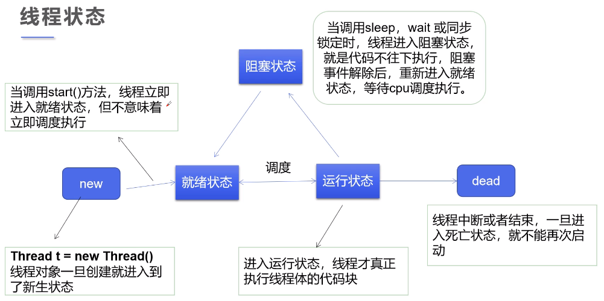

# 线程状态

`java.lang.Thread.State`

- `NEW` 新生,就绪
- `RUNNABLE` 运行
- `BLOCKED` 阻塞
- `WAITING` 等待
- `TIMED_WAITING` 超时等待
- `TERMINATED` 终止



```java
package com.zhengqing.demo.daily.thread;

import java.util.concurrent.TimeUnit;

public class ThreadStateDemo {
    public static void main(String[] args) throws InterruptedException {
        Thread thread = new Thread(() -> {
            System.out.println("Thread state: " + Thread.currentThread().getState());
            for (int i = 0; i < 5; i++) {
                try {
                    TimeUnit.SECONDS.sleep(1);
                } catch (InterruptedException e) {
                    e.printStackTrace();
                }
            }
        });

        System.out.println("Thread state: " + thread.getState());

        thread.start();

        while (thread.getState() != Thread.State.TERMINATED) {
            System.out.println("Thread state: " + thread.getState());
            Thread.sleep(500);
        }

        System.out.println("Thread state: " + thread.getState());
    }
}
```