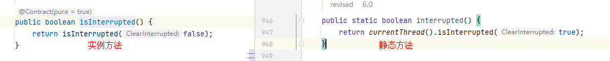

# 线程中断机制

Java线程有多种方法可以中断停止，具体取决于线程需要的控制和资源。下面是一些常见的方式

### 1、使用标志位

- 通过volatile变量实现
- 通过AtomicBoolean

为了能够正常地停止一个线程，你可以在代码中定义一个布尔类型的标志位，然后在线程运行时侦测这个标志位是否已被设置为true，如果是，线程就执行结束操作。

```java
public class MyThread extends Thread {

    private volatile boolean stop;

    public void setStop(boolean stop) {
        this.stop = stop;
    }

    @Override
    public void run() {
        while (!stop) {
            // do something
        }
        // perform clean-up work here
    }
}
```

### 2、使用 interrupt()

> 协作机制，并不能直接中断，需要被调用的线程自己进行配合才行 eg: 你在吃饭，我告诉你不要吃了，只是立个标识是让你不要吃了，但你不听话，还是继续吃吃吃...

- `Thread.currentThread().interrupt()`: 实例方法，中断线程 中断标识false -> true
- `Thread.currentThread().isInterrupted()`: 实例方法，查询线程中断标识状态 false/true
- `Thread.interrupted()`: 静态方法，返回当前线程的中断状态 & 将当前线程的中断状态设为false；即如果有2次调用，第一次为true，第二次为false



- 静态方法`Thread.interrupted()`将会清除中断状态(传入的参数ClearInterrupted为true)
- 实例方法`Thread.currentThread().isInterrupted()`则不会(传入的参数ClearInterrupted为false)

```
public class MyThread extends Thread {
    public void run() {
        while (!isInterrupted()) {
            // 线程逻辑...
        }
    }
}

// 中断线程
MyThread thread = new MyThread();
thread.start();
thread.interrupt();
```

#### eg：演示协作机制，非立即中断

```java
public class TestInterrupt1 {
    public static void main(String[] args) throws Exception {
        Thread thread = new Thread(() -> {
            for (int i = 0; i < 500; i++) { // 有限循环，用来测试调用 thread.interrupt() 之后，线程是否直接停止了...
                if (Thread.currentThread().isInterrupted()) {
                    System.out.println("中断：" + Thread.currentThread().getName() + "：" + Thread.currentThread().isInterrupted());
//                    break;
                }
                System.out.println(Thread.currentThread().getName() + "：" + Thread.currentThread().isInterrupted());
            }
        }, "t1");
        thread.start();

        TimeUnit.MILLISECONDS.sleep(2);

        // 发起中断 修改线程的中断标志位为true
        thread.interrupt(); // false --> true

        System.out.println(thread.getName() + "中断标识：" + thread.isInterrupted()); // true
        System.out.println(thread.getName() + "中断标识：" + thread.isInterrupted()); // true

        TimeUnit.SECONDS.sleep(3); // 睡3秒之后，上面线程中的 for (int i = 0; i < 500; i++) 已经执行完了，会是false
        System.out.println(thread.getName() + "中断标识：" + thread.isInterrupted()); // false
        System.out.println(thread.getName() + "中断标识：" + thread.isInterrupted()); // false
    }
}

// 执行效果：
//    t1：false
//    t1：false
//    t1：false
//    t1：false
//    t1：false
//    ...
//    t1中断标识：true
//    t1中断标识：true
//    t1：true
//    中断：t1：true
//    t1：true
//    中断：t1：true
//    t1：true
//    ...
//    t1中断标识：false
//    t1中断标识：false
```

如果线程处于被阻塞状态(例如处于`sleep`、`wait`、`join`等状态),
在别的线程中调用当前线程对象的`interrupt`方法,那么线程立即被阻塞状态,并抛出一个`InterruptedException`异常；
`sleep`方法抛出`InterruptedException`后,中断标识也被清空置为false,
我们可以在`catch`中通过调用 `t.interrupt()`方法再次将中断标识位设置为true

#### eg：演示遇到`sleep`抛出`InterruptedException`异常后在catch中再次将中断标识设置为true

```java
public class TestInterrupt2 {
    public static void main(String[] args) throws Exception {
        Thread thread = new Thread(() -> {
            while (true) {
                if (Thread.currentThread().isInterrupted()) {
                    System.out.println("中断：" + Thread.currentThread().getName() + "：" + Thread.currentThread().isInterrupted());
                    break;
                }
                System.out.println(Thread.currentThread().getName() + "：" + Thread.currentThread().isInterrupted());
                try {
                    TimeUnit.MILLISECONDS.sleep(100);
                } catch (InterruptedException e) {
                    // sleep会将 线程的中断标志位重新设置为false,无法停下,需要再次掉interrupt()设置true
                    Thread.currentThread().interrupt(); // 不设置会一直死循环执行
                    e.printStackTrace();
                }
            }
        }, "t1");
        thread.start();

        TimeUnit.SECONDS.sleep(1);

        // 发起中断 修改线程的中断标志位为true
        thread.interrupt(); // false --> true

        System.out.println(thread.getName() + "中断标识：" + thread.isInterrupted());
        System.out.println(thread.getName() + "中断标识：" + thread.isInterrupted());

        TimeUnit.SECONDS.sleep(3);
        System.out.println(thread.getName() + "中断标识：" + thread.isInterrupted());
        System.out.println(thread.getName() + "中断标识：" + thread.isInterrupted());
    }
}

// 执行效果：
//    t1：false
//    t1：false
//    t1：false
//    t1：false
//    t1：false
//    t1：false
//    t1：false
//    t1中断标识：false
//    t1中断标识：true
//    中断：t1：true
//    java.lang.InterruptedException: sleep interrupted
//        at java.lang.Thread.sleep(Native Method)
//        at java.lang.Thread.sleep(Thread.java:340)
//        at java.util.concurrent.TimeUnit.sleep(TimeUnit.java:386)
//        at com.zhengqing.demo.daily.thread.TestInterrupt2.lambda$main$0(TestInterrupt2.java:22)
//        at java.lang.Thread.run(Thread.java:748)
//    t1中断标识：false
//    t1中断标识：false
```

#### eg: 演示 `Thread.interrupted()` 静态方法效果

```java
public class TestInterrupt3 {
    public static void main(String[] args) throws Exception {
        System.out.println(Thread.currentThread().getName() + "：" + Thread.interrupted());
        System.out.println(Thread.currentThread().getName() + "：" + Thread.interrupted());

        Thread.currentThread().interrupt();
        System.out.println("--------------------");

        System.out.println(Thread.currentThread().getName() + "：" + Thread.interrupted());
        System.out.println(Thread.currentThread().getName() + "：" + Thread.interrupted());
    }
// 执行效果：
//    main：false
//    main：false
//            --------------------
//    main：true
//    main：false
}
```

### 3、使用 stop()

虽然这个方法能够立即终止一个线程，但并不推荐使用它，因为它可能导致一些非预期的结果。

```java
public class MyThread extends Thread {

    @Override
    public void run() {
        while (true) {
            // do something
        }
        // perform clean-up work here
    }
}

//MyThread myThread = new MyThread();
//myThread.start();
//myThread.stop(); // 立即停止 MyThread 线程
```

### 4、使用 Future

使用 `Future` 和 `ExecutorService` 来停止运行中的Java线程。
需要注意的是，在使用 `cancel()` 方法来取消任务时，实际上只是给线程发送一个中断信号，而不是直接停止线程。
因此，需要在任务代码中检查中断状态并根据需要提前结束线程才能确保任务可靠地结束。

```java
import java.util.concurrent.*;

public class StopThreadExample {
    public static void main(String[] args) throws Exception {
        ExecutorService executor = Executors.newSingleThreadExecutor();
        Callable<Void> task = new Callable<Void>() {
            public Void call() throws Exception {
                while (true) {
                    // 这里是线程要执行的代码
                }
            }
        };
        Future<Void> future = executor.submit(task);
        Thread.sleep(1000); //等待线程执行一段时间
        future.cancel(true); // 取消任务
        executor.shutdown(); // 关闭线程池，释放资源
    }
}
```
