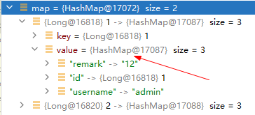

# Mybatis返回Map

> 参考 https://mybatis.org/mybatis-3/zh/java-api.html

@MapKey 方法 供返回值为 Map 的方法使用的注解。
它使用对象的某个属性作为 key，将对象 List 转化为 Map。 属性：value，指定作为 Map 的 key 值的对象属性名。

```
import org.apache.ibatis.annotations.*;

@MapKey("id")
Map<String, UserInfoVO> selectMap();
```

```
<select id="selectMap" resultType="java.util.Map">
    SELECT id,
           username,
           remark
    FROM t_demo LIMIT 2
</select>
```

效果：

```json
{
  "11": {
    "remark": "test",
    "id": 11,
    "username": "admin"
  },
  "22": {
    "remark": "test",
    "id": 22,
    "username": "hello"
  }
}
```

> tips: 返回类型无法对应`UserInfoVO`，慎用...
> 
