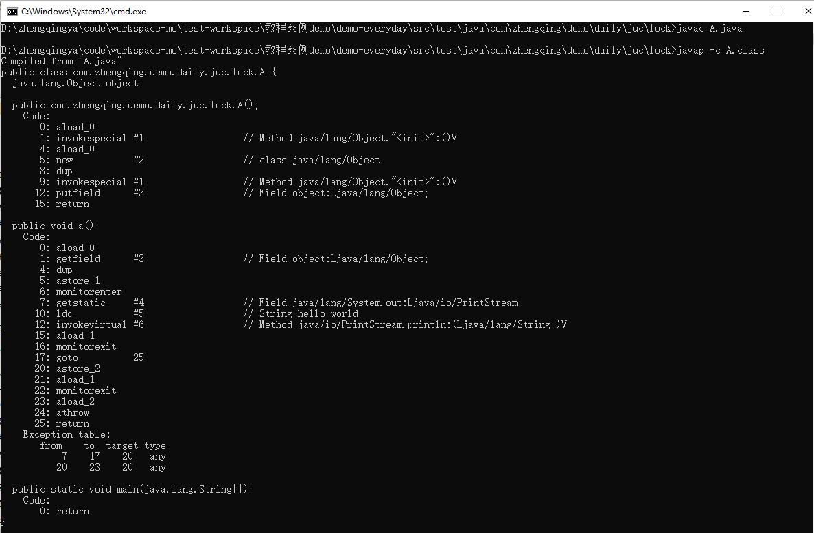
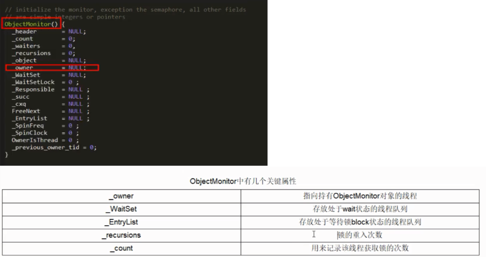

# synchronized

> https://www.bilibili.com/video/BV18Z4y1P7N4

### 一、锁的是什么?

> 可见 [8锁现象案例demo](./synchronized-8锁现象)

1. 锁方法
    - 非静态方法 =》 对象锁
    - 静态方法 =》 类锁
2. 锁代码块: 锁传入的对象

> tips: 对象锁 和 类锁 互不影响；
> 高并发时，能锁区块，就不要锁整个方法体，能用对象锁，就不要用类锁。

### 二、Demo

```
package com.zhengqing.demo.daily.juc;

/**
 * 基本的卖票例子
 * 记住:线程就是一个单独的资源类,没用任何的附属操作！
 */
public class Demo {
    public static void main(String[] args) {
        //多线程操作
        Ticket ticket = new Ticket();

        new Thread(()-> { for (int i = 0; i < 60; i++) ticket.sale(); },"A").start();
        new Thread(()-> { for (int i = 0; i < 60; i++) ticket.sale(); },"B").start();
        new Thread(()-> { for (int i = 0; i < 60; i++) ticket.sale(); },"C").start();
        new Thread(()-> { for (int i = 0; i < 60; i++) ticket.sale(); },"D").start();
    }
}

// 资源类
class Ticket {
    private static int number = 50;

    // 卖票方式
    public synchronized void sale() {
        if (number > 0) {
            System.out.println(Thread.currentThread().getName() + "购买了第" + (number--) + "张票,剩余票数为" + number);
        }
    }
}
```

```java
package com.zhengqing.demo.daily.thread;

public class TestSynchronizedBlock {
    public static void main(String[] args) {
        Ticket ticket = new Ticket();
        for (int i = 0; i < 20; i++) {
            new Thread(() -> ticket.sale()).start();
        }
    }

    static class Ticket {
        private static int number = 10;

        public void sale() {
//            Integer num = 1; // 线程安全
//            Integer num = 129; // 超过128 对象地址不一致 => 线程不安全
//            synchronized (num) {
            synchronized (this) { // this 当前调用的对象 ticket => 安全     如果上面ticket对象放在for循环中，则不安全
                if (number > 0) {
                    System.out.println(Thread.currentThread().getName() + "购买了第" + (number--) + "张票,剩余票数为" + number);
                } else {
                    System.out.println(Thread.currentThread().getName() + "没票了...");
                }
            }
        }
    }
}
```

### 三、从字节码角度分析synchronized实现

#### 1、synchronized 同步代码块

```java
package com.zhengqing.demo.daily.juc.lock;

public class A {

    Object object = new Object();

    public void a() {
        synchronized (this.object) {
            System.out.println("hello world");
        }
    }

    public static void main(String[] args) {

    }

}
```

```shell
# 编译成class文件
javac A.java
# 反编译
javap -c A.class
```



```shell
Compiled from "A.java"
public class com.zhengqing.demo.daily.juc.lock.A {
  java.lang.Object object;

  public com.zhengqing.demo.daily.juc.lock.A();
    Code:
       0: aload_0
       1: invokespecial #1                  // Method java/lang/Object."<init>":()V
       4: aload_0
       5: new           #2                  // class java/lang/Object
       8: dup
       9: invokespecial #1                  // Method java/lang/Object."<init>":()V
      12: putfield      #3                  // Field object:Ljava/lang/Object;
      15: return

  public void a();
    Code:
       0: aload_0
       1: getfield      #3                  // Field object:Ljava/lang/Object;
       4: dup
       5: astore_1
       6: monitorenter
       7: getstatic     #4                  // Field java/lang/System.out:Ljava/io/PrintStream;
      10: ldc           #5                  // String hello world
      12: invokevirtual #6                  // Method java/io/PrintStream.println:(Ljava/lang/String;)V
      15: aload_1
      16: monitorexit
      17: goto          25
      20: astore_2
      21: aload_1
      22: monitorexit
      23: aload_2
      24: athrow
      25: return
    Exception table:
       from    to  target type
           7    17    20   any
          20    23    20   any

  public static void main(java.lang.String[]);
    Code:
       0: return
}
```

synchronized 同步代码块 使用 `monitorenter` `monitorexit` 指令

#### 2、synchronized 普通同步方法

```java
package com.zhengqing.demo.daily.juc.lock;

public class B {

    public synchronized void b() {
        System.out.println("hello world");
    }

    public static void main(String[] args) {

    }

}
```

```shell
# 编译成class文件
javac A.java
# 反编译  -v：输出附加信息（ eg: 字节码的版本号、常量池中的项、异常处理表、线程局部变量表等 ）
javap -v A.class
```

```shell
Classfile /D:/zhengqingya/code/workspace-me/test-workspace/教程案例demo/demo-everyday/src/test/java/com/zhengqing/demo/daily/juc/lock/B.class
  Last modified 2023-6-13; size 484 bytes
  MD5 checksum 564eaea674a8bc6799e76eb9fe5ec7cc
  Compiled from "B.java"
public class com.zhengqing.demo.daily.juc.lock.B
  minor version: 0
  major version: 52
  flags: ACC_PUBLIC, ACC_SUPER
Constant pool:
   #1 = Methodref          #6.#16         // java/lang/Object."<init>":()V
   #2 = Fieldref           #17.#18        // java/lang/System.out:Ljava/io/PrintStream;
   #3 = String             #19            // hello world
   #4 = Methodref          #20.#21        // java/io/PrintStream.println:(Ljava/lang/String;)V
   #5 = Class              #22            // com/zhengqing/demo/daily/juc/lock/B
   #6 = Class              #23            // java/lang/Object
   #7 = Utf8               <init>
   #8 = Utf8               ()V
   #9 = Utf8               Code
  #10 = Utf8               LineNumberTable
  #11 = Utf8               b
  #12 = Utf8               main
  #13 = Utf8               ([Ljava/lang/String;)V
  #14 = Utf8               SourceFile
  #15 = Utf8               B.java
  #16 = NameAndType        #7:#8          // "<init>":()V
  #17 = Class              #24            // java/lang/System
  #18 = NameAndType        #25:#26        // out:Ljava/io/PrintStream;
  #19 = Utf8               hello world
  #20 = Class              #27            // java/io/PrintStream
  #21 = NameAndType        #28:#29        // println:(Ljava/lang/String;)V
  #22 = Utf8               com/zhengqing/demo/daily/juc/lock/B
  #23 = Utf8               java/lang/Object
  #24 = Utf8               java/lang/System
  #25 = Utf8               out
  #26 = Utf8               Ljava/io/PrintStream;
  #27 = Utf8               java/io/PrintStream
  #28 = Utf8               println
  #29 = Utf8               (Ljava/lang/String;)V
{
  public com.zhengqing.demo.daily.juc.lock.B();
    descriptor: ()V
    flags: ACC_PUBLIC
    Code:
      stack=1, locals=1, args_size=1
         0: aload_0
         1: invokespecial #1                  // Method java/lang/Object."<init>":()V
         4: return
      LineNumberTable:
        line 3: 0

  public synchronized void b();
    descriptor: ()V
    flags: ACC_PUBLIC, ACC_SYNCHRONIZED
    Code:
      stack=2, locals=1, args_size=1
         0: getstatic     #2                  // Field java/lang/System.out:Ljava/io/PrintStream;
         3: ldc           #3                  // String hello world
         5: invokevirtual #4                  // Method java/io/PrintStream.println:(Ljava/lang/String;)V
         8: return
      LineNumberTable:
        line 6: 0
        line 7: 8

  public static void main(java.lang.String[]);
    descriptor: ([Ljava/lang/String;)V
    flags: ACC_PUBLIC, ACC_STATIC
    Code:
      stack=0, locals=1, args_size=1
         0: return
      LineNumberTable:
        line 11: 0
}
SourceFile: "B.java"
```

调用指令将会检查方法的 ACC_SYNCHRONIZED 访问标志是否被设置。
如果设置了，执行线程会将先持有monitor然后再执行方法，最后在方法完成(无论是正常完成还是非正常完成)时释放 minotor

#### 3、synchronized 静态同步方法

```java
package com.zhengqing.demo.daily.juc.lock;

public class C {

    public synchronized void b() {
        System.out.println("hello world");
    }

    public synchronized void c() {
        System.out.println("hello world");
    }

    public static void main(String[] args) {

    }

}
```

```shell
# 编译成class文件
javac C.java
# 反编译  -v：输出附加信息（ eg: 字节码的版本号、常量池中的项、异常处理表、线程局部变量表等 ）
javap -v C.class
```

```shell
 Last modified 2023-6-13; size 539 bytes
  MD5 checksum e9e4c40496ccafba09e8c028338442d8
  Compiled from "C.java"
public class com.zhengqing.demo.daily.juc.lock.C
  minor version: 0
  major version: 52
  flags: ACC_PUBLIC, ACC_SUPER
Constant pool:
   #1 = Methodref          #6.#17         // java/lang/Object."<init>":()V
   #2 = Fieldref           #18.#19        // java/lang/System.out:Ljava/io/PrintStream;
   #3 = String             #20            // hello world
   #4 = Methodref          #21.#22        // java/io/PrintStream.println:(Ljava/lang/String;)V
   #5 = Class              #23            // com/zhengqing/demo/daily/juc/lock/C
   #6 = Class              #24            // java/lang/Object
   #7 = Utf8               <init>
   #8 = Utf8               ()V
   #9 = Utf8               Code
  #10 = Utf8               LineNumberTable
  #11 = Utf8               b
  #12 = Utf8               c
  #13 = Utf8               main
  #14 = Utf8               ([Ljava/lang/String;)V
  #15 = Utf8               SourceFile
  #16 = Utf8               C.java
  #17 = NameAndType        #7:#8          // "<init>":()V
  #18 = Class              #25            // java/lang/System
  #19 = NameAndType        #26:#27        // out:Ljava/io/PrintStream;
  #20 = Utf8               hello world
  #21 = Class              #28            // java/io/PrintStream
  #22 = NameAndType        #29:#30        // println:(Ljava/lang/String;)V
  #23 = Utf8               com/zhengqing/demo/daily/juc/lock/C
  #24 = Utf8               java/lang/Object
  #25 = Utf8               java/lang/System
  #26 = Utf8               out
  #27 = Utf8               Ljava/io/PrintStream;
  #28 = Utf8               java/io/PrintStream
  #29 = Utf8               println
  #30 = Utf8               (Ljava/lang/String;)V
{
  public com.zhengqing.demo.daily.juc.lock.C();
    descriptor: ()V
    flags: ACC_PUBLIC
    Code:
      stack=1, locals=1, args_size=1
         0: aload_0
         1: invokespecial #1                  // Method java/lang/Object."<init>":()V
         4: return
      LineNumberTable:
        line 3: 0

  public synchronized void b();
    descriptor: ()V
    flags: ACC_PUBLIC, ACC_SYNCHRONIZED
    Code:
      stack=2, locals=1, args_size=1
         0: getstatic     #2                  // Field java/lang/System.out:Ljava/io/PrintStream;
         3: ldc           #3                  // String hello world
         5: invokevirtual #4                  // Method java/io/PrintStream.println:(Ljava/lang/String;)V
         8: return
      LineNumberTable:
        line 6: 0
        line 7: 8

  public static synchronized void c();
    descriptor: ()V
    flags: ACC_PUBLIC, ACC_STATIC, ACC_SYNCHRONIZED
    Code:
      stack=2, locals=0, args_size=0
         0: getstatic     #2                  // Field java/lang/System.out:Ljava/io/PrintStream;
         3: ldc           #3                  // String hello world
         5: invokevirtual #4                  // Method java/io/PrintStream.println:(Ljava/lang/String;)V
         8: return
      LineNumberTable:
        line 10: 0
        line 11: 8

  public static void main(java.lang.String[]);
    descriptor: ([Ljava/lang/String;)V
    flags: ACC_PUBLIC, ACC_STATIC
    Code:
      stack=0, locals=1, args_size=1
         0: return
      LineNumberTable:
        line 15: 0
}
SourceFile: "C.java"
```

ACC_STATIC、ACC_SYNCHRONIZED 访问标志区分该方法是否静态同步方法，决定是否类锁

### 四、反编译 synchronized 锁的是什么？

在HotSpot虚拟机中，monitor采用ObjectMonitor实现。
每一个对象天生都带着一个对象监视器，每一个被锁住的对象都会和Monitor关联起来。

ObjectMonitor.java -> ObjectMonitor.cpp -> ObjectMonitor.hpp


