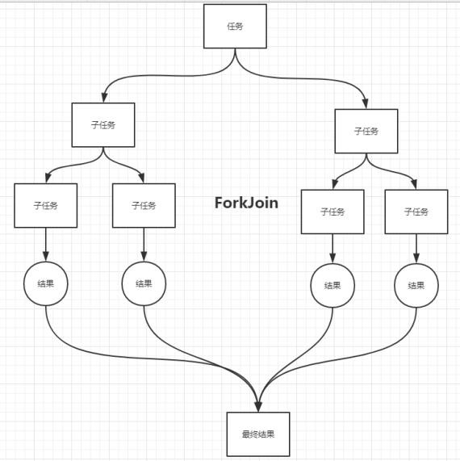
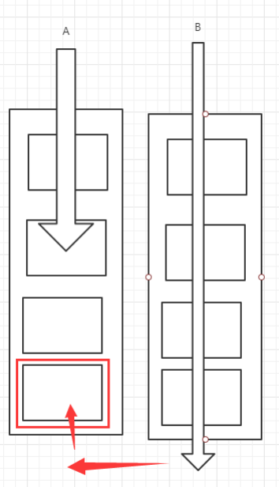

# ForkJoin

ForkJoin在JDK1.7,并发执行任务！提高效率，大数据量！

大数据：Map Reduce(把大任务拆分为小任务)

ForkJoin的特点:工作窃取

这个里面维护的都是双端队列




```java
package com.zhengqing.demo.daily.juc;

import org.junit.Test;

import java.util.concurrent.ForkJoinPool;
import java.util.concurrent.ForkJoinTask;
import java.util.concurrent.RecursiveTask;
import java.util.stream.LongStream;

public class TestForkJoin {

    @Test // 普通计算 257毫秒
    public void test01() {
        long sum = 0L;
        long stare = System.currentTimeMillis();
        for (int i = 1; i <= 10_0000_0000; i++) {
            sum += i;
        }
        long end = System.currentTimeMillis();
        System.out.println("sum=" + sum + ",时间为:" + (end - stare) + "毫秒");
    }

    @Test // 使用ForkJoin 2372毫秒
    public void test02() throws Exception {
        long stare = System.currentTimeMillis();
        ForkJoinPool forkJoinPool = new ForkJoinPool();
        MyForkJoin task = new MyForkJoin(1L, 10_0000_0000L);
        ForkJoinTask<Long> submit = forkJoinPool.submit(task);//提交任务
        Long sum = submit.get();
        long end = System.currentTimeMillis();
        System.out.println("sun=" + sum + ",时间为:" + (end - stare) + "毫秒");
    }

    @Test  // 使用Stream流计算 131毫秒
    public void test03() {
        long stare = System.currentTimeMillis();
        //range表示() 而rangeClosed表示(]
        long sum = LongStream.rangeClosed(1L, 10_0000_0000L).parallel().reduce(0, Long::sum);
        long end = System.currentTimeMillis();
        System.out.println("sun=" + sum + " 时间为:" + (end - stare) + "毫秒");
    }


    /**
     * 求和计算的任务
     * <p>
     * 如何使用ForkJoin?
     * 1.ForkJoinPool 通过它来执行
     * 2.计算任务 ForkJoinPool.execute(ForkJoinTask<?> task)
     * 3.计算类需要继承RecursiveTask抽象类
     */
    static class MyForkJoin extends RecursiveTask<Long> {
        private final Long start;//起始值  1
        private final Long end;//结束的值   1990999

        //临界值
        private final Long temp = 1000L;

        public MyForkJoin(Long start, Long end) {
            this.start = start;
            this.end = end;
        }


        /**
         * 计算方法
         *
         * @return 计算结果
         */
        @Override
        protected Long compute() {
            if ((this.end - this.start) < this.temp) {
                long sum = 0L;
                for (Long i = this.start; i <= this.end; i++) {
                    sum += i;
                }
                return sum;
            } else {
                //分支合并计算使用 ForkJoin
                long middle = (this.start + this.end) / 2; //中间值
                MyForkJoin task1 = new MyForkJoin(this.start, middle);
                task1.fork();//拆分把任务压入线程队列
                MyForkJoin task2 = new MyForkJoin(middle + 1, this.end);
                task2.fork();//拆分把任务压入线程队列
                return task1.join() + task2.join();
            }
        }
    }
}
```