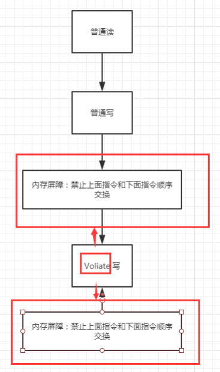
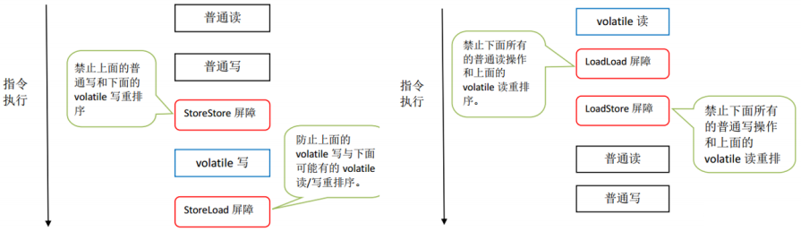

# Volatile

volatile是java虚拟机提供的轻量级的同步机制

1. 保证可见性
2. 不保证原子性
3. 禁止指令重排

### 保证可见性

```java
package com.zhengqing.demo.daily.juc.jmm;

import java.util.concurrent.TimeUnit;

public class TestJMM {
    //加入volatile可以保证程序的可见性
    private static volatile boolean flag = true;

    public static void main(String[] args) throws InterruptedException {
        new Thread(() -> { //该线程对主内存的变化是不可见的!
            while (flag) {

            }
        }).start();

        System.out.println("停顿!");
        TimeUnit.SECONDS.sleep(1);
        flag = false;
        System.out.println("修改完毕!");
        // 没有volatile 这里直接循环卡死!
    }
}
```

### 不保证原子性

原子性:不可分割
线程A在执行任务的时候不能被打扰的,也不能被分割,要么一起成功要么一起失败

volatile变量不适合参与到依赖当前值的运算，如：i++

在多线程环境下，数据计算和数据赋值操作多次出现，若数据在加载之后，若主内存volatile修饰变量发生修改之后，线程工作内存中的操作将会作废去读主内存最新值，
操作出现写丢失问题，即各线程私有内存和主内存公共内存中变量不同步，进而导致数据不一致。

```java
package com.zhengqing.demo.daily.juc.jmm;

import org.junit.Test;

import java.util.concurrent.TimeUnit;

public class TestJMM02 {

    // volatile不保证原子性
    private volatile static int flag = 0;

    public static void add() {
        flag++;
    }

    public static void main(String[] args) {
        for (int i = 0; i < 10; i++) {
            new Thread(() -> {
                for (int j = 0; j < 1000; j++) {
                    add();
                }
            }).start();
        }

        while (Thread.activeCount() > 2) {
            Thread.yield();
        }
        System.out.println(Thread.currentThread().getName() + ":" + flag);
    }

    @Test
    public void test() throws Exception {
        new Thread(() -> {
            try {
                TimeUnit.MILLISECONDS.sleep(10);
            } catch (InterruptedException e) {
                throw new RuntimeException(e);
            }
            flag++;
            System.out.println(Thread.currentThread().getName() + flag);
        }).start();
        new Thread(() -> {
            try {
                TimeUnit.MILLISECONDS.sleep(10);
            } catch (InterruptedException e) {
                throw new RuntimeException(e);
            }
            flag++;
            System.out.println(Thread.currentThread().getName() + flag);
        }).start();

        TimeUnit.SECONDS.sleep(2);
        System.out.println(flag);
    }
}
```

因此需要加锁或使用原子类来保证原子性

### 原子类保证原子性

```java
package com.zhengqing.demo.daily.juc.jmm;

import java.util.concurrent.atomic.AtomicInteger;

public class TestJMM03 {

    //volatile不保证原子性
    private volatile static AtomicInteger flag = new AtomicInteger();

    public static void add() {
        flag.getAndIncrement();//进行+1操作
    }

    public static void main(String[] args) {
        for (int i = 0; i < 10; i++) {
            new Thread(() -> {
                for (int j = 0; j < 1000; j++) {
                    add();
                }
            }).start();
        }

        while (Thread.activeCount() > 2) {
            Thread.yield();
        }
        System.out.println(Thread.currentThread().getName() + ":" + flag);
    }
}
```

### 指令重排

什么是指令重排：你写的程序计算机并不是按照你写的程序去执行的！

源代码->编译器优化的重排->指令并行也可能会重排->内存系统也会重排->执行

Volatile则可以避免指令重排

使其加入了内存屏障，作用:

1. 保证特定操作的执行顺序
2. 可以保证某些内存表变量的可见性(利用这些特性Volatile实现了可见性)



Volatile 是可以保持 可见性。不能保证原子性，由于内存屏障，可以保证避免指令重排的现象产生！

### JMM内存屏障插入策略

> https://blog.csdn.net/zhangzhigan1202/article/details/127658664

1. 在每个volatile写操作的前面插入一个StoreStore屏障。
2. 在每个volatile写操作的后面插入一个StoreLoad屏障。
3. 在每个volatile读操作的后面插入一个LoadLoad屏障。
4. 在每个volatile读操作的后面插入一个LoadStore屏障。



### JVM层面的内存屏障

- LoadLoad屏障：（指令Load1；LoadLoad；Load2），在Load2及后续 读取操作要读取的数据访问前，保障Load1要读取的数据被读取完毕。
- LoadStore屏障：（指令Load1；LoadStore；Store2），在Store2及后续写入操作被刷出前，保障Load1要读取的数据被读取完毕。
- StoreStore屏障：（指令Store1；StoreStore；Store2），在Store2及后续写入操作执行前，保障Store1的写入操作对其他处理器可见；
- StoreLoad屏障：（指令Store1；StoreLoad；Load2），在Load2及后续所有读取操作执行前保障Store1的写入对所有处理器可见。它的开销时四种屏障中最大的。
  在大多数处理器的实现中，这个屏障是个万能屏障；间距其他三种内存屏障的功能。

