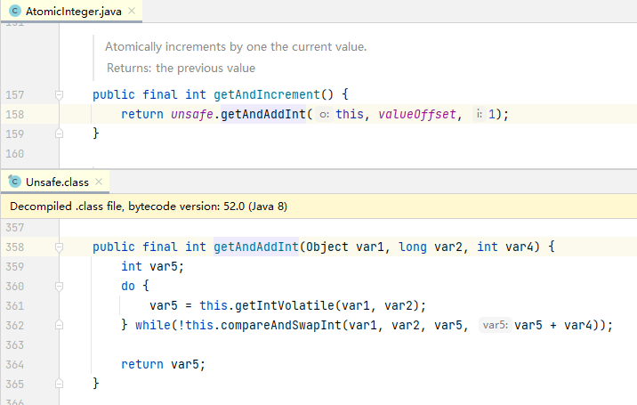
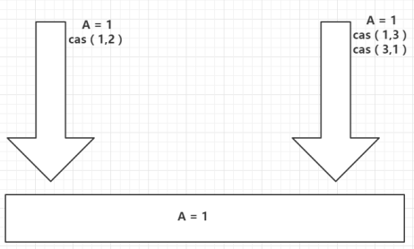

# CAS

> UnSafe类+CAS思想（自旋锁）

### 什么是 CAS

CAS的全称为Compare-And-Swap ,它是一条CPU并发原语,比较工作内存值(预期值)和主物理内存的共享值是否相同,
相同则执行规定操作，否则继续比较直到主内存和工作内存的值一致为止。
这个过程是原子的。

CAS并发原语提现在Java语言中就是sun.misc包下的UnSaffe类中的各个方法.调用UnSafe类中的CAS方法,JVM会帮我实现 CAS汇编指令.
这是一种完全依赖于硬件功能,通过它实现了原子操作,再次强调,由于CAS是一种系统原语,原语属于操作系统用于范畴,是由若干条指令组成,用于完成某个功能的一个过程,
并且原语的执行必须是连续的,在执行过程中不允许中断,也即是说CAS是一条原子指令,不会造成所谓的数据不一致的问题

> AtomicInteger类主要利用CAS(compare and swap)+volatile和native方法来保证原子操作，从而避免synchronized的高开销，执行效率大为提升。

```java
import java.util.concurrent.atomic.AtomicInteger;

public class TestCAS {
    // CAS compareAndSet : 比较并交换！
    public static void main(String[] args) {
        AtomicInteger atomicInteger = new AtomicInteger(2020);
        // 期望、更新
        // public final boolean compareAndSet(int expect, int update)
        // 如果我期望的值达到了，那么就更新，否则，就不更新, CAS 是CPU的并发原语！
        System.out.println(atomicInteger.compareAndSet(2020, 2021));
        System.out.println(atomicInteger.get());
        atomicInteger.getAndIncrement();
        System.out.println(atomicInteger.compareAndSet(2020, 2021));
        System.out.println(atomicInteger.get());
    }
}
```



CAS ： 比较当前工作内存中的值和主内存中的值，如果这个值是期望的，那么则执行操作！如果不是就一直循环！

缺点：

1. 循环会耗时
2. 一次性只能保证一个共享变量的原子性
3. ABA问题



### ABA问题

```java
import java.util.concurrent.atomic.AtomicInteger;

public class TestCAS {
    // CAS compareAndSet : 比较并交换！
    public static void main(String[] args) {
        AtomicInteger atomicInteger = new AtomicInteger(2020);
        // 期望、更新
        // public final boolean compareAndSet(int expect, int update)
        // 如果我期望的值达到了，那么就更新，否则，就不更新, CAS 是CPU的并发原语！
        // ============== 捣乱的线程 ==================
        System.out.println(atomicInteger.compareAndSet(2020, 2021));
        System.out.println(atomicInteger.get());
        System.out.println(atomicInteger.compareAndSet(2021, 2020));
        System.out.println(atomicInteger.get());
        // ============== 期望的线程 ==================
        System.out.println(atomicInteger.compareAndSet(2020, 6666));
        System.out.println(atomicInteger.get());
    }
}
```

#### 原子引用解决ABA问题

> 对应的思想：乐观锁！
> 解决： 加个 版本号/Boolean 记录是否被改动

```java
import java.util.concurrent.TimeUnit;
import java.util.concurrent.atomic.AtomicStampedReference;

public class TestCasAba {
    // AtomicStampedReference 注意，如果泛型是一个包装类，注意对象的引用问题
    // 正常在业务操作，这里面比较的都是一个个对象
    static AtomicStampedReference<Integer> atomicStampedReference = new AtomicStampedReference<>(1, 1);

    // CAS compareAndSet : 比较并交换！
    public static void main(String[] args) {
        new Thread(() -> {
            int stamp = atomicStampedReference.getStamp(); // 获得版本号
            System.out.println("a1=>" + stamp);
            try {
                TimeUnit.SECONDS.sleep(1);
            } catch (InterruptedException e) {
                e.printStackTrace();
            }
            atomicStampedReference.compareAndSet(1, 2, atomicStampedReference.getStamp(), atomicStampedReference.getStamp() + 1);
            System.out.println("a2=>" + atomicStampedReference.getStamp());
            System.out.println(atomicStampedReference.compareAndSet(2, 1, atomicStampedReference.getStamp(), atomicStampedReference.getStamp() + 1));
            System.out.println("a3=>" + atomicStampedReference.getStamp());
        }, "a").start();

        // 乐观锁的原理相同！
        new Thread(() -> {
            int stamp = atomicStampedReference.getStamp(); // 获得版本号
            System.out.println("b1=>" + stamp);
            try {
                TimeUnit.SECONDS.sleep(2);
            } catch (InterruptedException e) {
                e.printStackTrace();
            }
            System.out.println(atomicStampedReference.compareAndSet(1, 6, stamp, stamp + 1));
            System.out.println("b2=>" + atomicStampedReference.getStamp());
        }, "b").start();
    }
}
```