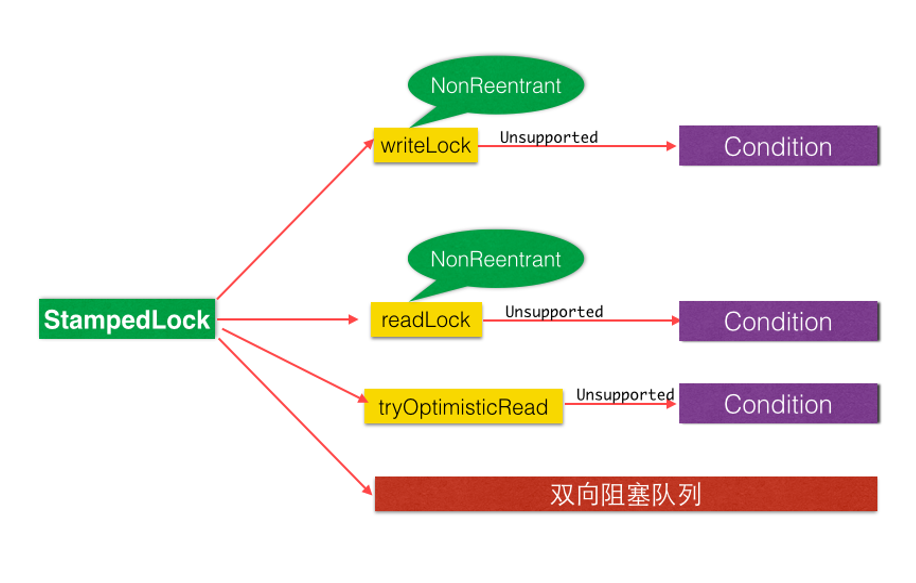

# 锁

### 一、公平锁、非公平锁

- 公平锁： 非常公平， 不能够插队，必须先来后到！ eg: Lock lock = new ReentrantLock(true);
- 非公平锁：非常不公平，可以插队 （默认都是非公平） eg: Lock lock = new ReentrantLock();

```java
package com.zhengqing.demo.daily.juc.lock;

import java.util.concurrent.locks.Lock;
import java.util.concurrent.locks.ReentrantLock;

public class TestReentrantLock {
    public static void main(String[] args) {
        // 多线程操作
        Ticket ticket = new Ticket();

        new Thread(() -> {
            for (int i = 0; i < 60; i++) {
                ticket.sale();
            }
        }, "A").start();
        new Thread(() -> {
            for (int i = 0; i < 60; i++) {
                ticket.sale();
            }
        }, "B").start();
        new Thread(() -> {
            for (int i = 0; i < 60; i++) {
                ticket.sale();
            }
        }, "C").start();
    }
}

// 资源类
class Ticket {
    private static int number = 50;

    Lock lock = new ReentrantLock(true);

    // 卖票方式
    public void sale() {
        // 加锁
        this.lock.lock();
        try {
            if (number > 0) {
                System.out.println(Thread.currentThread().getName() + "购买了第" + (number--) + "张票,剩余票数为" + number);
            }
        } finally {
            // 解锁
            this.lock.unlock();
        }
    }

}
```

### 二、可重入锁


指在同一个线程在外层方法获取锁的时候,再进入该线程的内层方法会自动获取锁(前提,锁对象得是同一个对象),不会因为之前已经获取过还没有释放而阻塞

synchronized 和 ReentrantLock 是可重入锁

#### 1、synchronized

> [synchronized锁升级【无锁 -> 偏向锁（适用于只有一个线程） -> 轻量级锁（CAS自旋） -> 重量级锁（cas不行了，升级，阻塞）】](./27-synchronized锁升级.md)

```java
public class TestSynchronized {
    public static void main(String[] args) {
        Phone phone = new Phone();
        new Thread(() -> phone.sms(), "A").start();
        new Thread(() -> phone.sms(), "B").start();
    }

    static class Phone {
        public synchronized void sms() {
            System.out.println(Thread.currentThread().getName() + ": sms");
            this.call(); // 这里也有锁
        }

        public synchronized void call() {
            System.out.println(Thread.currentThread().getName() + ": call");
        }
    }
}
```

#### 2、Lock

```java
import java.util.concurrent.locks.Lock;
import java.util.concurrent.locks.ReentrantLock;

public class TestLock {
    public static void main(String[] args) {
        Phone phone = new Phone();
        new Thread(() -> {
            phone.sms();
        }, "A").start();
        new Thread(() -> {
            phone.sms();
        }, "B").start();
    }

    static class Phone {
        Lock lock = new ReentrantLock();

        public void sms() {
            this.lock.lock(); // 细节问题：lock.lock(); lock.unlock(); // lock 锁必须配对，否则就会死在里面
            this.lock.lock();
            try {
                System.out.println(Thread.currentThread().getName() + ": sms");
                this.call(); // 这里也有锁
            } catch (Exception e) {
                e.printStackTrace();
            } finally {
                this.lock.unlock();
                this.lock.unlock();
            }
        }

        public void call() {
            this.lock.lock();
            try {
                System.out.println(Thread.currentThread().getName() + ": call");
            } catch (Exception e) {
                e.printStackTrace();
            } finally {
                this.lock.unlock();
            }
        }
    }
}
```

### 三、ReadWriteLock(读写锁)

一个ReentrantReadWriteLock同时只能存在一个写锁 或 可以存在多个读锁，但不能同时存在写锁和读锁。
即一个资源可以被多个读操作访问或一个写操作访问，但两者不能同时进行。

```java
package com.zhengqing.demo.daily.juc;

import java.util.HashMap;
import java.util.concurrent.locks.ReentrantReadWriteLock;

/**
 * 小结:
 * 独占锁(写锁):一次只能被一个线程占用
 * 共享锁(读锁):多线程可以同时占有
 * 读-读:可以共存!
 * 读-写:不能共存!
 * 写-写:不能共存!
 */
public class TestReadWriteLock {
    public static void main(String[] args) {
        MyCacheLock myCache = new MyCacheLock();
        //存写的线程
        for (int i = 0; i < 5; i++) {
            int temp = i;
            new Thread(() -> {
                myCache.put(String.valueOf(temp), temp);
            }, String.valueOf(i)).start();
        }

        //读写的线程
        for (int i = 0; i < 5; i++) {
            int temp = i;
            new Thread(() -> {
                myCache.get(String.valueOf(temp));
            }, String.valueOf(i)).start();
        }
    }
}

/**
 * 自定义缓存
 */
class MyCache {
    private volatile HashMap<String, Object> map = new HashMap<>();

    //存写
    public void put(String key, Object value) {
        System.out.println(Thread.currentThread().getName() + "正在写入" + key + ":" + value);
        this.map.put(key, value);
        System.out.println(Thread.currentThread().getName() + "写入完毕");
    }

    //读取
    public void get(String key) {
        System.out.println(Thread.currentThread().getName() + "正在读取" + key);
        Object o = this.map.get(key);
        System.out.println(Thread.currentThread().getName() + "读取完毕");
    }
}

/**
 * 加锁的自定义缓存
 */
class MyCacheLock {
    private volatile HashMap<String, Object> map = new HashMap<>();
    //读写锁,更加细腻度的控制
    private final ReentrantReadWriteLock lock = new ReentrantReadWriteLock();

    //存写 (存写的时候只希望有一个线程进行)
    public void put(String key, Object value) {
        //上一把写锁
        this.lock.writeLock().lock();
        try {
            System.out.println(Thread.currentThread().getName() + "正在写入" + key + ":" + value);
            this.map.put(key, value);
            System.out.println(Thread.currentThread().getName() + "写入完毕");
        } finally {
            this.lock.writeLock().unlock();
        }
    }

    //读取 (所有人都可以读)
    public void get(String key) {
        this.lock.readLock().lock();
        try {
            System.out.println(Thread.currentThread().getName() + "正在读取" + key);
            Object o = this.map.get(key);
            System.out.println(Thread.currentThread().getName() + "读取完毕");
        } finally {
            this.lock.readLock().unlock();
        }
    }
}
```

从 写锁 → 读锁，ReentrantReadWriteLock可以降级，但不可以升级

```java
package com.zhengqing.demo.daily.juc.lock;

import org.junit.Test;

import java.util.concurrent.locks.ReentrantReadWriteLock;

public class TestReentrantReadWriteLock {
    @Test
    public void test01() throws Exception {
        ReentrantReadWriteLock readWriteLock = new ReentrantReadWriteLock();

        ReentrantReadWriteLock.ReadLock readLock = readWriteLock.readLock();
        ReentrantReadWriteLock.WriteLock writeLock = readWriteLock.writeLock();

        writeLock.lock();
        System.out.println("-------正在写入");

        readLock.lock();
        System.out.println("-------正在读取");
        readLock.unlock();

        writeLock.unlock();
    }

    @Test
    public void test02() throws Exception {
        ReentrantReadWriteLock readWriteLock = new ReentrantReadWriteLock();

        ReentrantReadWriteLock.ReadLock readLock = readWriteLock.readLock();
        ReentrantReadWriteLock.WriteLock writeLock = readWriteLock.writeLock();

        readLock.lock();
        System.out.println("-------正在读取");

        // 阻塞
        writeLock.lock();
        System.out.println("-------正在写入");
        writeLock.unlock();

        readLock.unlock();
    }
}
```

### 四、StampedLock票据锁(邮戳锁)

无锁 → 独占锁 → 读写锁 → 邮戳锁



#### 1、锁饥饿问题

ReentrantReadWriteLock实现了读写分离，但是一旦读操作比较多的时候，想要获取写锁就变得比较困难了，
假如当前1000个线程，999个读，1个写，有可能999个读取线程长时间抢到了锁，那1个写线程就悲剧了
因为当前有可能会一直存在读锁，而无法获得写锁，根本没机会写 o(╥﹏╥)o

#### 2、如何缓解锁饥饿问题？

使用“公平”策略可以一定程度上缓解这个问题，例如：new ReentrantReadWriteLock(true);
但是“公平”策略是以牺牲系统吞吐量为代价的

#### 3、StampedLock类的乐观读锁

ReentrantReadWriteLock
允许多个线程同时读，但是只允许一个线程写，在线程获取到写锁的时候，其他写操作和读操作都会处于阻塞状态，
读锁和写锁也是互斥的，所以在读的时候是不允许写的，读写锁比传统的synchronized速度要快很多，
原因就是在于 ReentrantReadWriteLock支持读并发

StampedLock横空出世
ReentrantReadWriteLock的读锁被占用的时候，其他线程尝试获取写锁的时候会被阻塞。
但是，StampedLock采取乐观获取锁后，其他线程尝试获取写锁时 不会被阻塞，这其实是对读锁的优化，
所以，在获取乐观读锁后，还需要对结果进行校验。

#### 4、StampedLock的特点

所有获取锁的方法，都返回一个邮戳（Stamp），Stamp为零表示获取失败，其余都表示成功；
所有释放锁的方法，都需要一个邮戳（Stamp），这个Stamp必须是和成功获取锁时得到的Stamp一致；
StampedLock是不可重入的，危险(如果一个线程已经持有了写锁，再去获取写锁的话就会造成死锁)

StampedLock有三种访问模式

1. Reading（读模式）：功能和ReentrantReadWriteLock的读锁类似
2. Writing（写模式）：功能和ReentrantReadWriteLock的写锁类似
3. Optimistic reading（乐观读模式）：无锁机制，类似于数据库中的乐观锁，支持读写并发，很乐观认为读取时没人修改，假如被修改再实现升级为悲观读模式

#### 5、乐观读模式演示代码

```java
package com.zhengqing.demo.daily.juc.lock;

import java.util.concurrent.TimeUnit;
import java.util.concurrent.locks.StampedLock;

public class TestStampedLock {
    static int number = 37;
    static StampedLock stampedLock = new StampedLock();

    public void write() {
        long stamp = stampedLock.writeLock();
        System.out.println(Thread.currentThread().getName() + "\t" + "=====写线程准备修改");
        try {
            number = number + 13;
        } catch (Exception e) {
            e.printStackTrace();
        } finally {
            stampedLock.unlockWrite(stamp);
        }
        System.out.println(Thread.currentThread().getName() + "\t" + "=====写线程结束修改 值变为：" + number);
    }

    // 悲观读
    public void read() {
        long stamp = stampedLock.readLock();
        System.out.println(Thread.currentThread().getName() + "\t come in readlock block,4 seconds continue...");
        //暂停几秒钟线程
        for (int i = 0; i < 4; i++) {
            try {
                TimeUnit.SECONDS.sleep(1);
            } catch (InterruptedException e) {
                e.printStackTrace();
            }
            System.out.println(Thread.currentThread().getName() + "\t 正在读取中......");
        }
        try {
            int result = number;
            System.out.println(Thread.currentThread().getName() + "\t" + " 获得成员变量值result：" + result);
            System.out.println("写线程没有修改值，因为 stampedLock.readLock()读的时候，不可以写，读写互斥");
        } catch (Exception e) {
            e.printStackTrace();
        } finally {
            stampedLock.unlockRead(stamp);
        }
    }

    // 乐观读
    public void tryOptimisticRead() {
        long stamp = stampedLock.tryOptimisticRead();
        int result = number;
        //间隔4秒钟，我们很乐观的认为没有其他线程修改过number值，实际靠判断。
        System.out.println("4秒前stampedLock.validate值(true无修改，false有修改)" + "\t" + stampedLock.validate(stamp));
        for (int i = 1; i <= 4; i++) {
            try {
                TimeUnit.SECONDS.sleep(1);
            } catch (InterruptedException e) {
                e.printStackTrace();
            }
            System.out.println(Thread.currentThread().getName() + "\t 正在读取中......" + i +
                    "秒后stampedLock.validate值(true无修改，false有修改)" + "\t"
                    + stampedLock.validate(stamp));
        }
        if (!stampedLock.validate(stamp)) {
            System.out.println("有人动过--------存在写操作！");
            stamp = stampedLock.readLock();
            try {
                System.out.println("从乐观读 升级为 悲观读");
                result = number;
                System.out.println("重新悲观读锁通过获取到的成员变量值result：" + result);
            } catch (Exception e) {
                e.printStackTrace();
            } finally {
                stampedLock.unlockRead(stamp);
            }
        }
        System.out.println(Thread.currentThread().getName() + "\t finally value: " + result);
    }

    public static void main(String[] args) {
        TestStampedLock resource = new TestStampedLock();

        new Thread(() -> {
//            resource.read();
            resource.tryOptimisticRead();
        }, "readThread").start();

        // 2秒钟时乐观读失败，6秒钟乐观读取成功resource.tryOptimisticRead();，修改切换演示
        try {
            TimeUnit.SECONDS.sleep(2);
//            TimeUnit.SECONDS.sleep(6);
        } catch (InterruptedException e) {
            e.printStackTrace();
        }

        new Thread(() -> {
            resource.write();
        }, "writeThread").start();
    }

}
```

#### 6、StampedLock的缺点

1. StampedLock 不支持重入，没有Re开头
2. StampedLock 的悲观读锁和写锁都不支持条件变量（Condition），这个也需要注意。
3. 使用 StampedLock一定不要调用中断操作，即不要调用interrupt()方法。
   如果需要支持中断功能，一定使用可中断的悲观读锁readLockInterruptibly()和写锁writeLockInterruptibly()

### 五、自旋锁

> 自己写个简版的...

```java
import java.util.concurrent.TimeUnit;
import java.util.concurrent.atomic.AtomicReference;

public class TestSpinLock {
    public static void main(String[] args) throws InterruptedException {
        // ReentrantLock reentrantLock = new ReentrantLock();
        // reentrantLock.lock();
        // reentrantLock.unlock();
        // 底层使用的自旋锁CAS
        SpinlockDemo lock = new SpinlockDemo();
        new Thread(() -> {
            lock.myLock();
            try {
                TimeUnit.SECONDS.sleep(5);
            } catch (Exception e) {
                e.printStackTrace();
            } finally {
                lock.myUnLock();
            }
        }, "T1").start();
        TimeUnit.SECONDS.sleep(1);
        new Thread(() -> {
            lock.myLock();
            try {
                TimeUnit.SECONDS.sleep(1);
            } catch (Exception e) {
                e.printStackTrace();
            } finally {
                lock.myUnLock();
            }
        }, "T2").start();
    }


    /**
     * 自旋锁
     */
    static class SpinlockDemo {
        // int 0
        // Thread null
        AtomicReference<Thread> atomicReference = new AtomicReference<>();

        // 加锁
        public void myLock() {
            Thread thread = Thread.currentThread();
            System.out.println(Thread.currentThread().getName() + " ==> mylock");
            // 自旋锁
            while (!this.atomicReference.compareAndSet(null, thread)) {
                System.out.println(Thread.currentThread().getName());
            }
        }

        // 解锁
        // 加锁
        public void myUnLock() {
            Thread thread = Thread.currentThread();
            System.out.println(Thread.currentThread().getName() + " ==> myUnlock");
            this.atomicReference.compareAndSet(thread, null);
        }
    }
}
```

### 六、悲观锁

### 七、乐观锁