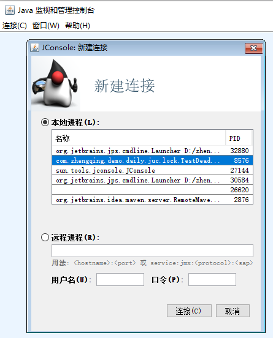
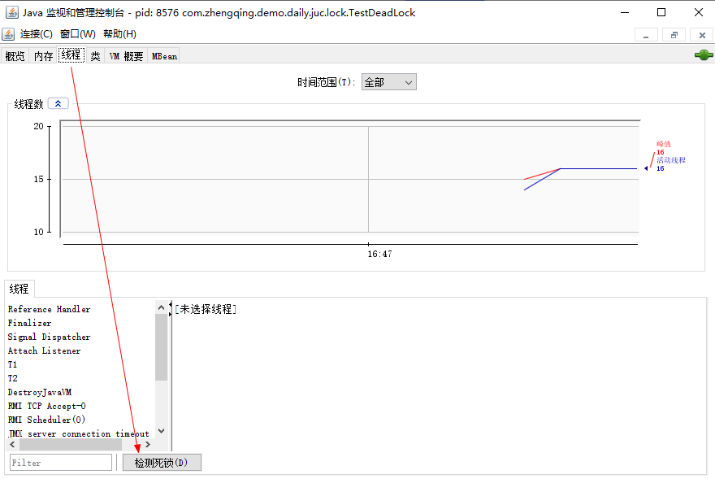
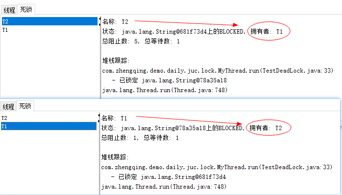

# 死锁


### 一、测试死锁

```java
import java.util.concurrent.TimeUnit;

public class TestDeadLock {
    public static void main(String[] args) {
        String lockA = "lockA";
        String lockB = "lockB";
        new Thread(new MyThread(lockA, lockB), "T1").start();
        new Thread(new MyThread(lockB, lockA), "T2").start();
    }
}

class MyThread implements Runnable {
    private String lockA;
    private String lockB;

    public MyThread(String lockA, String lockB) {
        this.lockA = lockA;
        this.lockB = lockB;
    }

    @Override
    public void run() {
        synchronized (this.lockA) {
            System.out.println(Thread.currentThread().getName() + " lock:" + this.lockA + "=>get" + this.lockB);
            try {
                TimeUnit.SECONDS.sleep(2);
            } catch (InterruptedException e) {
                e.printStackTrace();
            }
            synchronized (this.lockB) {
                System.out.println(Thread.currentThread().getName() + " lock:" + this.lockB + "=>get" + this.lockA);
            }
        }
    }
}
```

### 二、查看死锁

#### 法一：命令

1. 日志
2. 堆栈

```shell
# 查看PID(进程ID)
jps -l
# 查看问题 -- 打印出 Java 应用程序中所有线程的堆栈跟踪信息
jstack PID
```

```shell
Found one Java-level deadlock:
=============================
"T2":
  waiting to lock monitor 0x000001b4a5b5bde8 (object 0x000000074114f870, a java.lang.String),
  which is held by "T1"
"T1":
  waiting to lock monitor 0x000001b4a5b5e468 (object 0x000000074114f8a8, a java.lang.String),
  which is held by "T2"

Java stack information for the threads listed above:
===================================================
"T2":
        at com.zhengqing.demo.daily.juc.lock.MyThread.run(TestDeadLock.java:33)
        - waiting to lock <0x000000074114f870> (a java.lang.String)
        - locked <0x000000074114f8a8> (a java.lang.String)
        at java.lang.Thread.run(Thread.java:748)
"T1":
        at com.zhengqing.demo.daily.juc.lock.MyThread.run(TestDeadLock.java:33)
        - waiting to lock <0x000000074114f8a8> (a java.lang.String)
        - locked <0x000000074114f870> (a java.lang.String)
        at java.lang.Thread.run(Thread.java:748)

Found 1 deadlock.
```

#### 法二：图形化

`win + r` -> `jconsole`

选择进程


`线程` -> `检测死锁`


