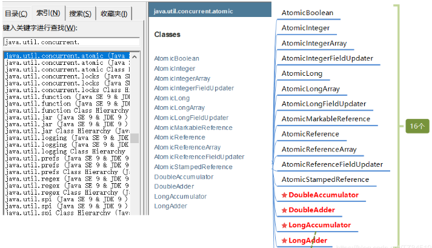
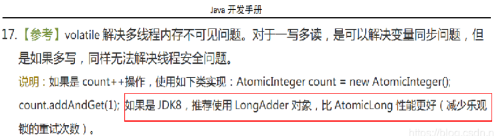
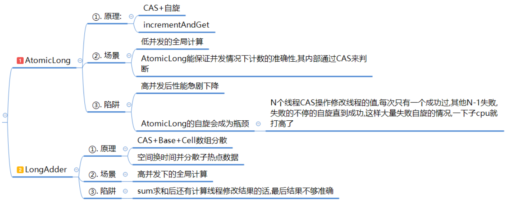

# 原子类

> 接下来我们会去介绍18罗汉以及LongAdder底层实现原理  
> (1). 基本类型原子类(AtomicInteger、AtomicBoolean、AtomicLong)  
> (2). 数组类型原子类 (AtomicIntegerArray、AtomicLongArray、AtomicReferenceArray)  
> (3). 引用类型原子类 (AtomicReference、AtomicStampedReference、AtomicMarkableReference)  
> (4). 对象的属性修改原子类 (AtomicIntegerFieldUp dater、AtomicLongFieldUpdater、AtomicRefere nceFieldUpdater)  
> (5). 原子操作增强类(DoubleAccumulator 、DoubleAdder 、LongAccumulator 、LongAdder)  
> (6). 第17位罗汉:Striped64 第18位罗汉: Number

### 一、atomic是什么？

#### 1、atomic是原子类,主要有如下：



#### 2、Java开发手册中说明：



### 二、基本类型原子类(AtomicInteger、AtomicBoolean、AtomicLong)

#### 1、常用API简介

| 方法                                           | 解释                  |
|----------------------------------------------|---------------------|
| public final int get()                       | 获取当前的值              |
| public final int getAndSet(int newValue)     | 获取到当前的值,并设置新的值      |
| public final int getAndIncrement()           | 获取当前的值,并自增          |
| public final int getAndDecrement()           | 获取到当前的值,并自减         |
| public final int getAndAdd(int delta)        | 获取到当前的值,并加上预期的值     |
| public final int incrementAndGet( )          | 返回的是加1后的值           |
| boolean compareAndSet(int expect,int update) | 如果输入的数值等于预期值,返回true |

#### 2、AtomicInteger解决 i++ 多线程下不安全问题

```java
package com.zhengqing.demo.daily.juc.atomic;

import java.util.concurrent.CountDownLatch;
import java.util.concurrent.atomic.AtomicInteger;

public class Test_01_AtomicInteger {
    public static void main(String[] args) throws InterruptedException {
        AtomicInteger atomicInteger = new AtomicInteger(0);
        CountDownLatch countDownLatch = new CountDownLatch(3);
        // 3个线程循环100次
        for (int i = 0; i < 3; i++) {
            new Thread(() -> {
                try {
                    for (int j = 0; j < 100; j++) {
                        // +1
                        atomicInteger.incrementAndGet();
                    }
                } finally {
                    // -1
                    countDownLatch.countDown();
                }
            }, String.valueOf(i)).start();
        }
        // 等待所有任务完成
        countDownLatch.await();
        System.out.println(atomicInteger.get());
    }
}
```

#### 3、AtomicBoolean可以作为中断标识停止线程的方式

```java
package com.zhengqing.demo.daily.juc.atomic;

import java.util.concurrent.TimeUnit;
import java.util.concurrent.atomic.AtomicBoolean;

public class Test_02_AtomicBoolean {
    public static void main(String[] args) throws InterruptedException {
        AtomicBoolean atomicBoolean = new AtomicBoolean(false);
        new Thread(() -> {
            System.out.println(Thread.currentThread().getName() + "\t" + "coming.....");
            while (!atomicBoolean.get()) {
                System.out.println("wait...");
            }
            System.out.println(Thread.currentThread().getName() + "\t" + "over.....");
        }, "t1").start();
        TimeUnit.MILLISECONDS.sleep(1);
        new Thread(() -> {
            atomicBoolean.set(true);
        }, "t2").start();
    }
}
```

#### 4、AtomicLong的底层是CAS+自旋锁的思想,适用于低并发的全局计算,高并发后性能急剧下降,原因如下:

N个线程CAS操作修改线程的值,每次只有一个成功过,其他N-1失败,失败的不停的自旋直到成功,
这样大量失败自旋的情况,一下子cpu就打高了(AtomicLong的自旋会成为瓶颈)  
在高并发的情况下,我们使用LoadAdder

### 三、数组类型原子类 (AtomicIntegerArray、AtomicLongArray、AtomicReferenceArray)

```java
package com.zhengqing.demo.daily.juc.atomic;

import java.util.concurrent.atomic.AtomicIntegerArray;

public class Test_03_AtomicIntegerArray {
    public static void main(String[] args) throws InterruptedException {
        int[] arr = {1, 2, 3, 4, 5};
        // 创建一个新的AtomicIntegerArray，其长度与从给定数组复制的所有元素相同
        AtomicIntegerArray array = new AtomicIntegerArray(arr);
        // 创建给定长度的新AtomicIntegerArray,所有元素最初为零。
//        AtomicIntegerArray array = new AtomicIntegerArray(5);

        for (int i = 0; i < arr.length; i++) {
            System.out.println(arr[i]);
        }

        System.out.println("-------------------------------------------");

        array.getAndSet(0, 111);
        System.out.println("将数字中位置为0位置上的元素改为:" + array.get(0));
        System.out.println("数组位置为1位置上的旧值是:" + array.get(1));
        System.out.println("将数组位置为1位置上的数字进行加1的处理");
        array.getAndIncrement(1);
        System.out.println("数组位置为1位置上的新值是:" + array.get(1));
    }
}
```

### 四、引用类型原子类 (AtomicReference、AtomicStampedReference、AtomicMarkableReference)

引用类型原子类主要有三个: AtomicReference、AtomicStampedReference、AtomicMarkableReference

#### 1、使用AtomicReference来实现自旋锁案例

```java
package com.zhengqing.demo.daily.juc.atomic;

import java.util.concurrent.TimeUnit;
import java.util.concurrent.atomic.AtomicReference;

public class Test_04_AtomicReference {
    static AtomicReference<Thread> atomicReference = new AtomicReference<>();

    public void lock() {
        System.out.println(Thread.currentThread().getName() + "\t" + "coming.....");
        while (!atomicReference.compareAndSet(null, Thread.currentThread())) {

        }
    }

    public void unlock() {
        System.out.println(Thread.currentThread().getName() + "\t" + "over.....");
        atomicReference.compareAndSet(Thread.currentThread(), null);
    }

    public static void main(String[] args) throws InterruptedException {
        Test_04_AtomicReference lock = new Test_04_AtomicReference();
        new Thread(() -> {
            lock.lock();
            try {
                TimeUnit.SECONDS.sleep(3);
            } catch (InterruptedException e) {
                e.printStackTrace();
            }
            lock.unlock();
        }, "t1").start();

        new Thread(() -> {
            lock.lock();
            lock.unlock();
        }, "t2").start();
    }
}
```

#### 2、AtomicStampedReference 解决ABA问题

1. 携带版本号的引用类型原子类,可以解决ABA问题
2. 解决修改过几次
3. 状态戳原子引用

```java
package com.zhengqing.demo.daily.juc.atomic;

import java.util.concurrent.TimeUnit;
import java.util.concurrent.atomic.AtomicReference;
import java.util.concurrent.atomic.AtomicStampedReference;

public class Test_05_AtomicStampedReference_ABA {
    private static AtomicReference<Integer> atomicReference = new AtomicReference<>(100);
    private static AtomicStampedReference<Integer> stampedReference = new AtomicStampedReference<>(100, 1);

    public static void main(String[] args) {
        System.out.println("===以下是ABA问题的产生===");
        new Thread(() -> {
            atomicReference.compareAndSet(100, 101);
            atomicReference.compareAndSet(101, 100);
        }, "t1").start();

        new Thread(() -> {
            //先暂停1秒 保证完成ABA
            try {
                TimeUnit.SECONDS.sleep(1);
            } catch (InterruptedException e) {
                e.printStackTrace();
            }
            System.out.println(atomicReference.compareAndSet(100, 2019) + "\t" + atomicReference.get());
        }, "t2").start();
        try {
            TimeUnit.SECONDS.sleep(2);
        } catch (InterruptedException e) {
            e.printStackTrace();
        }

        System.out.println("===以下是ABA问题的解决===");

        new Thread(() -> {
            int stamp = stampedReference.getStamp();
            System.out.println(Thread.currentThread().getName() + "\t 第1次版本号" + stamp + "\t值是" + stampedReference.getReference());
            // 暂停1秒钟 等t4
            try {
                TimeUnit.SECONDS.sleep(1);
            } catch (InterruptedException e) {
                e.printStackTrace();
            }

            stampedReference.compareAndSet(100, 101, stampedReference.getStamp(), stampedReference.getStamp() + 1);
            System.out.println(Thread.currentThread().getName() + "\t 第2次版本号" + stampedReference.getStamp() + "\t值是" + stampedReference.getReference());
            stampedReference.compareAndSet(101, 100, stampedReference.getStamp(), stampedReference.getStamp() + 1);
            System.out.println(Thread.currentThread().getName() + "\t 第3次版本号" + stampedReference.getStamp() + "\t值是" + stampedReference.getReference());
        }, "t3").start();

        new Thread(() -> {
            int stamp = stampedReference.getStamp();
            System.out.println(Thread.currentThread().getName() + "\t 第1次版本号" + stamp + "\t值是" + stampedReference.getReference());
            // 保证t3线程完成1次ABA
            try {
                TimeUnit.SECONDS.sleep(3);
            } catch (InterruptedException e) {
                e.printStackTrace();
            }
            boolean result = stampedReference.compareAndSet(100, 2019, stamp, stamp + 1);
            System.out.println(Thread.currentThread().getName() + "\t 修改成功否" + result + "\t最新版本号" + stampedReference.getStamp());
            System.out.println("最新的值\t" + stampedReference.getReference());
        }, "t4").start();
    }
}
```

#### 3、AtomicMarkableReference 解决ABA问题

1. 原子更新带有标志位的引用类型对象
2. 解决是否修改(它的定义就是将状态戳简化位true|false),类似一次性筷子
3. 状态戳(true/false)原子引用

```java
package com.zhengqing.demo.daily.juc.atomic;

import java.util.concurrent.TimeUnit;
import java.util.concurrent.atomic.AtomicMarkableReference;

public class Test_06_AtomicMarkableReference_ABA {
    static AtomicMarkableReference<Integer> markableReference = new AtomicMarkableReference<>(100, false);

    public static void main(String[] args) {
        new Thread(() -> {
            boolean marked = markableReference.isMarked();
            System.out.println(Thread.currentThread().getName() + "\t 默认标识" + marked);
            try {
                TimeUnit.SECONDS.sleep(1);
            } catch (InterruptedException e) {
                e.printStackTrace();
            }
            markableReference.compareAndSet(100, 200, marked, !marked);
            System.out.println(Thread.currentThread().getName() + "\t 修改后" + markableReference.isMarked());
        }, "t1").start();

        new Thread(() -> {
            boolean marked = markableReference.isMarked();
            System.out.println(Thread.currentThread().getName() + "\t 默认标识" + marked);
            try {
                TimeUnit.SECONDS.sleep(2);
            } catch (InterruptedException e) {
                e.printStackTrace();
            }
            boolean result = markableReference.compareAndSet(100, 666, marked, !marked);
            System.out.println(Thread.currentThread().getName() + "\t 修改结果：" + result + " 值：" + markableReference.getReference() + "\t" + markableReference.isMarked());
        }, "t2").start();
    }
}
```

- AtomicStampedReference：版本号,修改一次 +1
- AtomicMarkableReference：true、false 是否修改过

### 五、对象的属性修改原子类 (AtomicIntegerFieldUpdater、AtomicLongFieldUpdater、AtomicReferenceFieldUpdater)

使用目的：以一种线程安全的方式操作非线程安全对象内的某些字段  
(是否可以不要锁定整个对象,减少锁定的范围,只关注长期、敏感性变化的某一个字段,而不是整个对象,已达到精确加锁+节约内存的目的)

使用要求：

1. 更新的对象属性必须使用public volatile修饰符
2. 因为对象的属性修改类型原子类都是抽象类,所以每次使用都必须使用静态方法newUpdater()创建一个更新器,并且需要设置想要更新的类和属性

你在哪里用到了volatile

1. 单例设置模式(双端检锁机制)
2. AtomicIntegerFieldUpdater、AtomicLongFieldUpdater、AtomicReferenceFieldUpdater

#### 1、AtomicIntegerFieldUpdater:原子更新对象中int类型字段的值

```java
package com.zhengqing.demo.daily.juc.atomic;

import java.util.concurrent.CountDownLatch;
import java.util.concurrent.atomic.AtomicIntegerFieldUpdater;

public class Test_07_AtomicIntegerFieldUpdater {

    static class BankAccount {
        String username = "qq";

        // 更新的对象必须使用 public volatile 修饰符
        public volatile int money = 0;

        private static AtomicIntegerFieldUpdater<BankAccount> atomicIntegerFieldUpdater = AtomicIntegerFieldUpdater.newUpdater(BankAccount.class, "money");

        public void addMoney(BankAccount bankAccount) {
            atomicIntegerFieldUpdater.incrementAndGet(bankAccount);
        }
    }

    public static void main(String[] args) throws InterruptedException {
        final int size = 1000;
        CountDownLatch countDownLatch = new CountDownLatch(size);
        BankAccount bankAccount = new BankAccount();
        for (int j = 0; j < size; j++) {
            new Thread(() -> {
                bankAccount.addMoney(bankAccount);
                countDownLatch.countDown();
            }).start();
        }
        countDownLatch.await();
        System.out.println(bankAccount.money);
    }
}
```

#### 2、AtomicReferenceFieldUpdater:原子更新引用类型字段的值

```java
package com.zhengqing.demo.daily.juc.atomic;

import java.util.concurrent.TimeUnit;
import java.util.concurrent.atomic.AtomicReferenceFieldUpdater;

//需求:多线程并发调用一个类的初始化方法,如果未被初始化过,将执行初始化工作,要求只能初始化一次
public class Test_08_AtomicReferenceFieldUpdater {
    static class MyVar {
        public volatile Boolean flag = Boolean.FALSE;
        AtomicReferenceFieldUpdater<MyVar, Boolean> atomicReferenceFieldUpdater = AtomicReferenceFieldUpdater.newUpdater(MyVar.class, Boolean.class, "flag");

        public void init(MyVar myVar) {
            if (this.atomicReferenceFieldUpdater.compareAndSet(myVar, Boolean.FALSE, Boolean.TRUE)) {
                System.out.println(Thread.currentThread().getName() + "\t" + "init...");
                try {
                    TimeUnit.SECONDS.sleep(2);
                } catch (InterruptedException e) {
                    e.printStackTrace();
                }
                System.out.println(Thread.currentThread().getName() + "\t" + "init... over");
            } else {
                System.out.println(Thread.currentThread().getName() + "\t" + "------其它线程正在初始化...");
            }
        }
    }

    public static void main(String[] args) {
        MyVar myVar = new MyVar();
        for (int i = 1; i <= 5; i++) {
            new Thread(() -> {
                myVar.init(myVar);
            }, "t" + i).start();
        }
    }
}
```

### 六、原子操作增强类(DoubleAccumulator 、DoubleAdder 、LongAccumulator 、LongAdder)

#### 1、常用API

| 方法                  | 解释                                                                  |
|---------------------|---------------------------------------------------------------------|
| void add(long x)    | 将当前的value加1                                                         |
| void increment( )   | 将当前的value加1                                                         |
| void decrement( )   | 将当前value减1                                                          |
| long sum( )         | 返回当前的值,特别注意,在没有并发更新value的情况下，sum会返回一个精确值,在存在并发的情况下,sum不保证返回精确值      |
| long longvale       | 等价于long sum()，将value重置为0,可用于替换重新new一个LongAdder,但次方法只可以在没有并发更新的情况下使用 |
| long sumThenReset() | 获取当前value,并将value重置为0                                               |

#### 2、入门讲解(LongAdder|LongAccumulator区别)

1. LongAdder 只能用来计算加法、减法,且从零开始计算
2. LongAccumulator 提供了自定义的函数操作

```java
package com.zhengqing.demo.daily.juc.atomic;

import java.util.concurrent.atomic.LongAccumulator;
import java.util.concurrent.atomic.LongAdder;

public class Test_09_LongAdder_LongAccumulator {
    public static void main(String[] args) {
        // LongAdder只能做加减法,不能做乘除法
        LongAdder longAdder = new LongAdder();
        longAdder.increment();
        longAdder.increment();
        longAdder.increment();
        longAdder.decrement();

        System.out.println(longAdder.longValue());

        // 可自定义计算 eg：加法
        LongAccumulator longAccumulator = new LongAccumulator((left, right) -> left + right, 0);
        longAccumulator.accumulate(1);
        longAccumulator.accumulate(3);
        System.out.println(longAccumulator.longValue());
    }
}
```

#### 3、LongAdder高性能对比code演示

```java
package com.zhengqing.demo.daily.juc.atomic;

import java.util.concurrent.CountDownLatch;
import java.util.concurrent.atomic.AtomicInteger;
import java.util.concurrent.atomic.AtomicLong;
import java.util.concurrent.atomic.LongAccumulator;
import java.util.concurrent.atomic.LongAdder;

/**
 * 50个线程,每个线程100w次,总点赞数出来
 */
public class Test_10_LongAdder {

    static class ClickNumber {
        int number = 0;

        // 1、使用synchronized实现number++
        public synchronized void add_synchronized() {
            this.number++;
        }

        // 2、使用AtomicInteger
        AtomicInteger atomicInteger = new AtomicInteger();

        public void add_atomicInteger() {
            this.atomicInteger.incrementAndGet();
        }

        // 3、使用AtomicLong
        AtomicLong atomicLong = new AtomicLong();

        public void add_atomicLong() {
            this.atomicLong.incrementAndGet();
        }

        // 4、使用LongAdder
        LongAdder adder = new LongAdder();

        public void add_longAdder() {
            this.adder.increment();
        }

        // 5、使用LongAccumulator
        LongAccumulator accumulator = new LongAccumulator((x, y) -> x + y, 0);

        public void add_longAccumulater() {
            this.accumulator.accumulate(1);
        }
    }

    public static final int SIZE_THREAD = 50;

    public static void main(String[] args) throws InterruptedException {
        CountDownLatch countDownLatch = new CountDownLatch(SIZE_THREAD);
        ClickNumber clickNumber = new ClickNumber();
        long startTime = System.currentTimeMillis();
        // 50个线程和每个线程点在100w次
        for (int i = 1; i <= SIZE_THREAD; i++) {
            new Thread(() -> {
                try {
                    for (int j = 1; j <= 100000; j++) {
                        // 我们明显可以看到调用LongAdder性能最好
//                        clickNumber.add_synchronized(); // 222ms
//                        clickNumber.add_atomicInteger(); // 98毫秒
//                        clickNumber.add_atomicLong(); // 109毫秒
                        clickNumber.add_longAdder(); // 62毫秒
//                        clickNumber.add_longAccumulater(); // 49毫秒
                    }
                } finally {
                    countDownLatch.countDown();
                }
            }, String.valueOf(i)).start();
        }
        countDownLatch.await();
        long endTime = System.currentTimeMillis();
        System.out.println("-----耗时:" + (endTime - startTime) + "毫秒" + "\t");
        System.out.println(clickNumber.adder.longValue());
    }

}
```


