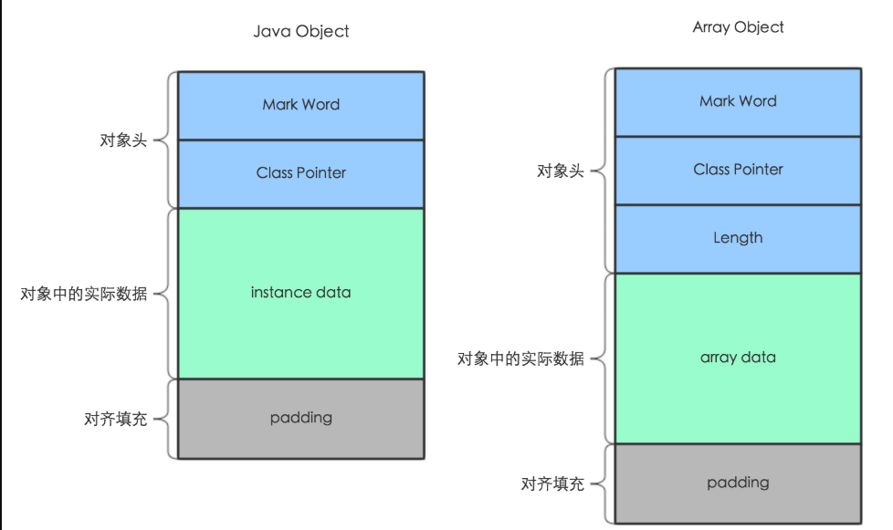
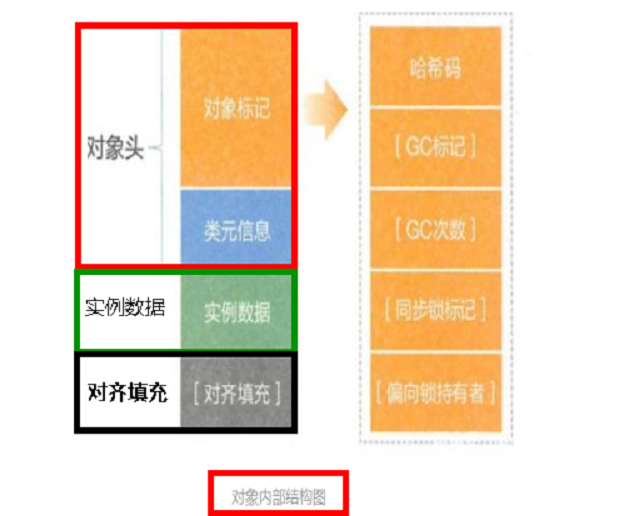
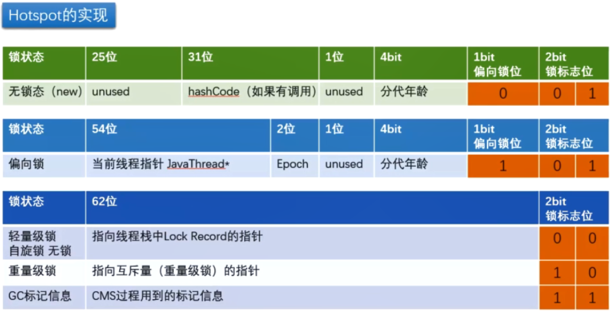
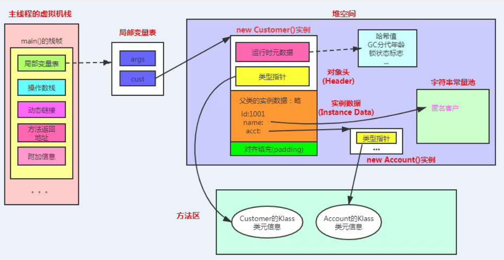

# Java对象内存布局和对象头

### 一、对象的存储布局

一个对象在堆内存中的存储布局是由三部分来组成的:

* 对象头
* 实例数据
* 对齐填充(保证8个字节的倍数)



### 二、对象头结构

java对象的对象头由两部分构成:

* 对象标记(又称为Mark Word)
* 类元信息(又称为类型指针)

#### 1、Mark Word的作用

默认存储对象的HashCode、分代年龄和锁标志位等信息。  
这些信息都是与对象自身定义无关的数据，所以MarkWord被设计成一个非固定的数据结构以便在极小的空间内存存储尽量多的数据。  
它会根据对象的状态复用自己的存储空间，也就是说在运行期间MarkWord里存储的数据会随着锁标志位的变化而变化。  


他的存储内容是什么

| 存储内容                | 标志位 | 状态        |
|---------------------|-----|-----------|
| 对象哈希码,对象分代年龄        | 01  | 未锁定       |
| 指向锁记录的指针            | 00  | 轻量级锁定     |
| 指向重量级锁的指针           | 10  | 膨胀(重量级锁定) |
| 空,不需要记录信息           | 11  | GC标记      |
| 偏向线程ID,偏向时间戳,对象分带年龄 | 01  | 可偏向       |

在64位系统中，Mark Word占了8个字节(就是64bit大小的存储容量),其具体的存储结构为:  


> 小知识点:GC年龄采用4位bit存储，最大也只能为15，所以MaxTenuringThreshold参数默认值就是15,也不能超过15

#### 2、类型指针

直接指向了方法区内的kclass信息  


#### 3、对象头的大小

在64位系统中,Mark Word占用了8个字节,类型指针占用了8个字节,对象头总计是16个字节的大小

#### 4、实例数据

存放类的属性(Field)数据信息，包括父类的属性信息，如果是数组的实例部分还包括数组的长度，这部分内存按4字节对齐。

#### 5、对齐填充

虚拟机要求对象起始地址必须是8字节的整数倍。填充数据不是必须存在的，仅仅是为了字节对齐，这部分内存按8字节补充对齐。

#### 6、new Object 占多少字节？

引入JOL依赖

> 用来分析Java虚拟机和对象的一些基础信息

```
<dependency>
    <groupId>org.openjdk.jol</groupId>
    <artifactId>jol-core</artifactId>
    <version>0.16</version>
</dependency>
```

测试代码

```
public static void main(String[] args) {
    System.out.println(ClassLayout.parseInstance(new Object()).toPrintable());
}
```

日志

```shell
java.lang.Object object internals:
OFF  SZ   TYPE DESCRIPTION               VALUE
  0   8        (object header: mark)     0x0000000000000001 (non-biasable; age: 0)
  8   4        (object header: class)    0x200001e5
 12   4        (object alignment gap)    
Instance size: 16 bytes
Space losses: 0 bytes internal + 4 bytes external = 4 bytes total
```

如果Object是个空对象,那么new Object 就是占16个字节

如果不为空

```
static class MyObject {
    int i =89;
    long a = 889;
    char b = 'b';
}

public static void main(String[] args) {
    System.out.println(ClassLayout.parseInstance(new MyObject()).toPrintable());
}
```

日志

```shell
com.zhengqing.demo.daily.juc.TestJol$MyObject object internals:
OFF  SZ   TYPE DESCRIPTION               VALUE
  0   8        (object header: mark)     0x0000000000000001 (non-biasable; age: 0)
  8   4        (object header: class)    0x2000c043
 12   4    int MyObject.i                89
 16   8   long MyObject.a                889
 24   2   char MyObject.b                b
 26   6        (object alignment gap)    
Instance size: 32 bytes
Space losses: 0 bytes internal + 6 bytes external = 6 bytes total
```

### 三、压缩指针介绍

#### 1、尾巴参数说明

显示JVM自带的的一些默认参数 `java -XX:+PrintCommandLineFlags -version`

64位的JVM自己默认开启了压缩指针 `-XX:+UseCompressedClassPointers`

#### 2、开启压缩与不开启的区别

开启压缩时,类型指针就为4个字节,不开启的时候类型指针为8个字节
