# AQS

### 一、AQS是什么？

volatile+cas机制实现的锁模板，保证了代码的同步性和可见性，而AQS封装了线程阻塞等待挂起，解锁唤醒其它线程的逻辑。
AQS子类只需根据状态变量，判断是否可获取锁，是否释放锁，使用LockSupport挂起、唤醒线程即可。

* ①. 是用来构建锁或者其它同步器组件的重量级基础框架及整个JUC体系的基石,通过内置的CLH(FIFO)
  队列的变种来完成资源获取线程的排队工作,将每条将要去抢占资源的线程封装成一个Node节点来实现锁的分配,有一个int类变量表示持有锁的状态(
  private volatile int state),通过CAS完成对status值的修改(0表示没有,1表示阻塞)  
  CLH:Craig、Landin and Hagersten 队列,是一个单向链表,AQS中的队列是CLH变体的虚拟双向队列FIFO  
  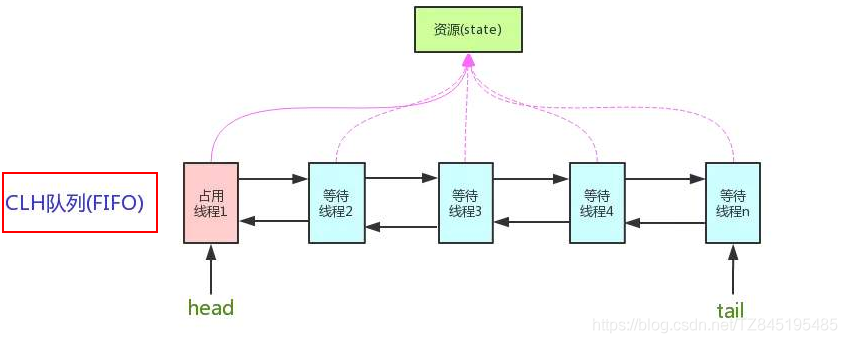
* ②. AQS为什么是JUC内容中最重要的基石  
  (ReentrantLock | CountDownLatch | ReentrantReadWriteLock | Semaphore)
  > 通过代码解释为什么JUC是最重要的基石  
  > (1). 和AQS有关的  
  > 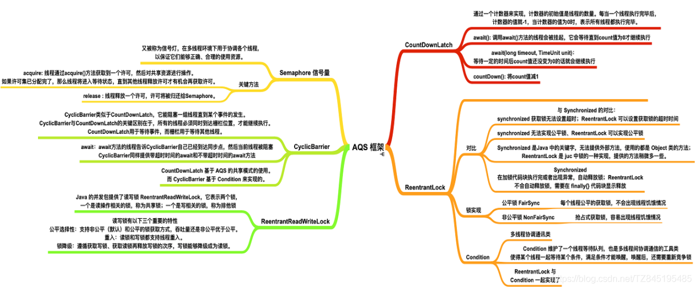
  > 2).ReentrantLock  
  > 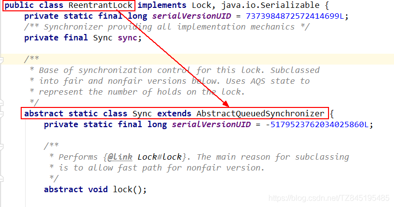  
  > (3).CountDownLatch  
  > 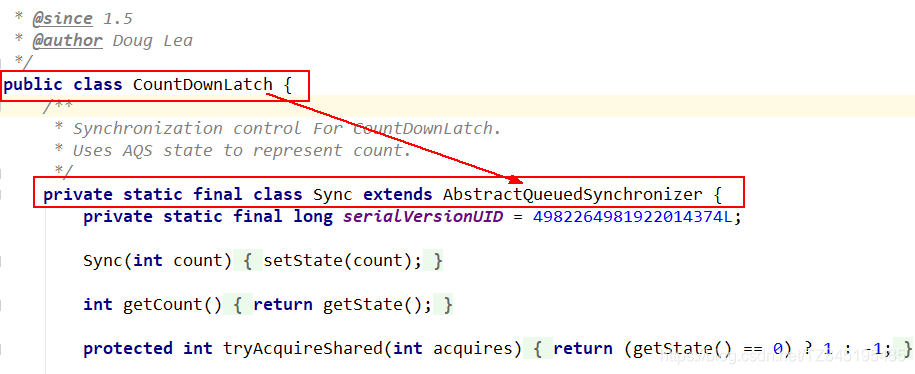  
  > (4).ReentrantReadWriteLock  
  > 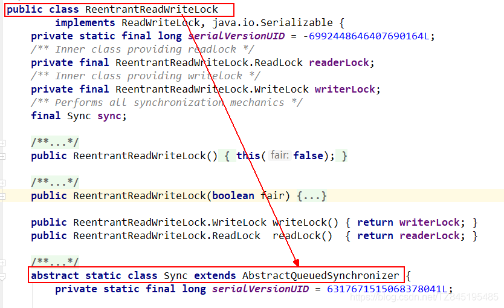
  > 5). Semaphore  
  > 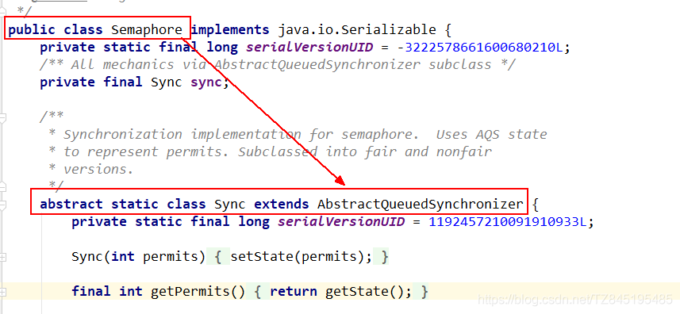
* ③. 锁,面向锁的使用者(定义了程序员和锁交互的使用层API,隐藏了实现细节,你调用即可)  
  同步器,面向锁的实现者(
  比如Java并发大神Douglee,提出统一规范并简化了锁的实现,屏蔽了同步状态管理、阻塞线程排队和通知、唤醒机制等。)
* ④. 加锁会导致阻塞、有阻塞就需要排队,实现排队必然需要队列
* ⑤.
  如果共享资源被占用,就需要一定的阻塞等待唤醒机制来保证锁分配。这个机制主要用的是CLH队列的变体实现的,将暂时获取不到锁的线程加入到队列中,这个队列就是AQS的抽象表现。它将请求共享资源的线程封装成队列的结点(
  Node) ,通过CAS、自旋以及LockSuport.park()的方式,维护state变量的状态,使并发达到同步的效果  
  

### 二、AQS内部体系架构

* ①. AQS内部架构图:  
  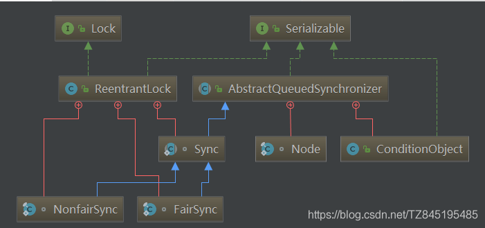  
  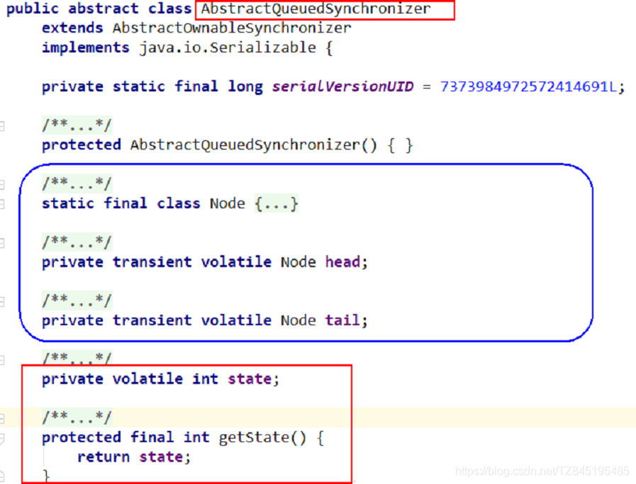
* ②. 详解AQS内部代码有什么？  
  
* ③. CLH队列(三个大牛的名字组成),为一个双向队列  
  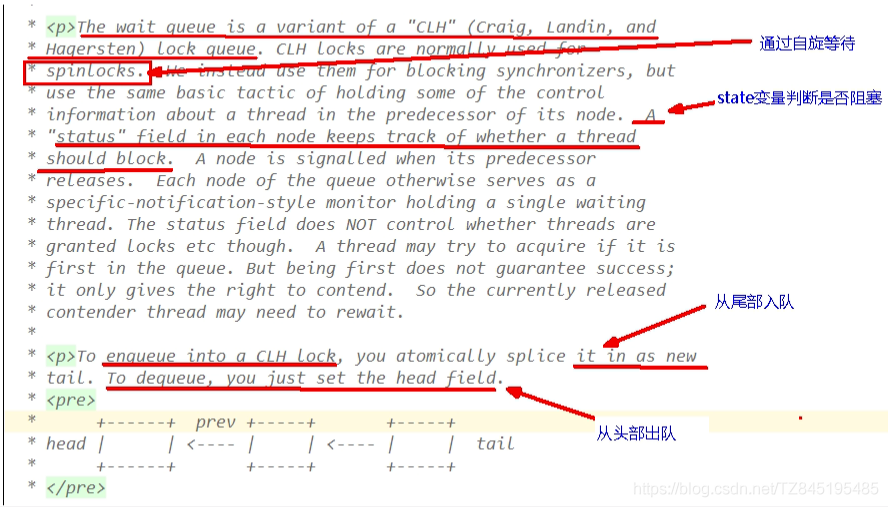
* ④. 内部结构(Node此类的讲解)  
  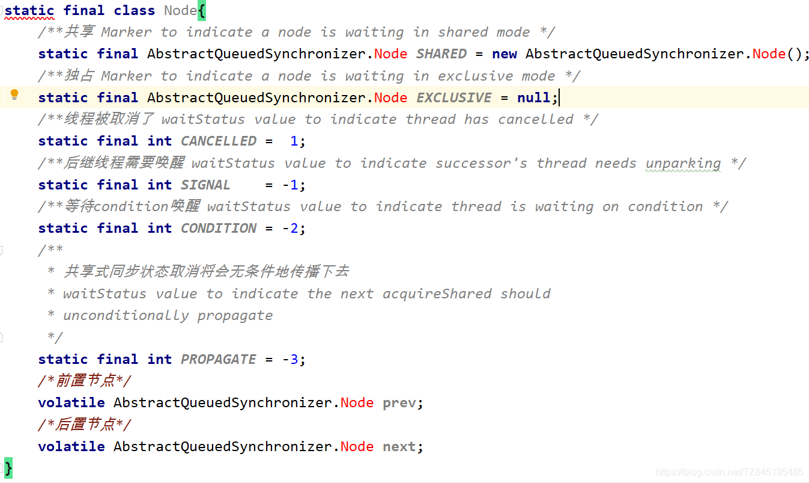  
  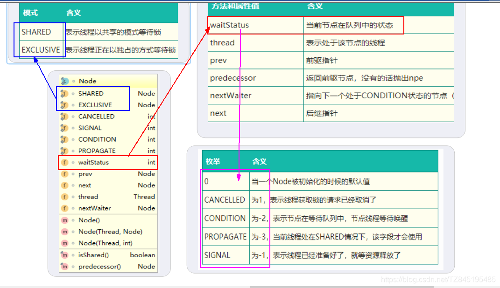
* ⑤. AQS同步队列的基本结构  
  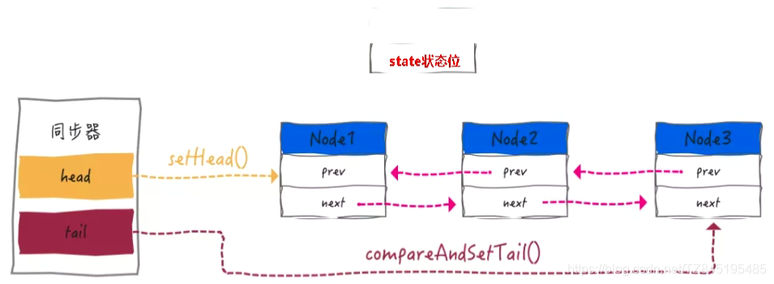

### 三、ReentrantLock开始解读AQS

> 写在最前面:  
> (1). 本次讲解我们走最常用的,lock/unlock作为案例突破口  
> (2). 我相信你应该看过源码了,那么AQS里面有个变量叫State,它的值有几种？3个状态:没占用是0,占用了是1,大于1是可重入锁  
> (3). 如果AB两个线程进来了以后,请问这个总共有多少个Node节点？答案是3个,其中队列的第一个是傀儡节点(哨兵节点)  
> 业务图:  
> 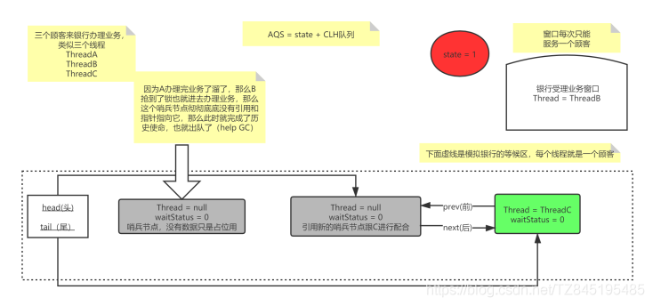

#### 1、代码展示

```
public class AQSDemo {
    public static void main(String[] args) {
        ReentrantLock lock = new ReentrantLock();
        //带入一个银行办理业务的案例来模拟我们的AQS如何进行线程的管理和通知唤醒机制
        //3个线程模拟3个来银行网点,受理窗口办理业务的顾客
        //A顾客就是第一个顾客,此时受理窗口没有任何人,A可以直接去办理
        new Thread(() -> {
                lock.lock();
                try{
                    System.out.println("-----A thread come in");

                    try { TimeUnit.MINUTES.sleep(20); }catch (Exception e) {e.printStackTrace();}
                }finally {
                    lock.unlock();
                }
        },"A").start();

        //第二个顾客,第二个线程---》由于受理业务的窗口只有一个(只能一个线程持有锁),此时B只能等待,
        //进入候客区
        new Thread(() -> {
            lock.lock();
            try{
                System.out.println("-----B thread come in");
            }finally {
                lock.unlock();
            }
        },"B").start();

        //第三个顾客,第三个线程---》由于受理业务的窗口只有一个(只能一个线程持有锁),此时C只能等待,
        //进入候客区
        new Thread(() -> {
            lock.lock();
            try{
                System.out.println("-----C thread come in");
            }finally {
                lock.unlock();
            }
        },"C").start();
    }
}

```

#### 2、从最简单的lock方法开始看看公平和非公平

* ①. 通过ReentrantLock的源码来讲解公平锁和非公平锁  
  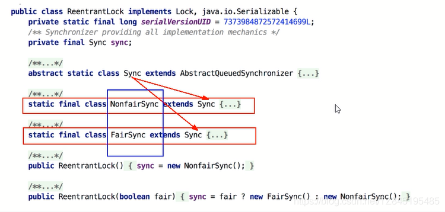  
  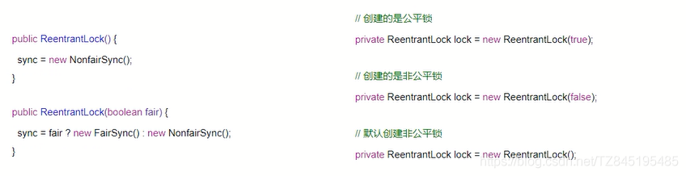
* ②. 可以明显看出公平锁与非公平锁的lock()方法唯一的区别就在于公平锁在获取同步状态时多了一个限制条件:
  hasQueuedPredecessors()  
  hasQueuedPredecessors是公平锁加锁时判断等待队列中是否存在有效节点的方法  
  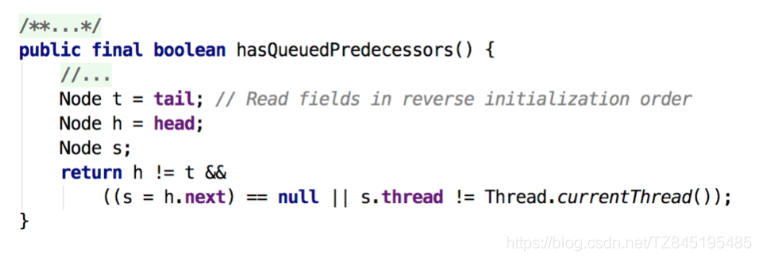

#### 3、lock()

* ①. lock.lock( ) 源码  
  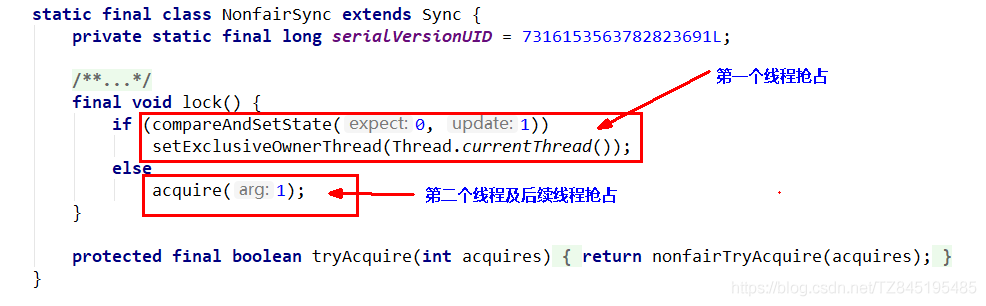
* ②. acquire( ):源码和3大流程走向  
  

#### 4、tryAcquire(arg)

* ①.本次走非公平锁方向  
  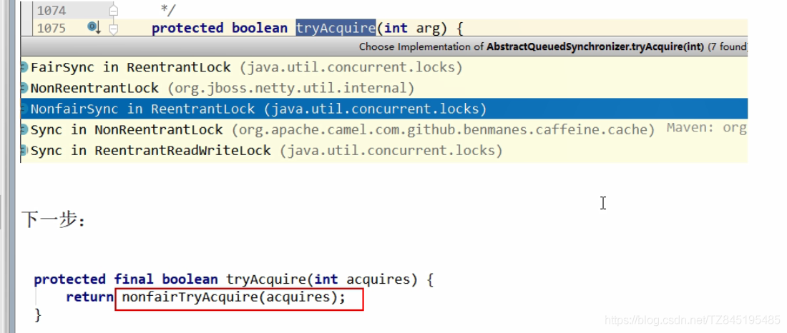
* ②. nonfairTryAcquire(acquires)  
  return false(继续推进条件,走下一步方法addWaiter)  
  return true(结束)  
  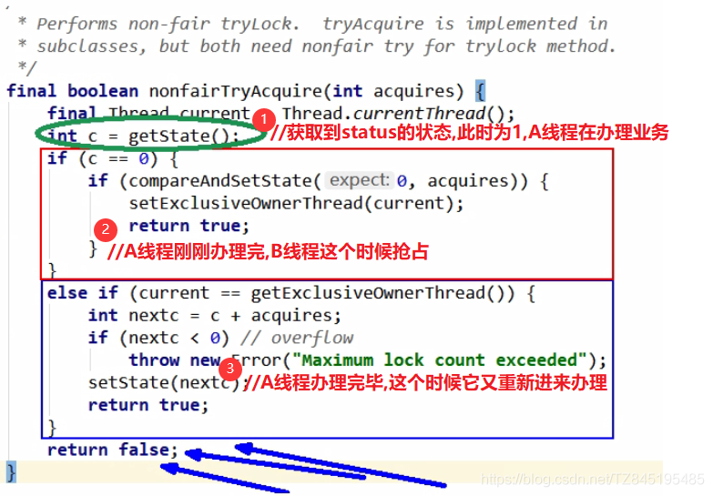

#### 5、addWaiter(Node.EXCLUSIVE)

> 假如3号ThreadC线程进来  
> (1). prev  
> (2). compareAndSetTail  
> (3). next

* ①. addWaiter(Node mode )  
  双向链表中,第一个节点为虚节点(也叫哨兵节点),其实并不存储任何信息,只是占位。
  真正的第一个有数据的节点,是从第二个节点开始的  
  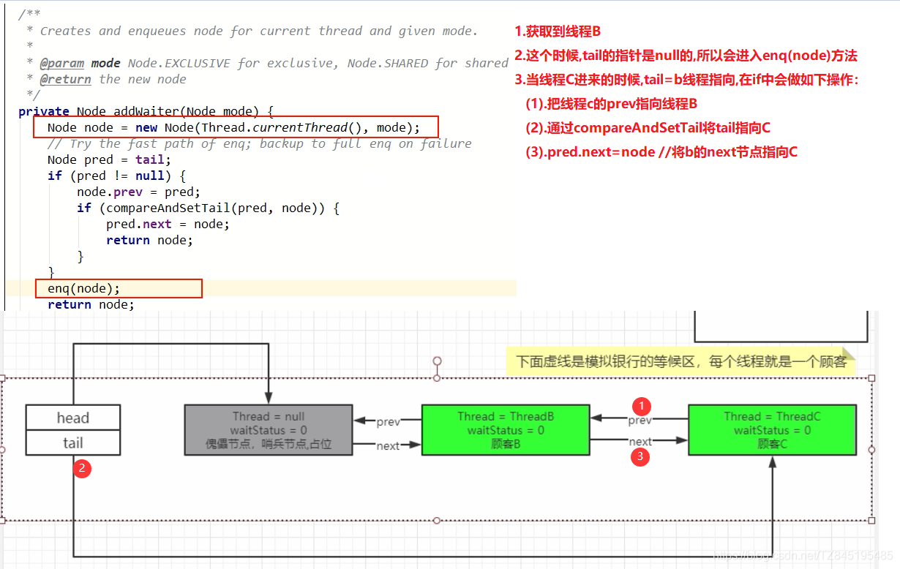
* ②. enq(node);  
  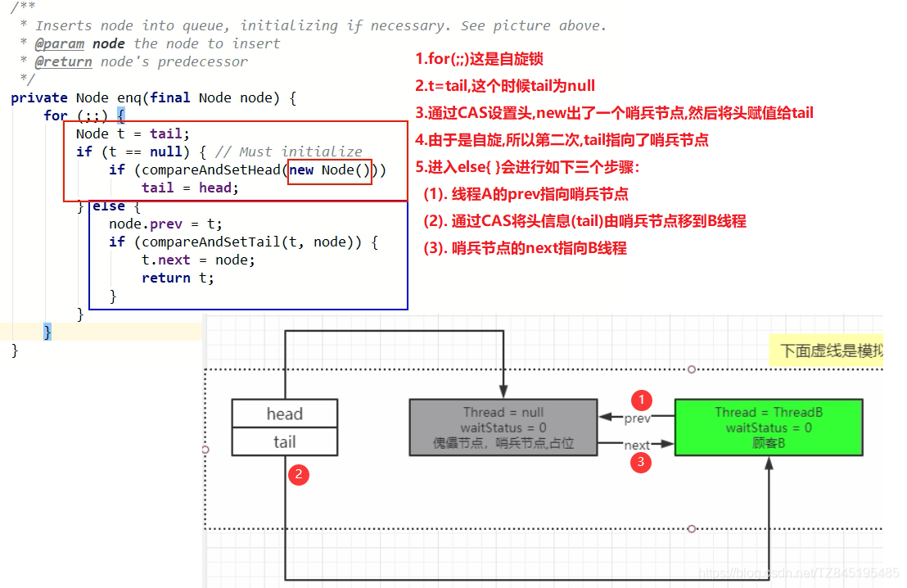
* ③. B、C线程都排好队了效果图如下:  
  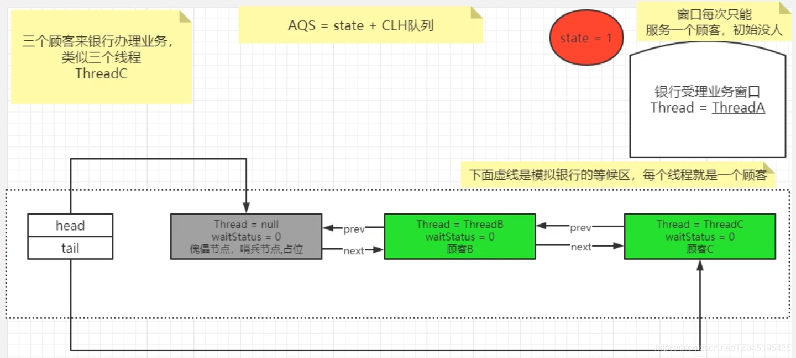

#### 6、acquireQueued(addWaiter(Node.EXCLUSIVE), arg)

* ①. acquireQueued  
  (会调用如下方法:shouldParkAterFailedAcquire和parkAndCheckInterrupt | setHead(node) )
* ②. shouldParkAfterFailedAcquire  
  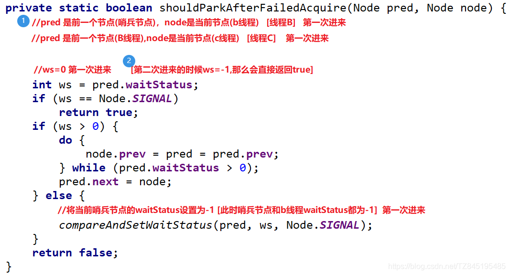
* ③. parkAndCheckInterrupt  
  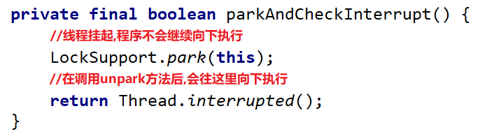
* ④. 当我们执行下图中的③表示线程B或者C已经获取了permit了  
  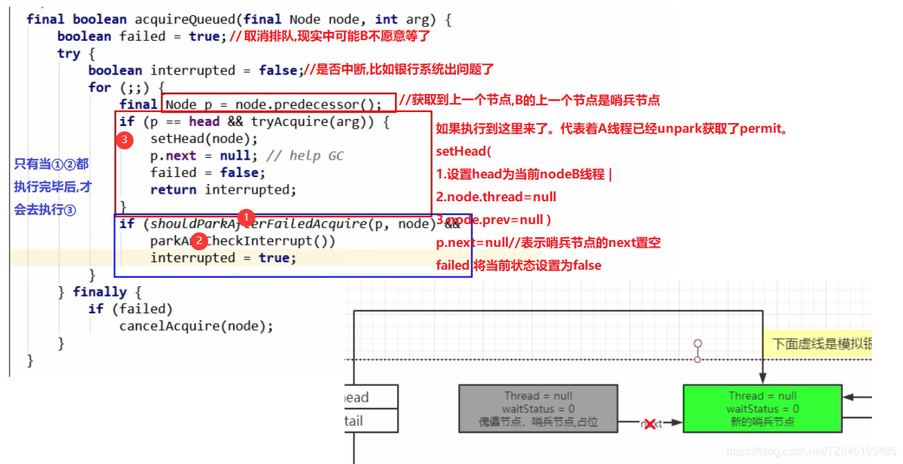
* ⑤. setHead( )方法  
  代码执行完毕后,会出现如下图所示  
  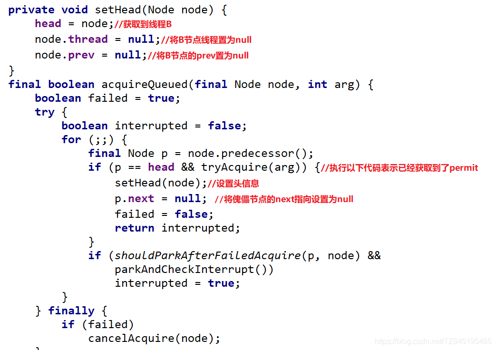

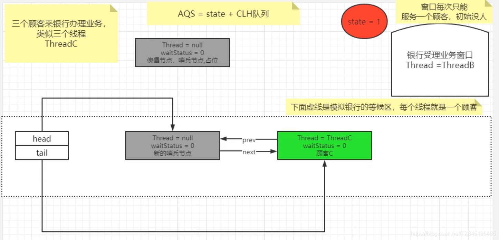

#### 7、unlock( )获取permit

* ①. release | tryRelease | unparkSuccessor(h);  
  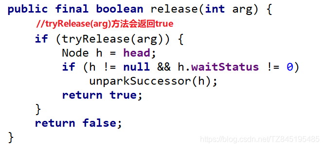
* ②. tryRelease()  
  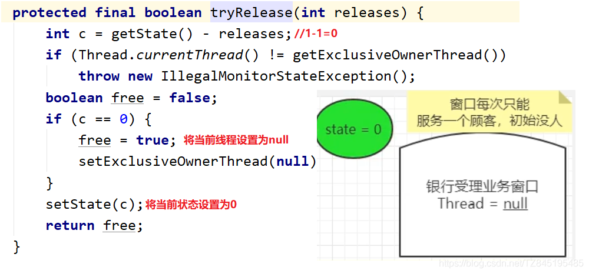
* ③. unparkSuccessor( )  
  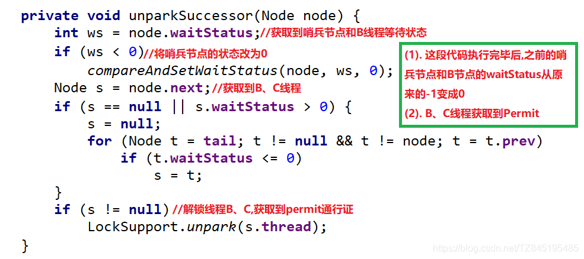

#### 8、AQS源码总结

* ①.
  业务场景,比如说我们有三个线程A、B、C去银行办理业务了,A线程最先抢到执行权开始办理业务,那么B、C两个线程就在CLH队列里面排队如图所示,注意傀儡结点和B结点的状态都会改为-1  
  
* ②. 当A线程办理好业务,离开的时候,会把傀儡结点的waitStatus从-1改为0 | 将status从1改为0,将当前线程置为null
* ③. 这个时候如果B上位,首先将status从0改为1(表示占用),把thread置为线程B |
  会执行如下图的①②③④,会触发GC,然后就把第一个灰色的傀儡结点给清除掉了,这个时候原来的B结点重新成为傀儡结点  
  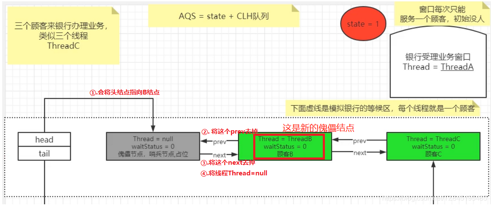


