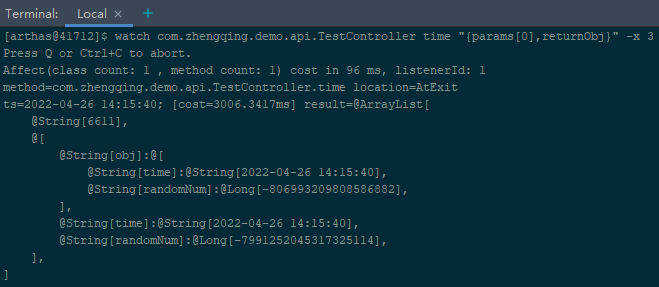

# Arthas操作

> https://alibaba.github.io/arthas/dashboard.html

### 使用

选择应用java进程


> http://127.0.0.1:3658
> 或者使用命令行进入：win+R—>cmd—>telnet 127.0.0.1 3658，同样可以出现上面的arthas语境

```shell
# 展示当前进程的信息
dashboard

# jvm参数信息...
jvm

# 查看所有线程
thread

# 查看指定线程
thread 1
thread 1 | grep 'main('

# 查找哪些线程产生了死锁
thread -b


# ------------------------------------------------------------


# 查找此包下所有类
sc *com.zhengqing.demo.api*

# 查找指定类下有哪些方法
sm com.zhengqing.demo.api.TestController


# ------------------------------------------------------------


# 将内存导出为一个文件
heapdump /tmp/dump.hprof

# 将文件从容器中拷到宿主机当前目录下 前：容器文件路径  后：宿主机路径
docker cp app:/tmp/dump.hprof $PWD


# win+r -》 jvisualvm -》 文件 -》 装入 -》 选择文件... 

# 查看 `类` 下实例数多的吃内存的类，然后去代码中看看是否有问题...

# OQL控制台 -》 查询编辑器 -》 【查询String类型的数据】输入`select s from java.lang.String s` -》 执行
```

### watch

> 监听方法执行情况: 返回值、抛出异常、入参

```shell
# 监听第一个提交参数 & 返回对象中的time字段值
watch com.zhengqing.demo.api.TestController time "{params[0],returnObj.obj.time}"

# 监听第一个提交参数 & 指定输出结果的属性遍历深度(默认为1)
watch com.zhengqing.demo.api.TestController time "{params[0],returnObj}" -x 3

# 监听异常 -n：只执行2次
watch com.zhengqing.demo.api.TestController time "{params[0],returnObj,throwExp}" -x 3 -n 2
```



### trace

> 跟踪一级方法的调用链路。

```shell
# 当我们怀疑某一个方法有问题的时候，跟踪它的时间
# trace 全限定名 方法名
trace com.zhengqing.demo.api.TestController time

# 只跟踪执行耗时超过2000ms的结果
trace com.zhengqing.demo.api.TestController time '#cost>2000'
```


### jad

> 反编译

```shell
# 反编译指定已加载类的源码
jad com.zhengqing.demo.api.TestController

# 默认情况下，反编译结果里会带有ClassLoader信息，通过--source-only选项，可以只打印源代码。方便和mc/retransform命令结合使用。
jad --source-only com.zhengqing.demo.api.TestController

# 反编译时不显示行号
jad --source-only com.zhengqing.demo.api.TestController --lineNumber false

# 方法
jad --source-only com.zhengqing.demo.api.TestController handleBusiness2 --lineNumber false
```

### ognl

> 获取静态类的静态字段

```shell
ognl '@com.zhengqing.demo.api.TestController@LOCAL_NUM'
# 或
getstatic com.zhengqing.demo.api.TestController LOCAL_NUM -x 3
```

### retransform

> 加载外部的.class文件，retransform jvm已加载的类。
> 热部署

```shell
# 反编译查看旧数据
jad com.zhengqing.demo.api.TestController time

# 自行修改编译文件 TestController.java

# 如果多次执行 retransform 加载同一个 class 文件，则会有多条 retransform entry.
retransform src/main/java/com/zhengqing/demo/api/TestController.class

# 反编译查看新数据
jad com.zhengqing.demo.api.TestController time

# 查看
retransform -l

# 删除
retransform -d 1
# 删除所有
retransform --deleteAll
```
