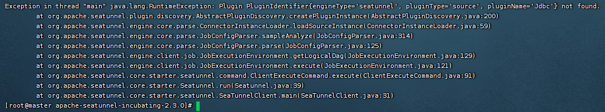

# MySQL

### 一、下载

```shell
export version="2.3.0"
wget "https://archive.apache.org/dist/incubator/seatunnel/${version}/apache-seatunnel-incubating-${version}-bin.tar.gz"
tar -xzvf "apache-seatunnel-incubating-${version}-bin.tar.gz"
```

### 二、配置

#### 1、`config/plugin_config`配置

配置需要的插件`config/plugin_config`，插件名可参考`connectors/plugins-mapping.properties`

```
--connectors-v2--
connector-jdbc
--end--
```

安装

```shell
# 先替换`bin/install-plugin.sh`中的 `${SEATUNNEL_HOME}/mvnw` 为 `mvn`  =>  使用自己本地配置的maven，不然后面安装插件会很慢...
sh bin/install-plugin.sh
# 安装后连接器在`connectors`目录下
```

#### 2、提供MySQL数据库驱动

> https://mvnrepository.com/artifact/mysql/mysql-connector-java

ex: 将 `mysql-connector-java-8.0.30.jar` 放到 `plugins/jdbc/lib/` 目录下

#### 3、新增配置文件 [`config/seatunnel-mysql.conf`](config/seatunnel-mysql.conf)

连接器配置见

- https://seatunnel.apache.org/docs/2.3.0/connector-v2/source/Jdbc
- https://seatunnel.apache.org/docs/2.3.0/connector-v2/sink/Jdbc

> `demo`库下的`t_test`表数据同步到`demo-bak`库中

```
env { 
  execution.parallelism = 1
  job.mode = "BATCH"
}
 
source {
  Jdbc {
    url = "jdbc:mysql://127.0.0.1:3306/demo"
    driver = "com.mysql.cj.jdbc.Driver"
    connection_check_timeout_sec = 100
    user = "root"
    password = "root"
    query = "select * from t_test"
  }
}
 
transform {
}
 
sink {
  jdbc {
    url = "jdbc:mysql://127.0.0.1:3306/demo-bak"
    driver = "com.mysql.cj.jdbc.Driver"
    user = "root"
    password = "root"
    table = "t_test"
  }
  
}
```

### 三、运行

```shell
sh ./bin/seatunnel.sh --config ./config/seatunnel-mysql.conf -e local
```

---

### 问题

#### 1、报错：`Plugin PluginIdentifier{engineType='seatunnel', pluginType='source', pluginName='Jdbc'} not found`



之前在Linux上是通过链接直接下载的资源`https://dlcdn.apache.org/incubator/seatunnel/2.3.0/apache-seatunnel-incubating-2.3.0-bin.tar.gz`

下班回家在Mac上通过以下方式下载的，再运行就没报错了...

```shell
export version="2.3.0"
wget "https://archive.apache.org/dist/incubator/seatunnel/${version}/apache-seatunnel-incubating-${version}-bin.tar.gz"
tar -xzvf "apache-seatunnel-incubating-${version}-bin.tar.gz"
```

2023-02-22 第二天到公司经测试发现是`config/plugin_config`配置问题，
要使用`--connectors-v2--`，不能使用`--seatunnel-connectors--`

安装插件后`connectors/seatunnel`目录下会存在对应的jar包。

#### 2、报错：`ErrorCode:[API-01], ErrorDescription:[Configuration item validate failed] - PluginName: jdbc, PluginType: source, Message: com.mysql.cj.jdbc.exceptions.CommunicationsException: Communications link failure`

修改jdbc url连接参数

ex: `url = "jdbc:mysql://127.0.0.1:3306/demo?useSSL=false&serverTimezone=Asia/Shanghai"`

在mac上同样的环境没出现此问题，但在Linux上就会出现...

---

> 错误快速参考手册 https://seatunnel.apache.org/docs/2.3.0/connector-v2/Error-Quick-Reference-Manual
