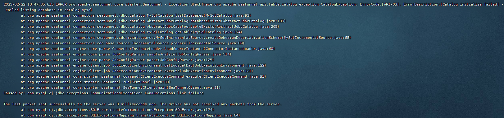

# MySQL

MySQL CDC 连接器允许从 MySQL 数据库读取快照数据和增量数据。

### 一、配置

#### 1、`config/plugin_config`配置

```
--connectors-v2--
connector-cdc-mysql
connector-jdbc
--end--
```

安装

```shell
sh bin/install-plugin.sh
```

#### 2、提供MySQL数据库驱动

> https://mvnrepository.com/artifact/mysql/mysql-connector-java

ex: 将 `mysql-connector-java-8.0.30.jar` 放到 `plugins/jdbc/lib/` 目录下

#### 3、新增配置文件 [`config/seatunnel-mysql-cdc.conf`](config/seatunnel-mysql-cdc.conf)

连接器配置见

- https://seatunnel.apache.org/docs/2.3.0/connector-v2/source/MySQL-CDC
- https://seatunnel.apache.org/docs/2.3.0/connector-v2/sink/Jdbc

> `demo`库下的`t_test`表数据同步到`demo-bak`库中

```
env {
  execution.parallelism = 1
  job.mode = "BATCH"
}

source {
  MySQL-CDC {
    result_table_name = "fake"
    parallelism = 1
    server-id = 3306
    hostname = "127.0.0.1"
    port = 3306
    username = "root"
    password = "root"
    database-name = "demo"
    table-name = "t_test"
    base-url = "jdbc:mysql://localhost:3306"
  }
}

transform {
}

sink {
  jdbc {
    url = "jdbc:mysql://127.0.0.1:3306/demo-bak?useSSL=false&serverTimezone=Asia/Shanghai"
    driver = "com.mysql.cj.jdbc.Driver"
    user = "root"
    password = "root"
    table = "t_test"
  }

}
```

### 二、运行

```shell
sh ./bin/seatunnel.sh --config ./config/seatunnel-mysql-cdc.conf -e local
```

---

### 问题

报错：


```shell
Exception in thread "main" org.apache.seatunnel.api.table.catalog.exception.CatalogException: ErrorCode:[API-03], ErrorDescription:[Catalog initialize failed] - Failed listing database in catalog mysql
... 
Caused by: com.mysql.cj.jdbc.exceptions.CommunicationsException: Communications link failure

The last packet sent successfully to the server was 0 milliseconds ago. The driver has not received any packets from the server.
```

解决：关闭MySQL的SSL验证

> 目前暂时未发现`MySQL-CDC`中有类似`jdbc`中的参数`useSSL=false`

修改配置文件`my.cnf`

```
[mysqld]

# 关闭SSL验证
skip_ssl
```
