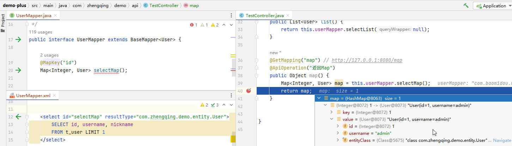
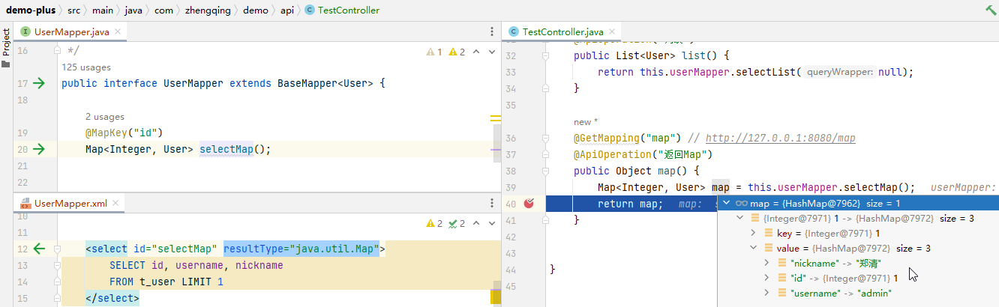

# Mybatis返回Map

> 参考 https://mybatis.org/mybatis-3/zh/java-api.html

@MapKey 方法 供返回值为 Map 的方法使用的注解。
它使用对象的某个属性作为 key，将对象 List 转化为 Map。 属性：value，指定作为 Map 的 key 值的对象属性名。

```
import org.apache.ibatis.annotations.MapKey;

@MapKey("id")
Map<Integer, User> selectMap();
```

```
<select id="selectMap" resultType="com.zhengqing.demo.entity.User">
    SELECT id, username, nickname
    FROM t_user LIMIT 1
</select>
```

效果：

```json
{
  "1": {
    "id": 1,
    "username": "admin"
  },
  "3": {
    "id": 3,
    "username": "test"
  }
}
```



---

> tips: 返回类型对应map的value类型，但是idea会有警告，可不管；
> 如果为`resultType="java.util.Map"`，返回类型无法对应`com.zhengqing.demo.entity.User`，当获取User对象中的字段值时就会出现问题！
> 
