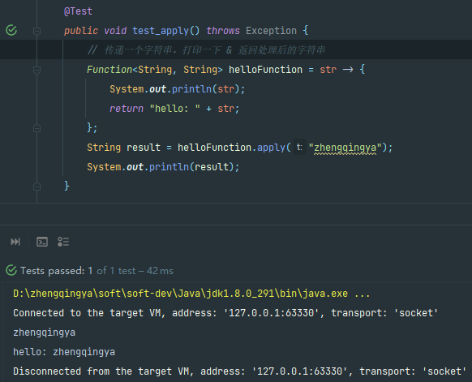
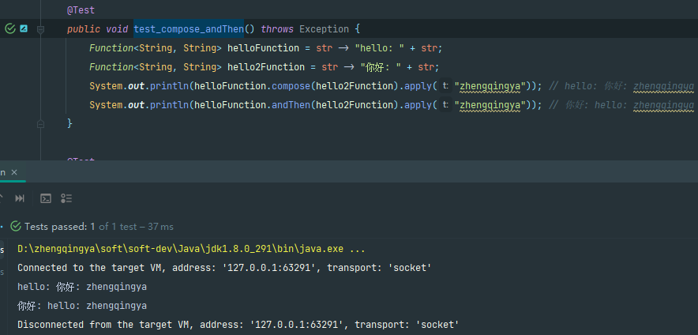

# Function 函数接口

在Java8中，Function接口是一个函数接口。

### 源码

```java
package java.util.function;

import java.util.Objects;

/**
 * 函数接口：表示接受一个实参并产生结果的函数。
 * 函数方法 {@link #apply(Object)}.
 * @param <T> 函数输入的类型
 * @param <R> 函数结果的类型
 * @since 1.8
 */
@FunctionalInterface
public interface Function<T, R> {

    /**
     * 应用函数
     * @param t the function argument
     * @return the function result
     */
    R apply(T t);

    /**
     * 可以让多个`Function`函数组合使用
     */
    default <V> Function<V, R> compose(Function<? super V, ? extends T> before) {
        Objects.requireNonNull(before);
        return (V v) -> apply(before.apply(v));
    }

    /**
     * 可以让多个`Function`函数组合使用
     */
    default <V> Function<T, V> andThen(Function<? super R, ? extends V> after) {
        Objects.requireNonNull(after);
        return (T t) -> after.apply(apply(t));
    }

    static <T> Function<T, T> identity() {
        return t -> t;
    }
}
```

### apply

ex: 传递一个字符串，打印一下 & 返回处理后的字符串

```java
public class Java8Function {
    @Test
    public void test_apply() throws Exception {
        // 传递一个字符串，打印一下 & 返回处理后的字符串
        Function<String, String> helloFunction = str -> {
            System.out.println(str);
            return "hello: " + str;
        };
        String result = helloFunction.apply("zhengqingya");
        System.out.println(result);
    }
}
```



### `compose`/`andThen`

多个`Function`函数组合使用

> tips: 执行顺序差异

```java
public class Java8Function {
    @Test
    public void test_compose_andThen() throws Exception {
        Function<String, String> helloFunction = str -> "hello: " + str;
        Function<String, String> hello2Function = str -> "你好: " + str;
        System.out.println(helloFunction.compose(hello2Function).apply("zhengqingya")); // hello: 你好: zhengqingya
        System.out.println(helloFunction.andThen(hello2Function).apply("zhengqingya")); // 你好: hello: zhengqingya
    }
}
```



### 作为方法参数传入

将函数接口作为方法参数传入，可以解决只有部分差异的相同业务代码中的硬编码问题，让代码更灵活通用。

ex: 将list转成map。通过传入不同的处理方式实现不同的结果。

```java
public class Java8Function {
    @Test
    public void test_listToMap() throws Exception {
        List<String> list = Lists.newArrayList("zhengqingya");
        Map<String, String> result = listToMap(list, str -> {
            return "hello:" + str;
        });
        System.out.println(result);
        Map<String, String> result2 = listToMap(list, str -> {
            return "你好:" + str;
        });
        System.out.println(result2);
    }

    public static <T, R> Map<T, R> listToMap(List<T> list, Function<T, R> function) {
        HashMap<T, R> hashMap = Maps.newHashMap();
        for (T t : list) {
            hashMap.put(t, function.apply(t));
        }
        return hashMap;
    }
}
```


