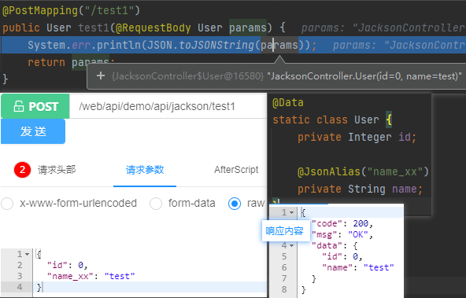

# Jackson - 字段别名

#### post请求

1. `@JsonProperty`：序列化和反序列化过程中修改java属性名
2. `@JsonAlias`：反序列化时让java属性可以接收多个别名

```
// 字段别名
@JsonAlias("name_xx")
// @JsonAlias({"name_xx", "name_2"})
// @JsonProperty("name_xx")
private String name;
```




#### get请求

> tips: 需要自定义注解`@RequestParamAlias`
> 参考 https://gitee.com/zhengqingya/small-tools


