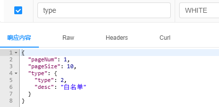
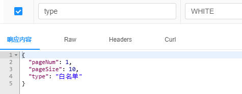

# Jackson - 枚举响应指定字段值

### 枚举响应指定字段值

> 默认情况下返回枚举名称，即 BLACK/WHITE

```java
package com.zhengqing.demo.model.dto;

import com.fasterxml.jackson.annotation.JsonFormat;
import com.fasterxml.jackson.annotation.JsonValue;
import lombok.AllArgsConstructor;
import lombok.Getter;

import java.util.Objects;
import java.util.stream.Stream;

@Getter
@AllArgsConstructor
//@JsonFormat(shape = JsonFormat.Shape.OBJECT)
public enum TestTypeEnum {
    BLACK(1, "黑名单"),

    WHITE(2, "白名单");

    private final Integer type;

    @JsonValue
    private final String desc;
}
```

`@JsonFormat(shape = JsonFormat.Shape.OBJECT)` 效果如下：



`@JsonValue` 效果如下:

