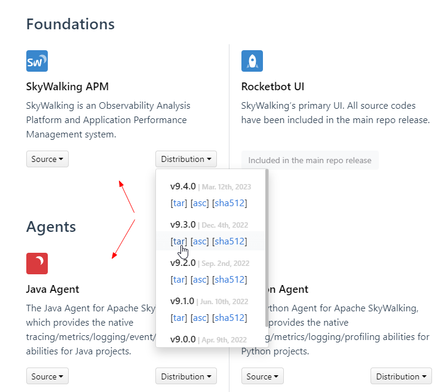

# windows本地部署

### 一、下载

`SkyWalking APM` & `Java Agent`

https://skywalking.apache.org/downloads/



> eg:
> https://dlcdn.apache.org/skywalking/9.3.0/apache-skywalking-apm-9.3.0.tar.gz
> https://dlcdn.apache.org/skywalking/java-agent/8.15.0/apache-skywalking-java-agent-8.15.0.tgz

### 二、配置MySQL存储

> tips: 默认h2存储，这里根据自己的情况进行修改...

将mysql驱动拷贝到`apache-skywalking-apm-bin\oap-libs`目录下 eg: `mysql-connector-java-8.0.28.jar`

修改配置文件`apache-skywalking-apm-bin\config\application.yml`

```yml
storage:
  selector: ${SW_STORAGE:mysql}
  mysql:
    properties:
      jdbcUrl: ${SW_JDBC_URL:"jdbc:mysql://localhost:3306/swtest?rewriteBatchedStatements=true"}
      dataSource.user: ${SW_DATA_SOURCE_USER:root}
      dataSource.password: ${SW_DATA_SOURCE_PASSWORD:root@1234}
      dataSource.cachePrepStmts: ${SW_DATA_SOURCE_CACHE_PREP_STMTS:true}
      dataSource.prepStmtCacheSize: ${SW_DATA_SOURCE_PREP_STMT_CACHE_SQL_SIZE:250}
      dataSource.prepStmtCacheSqlLimit: ${SW_DATA_SOURCE_PREP_STMT_CACHE_SQL_LIMIT:2048}
      dataSource.useServerPrepStmts: ${SW_DATA_SOURCE_USE_SERVER_PREP_STMTS:true}
    metadataQueryMaxSize: ${SW_STORAGE_MYSQL_QUERY_MAX_SIZE:5000}
    maxSizeOfBatchSql: ${SW_STORAGE_MAX_SIZE_OF_BATCH_SQL:2000}
    asyncBatchPersistentPoolSize: ${SW_STORAGE_ASYNC_BATCH_PERSISTENT_POOL_SIZE:4}
```

### 三、运行

双击 `apache-skywalking-apm-bin\bin\startup.bat`

访问 http://127.0.0.1:8888

### 四、Java项目配置

在java项目运行启动的时候，添加如下运行参数

```shell
-javaagent:D:\tmp\skywalking-agent\skywalking-agent.jar -DSW_AGENT_NAME=test -DSW_AGENT_COLLECTOR_BACKEND_SERVICES=127.0.0.1:11800
```

项目跑起来之后调用下接口，就可以去SkyWalking中查看拓扑图，追踪等信息了...

