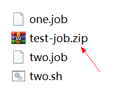
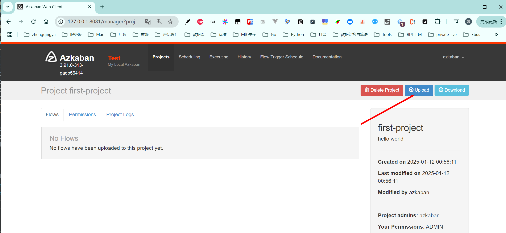
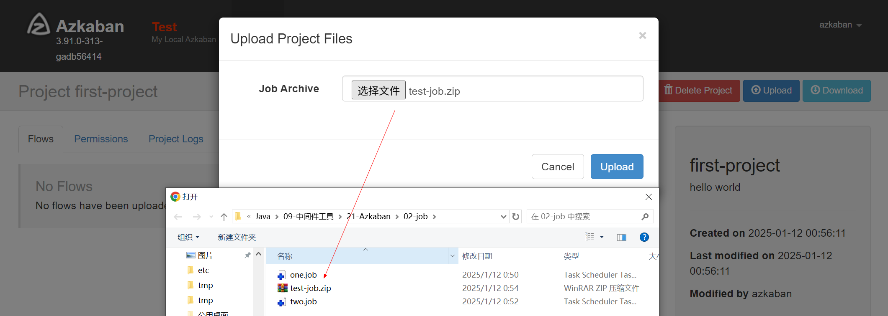
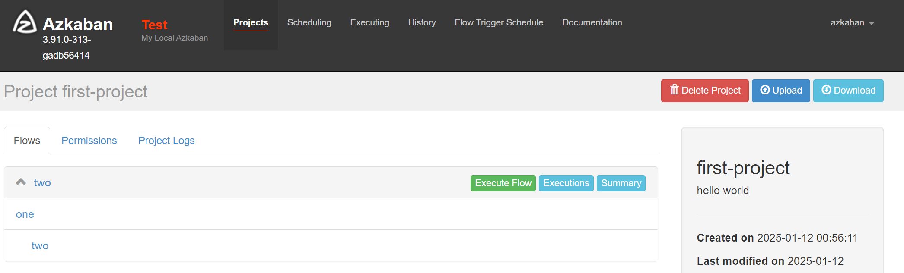
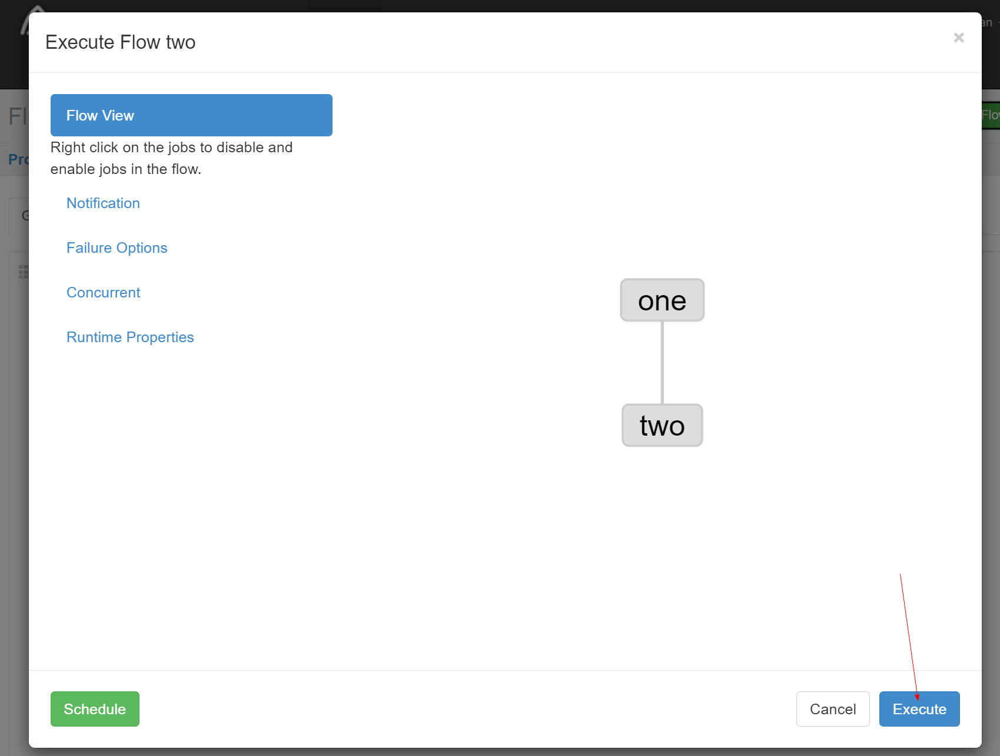
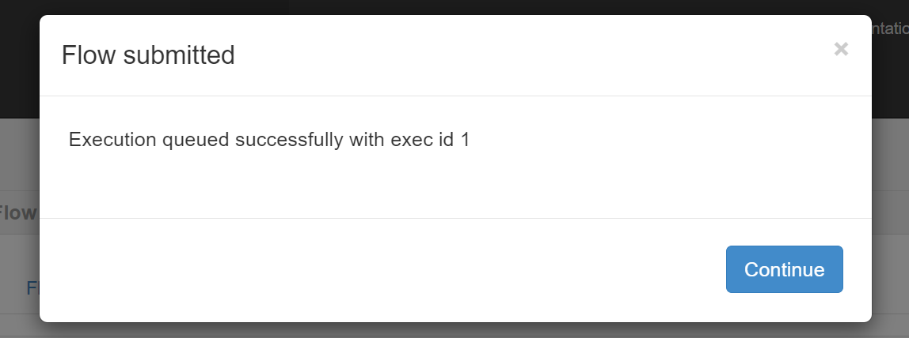
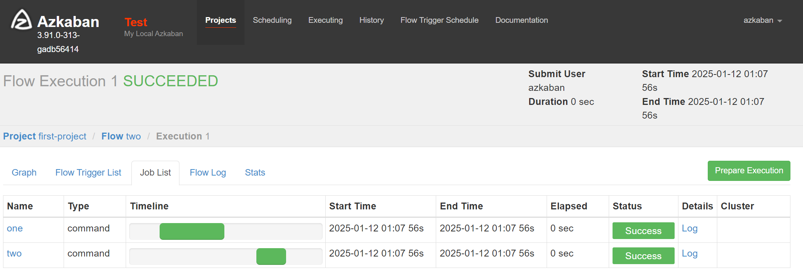
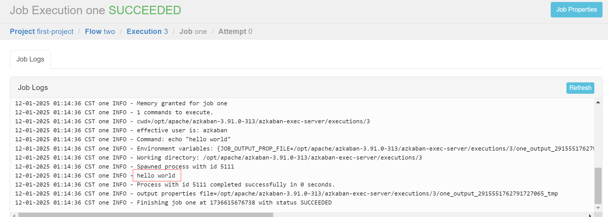

# 入门体验 -- shell command调度

### 新建2个job文件

###### [one.job](02-job/one.job)

> 直接执行命令

```
# one.job
type=command
command=echo "hello world"
```

###### [two.job](02-job/two.job)

> 执行shell脚本，依赖于one.job任务执行完后，才执行当前two.job任务

```
# two.job
dependencies=one
type=command
command=sh two.sh
```

[two.sh](02-job/two.sh)

```shell
echo "shell execute start..."
echo "this is the second job..."
```

将这2个文件打包压缩成 `.zip` 文件


### web管理执行任务

到web管理页面中，创建第一个测试项目


上传 `.zip` 配置文件



查看


执行任务


执行成功


这里也可以看出任务先后执行顺序


查看日志


