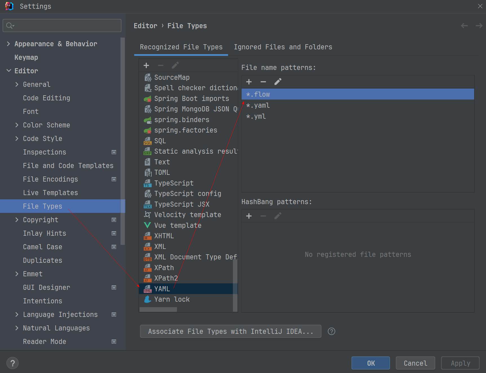
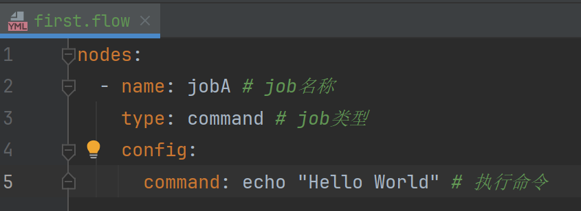
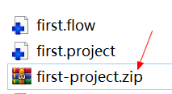
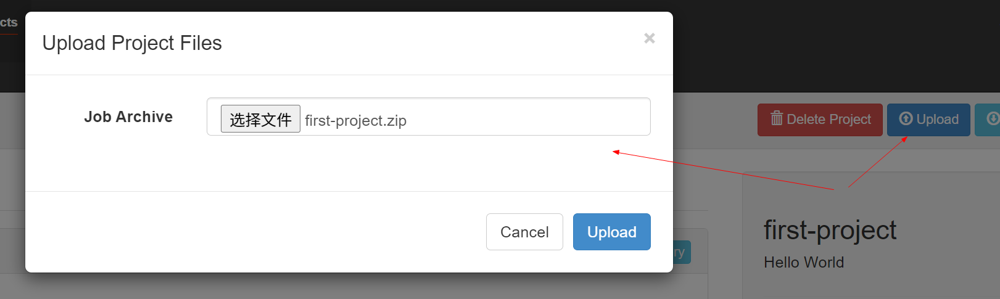
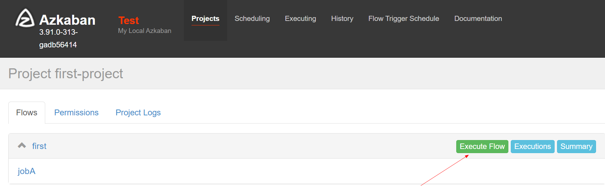
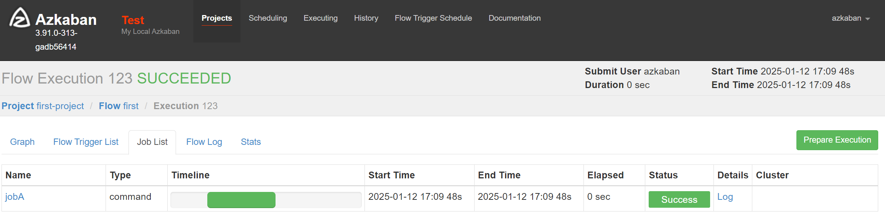

# Work Flow 示例

### Hello World 简单工作流案例

#### 1、配置文件准备

[first.project](04-job/first.project)

文件作用：采用新的`Flow-API`方式解析flow文件

> tips: 与[02-job/one.job](02-job/one.job) 定义任务的语法有区别，之前是key-value，现在采用的yaml语法。

```yaml
azkaban-flow-version: 2.0
```

[first.flow](04-job/first.flow)

```yaml
nodes:
  - name: jobA # job名称
    type: command # job类型
    config:
      command: echo "Hello World" # 执行命令
```

IDE配置文件类型识别



压缩 zip 文件


#### 2、web配置执行任务

到web中创建项目并上传zip


执行任务


