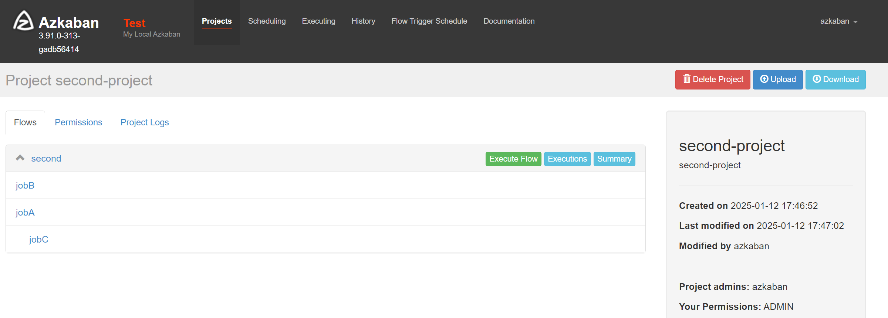
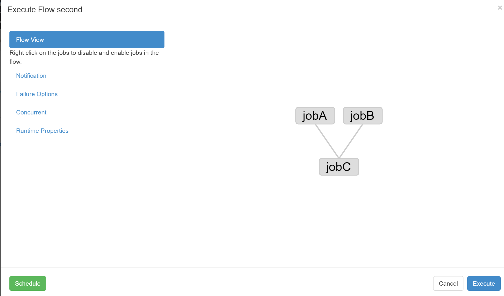
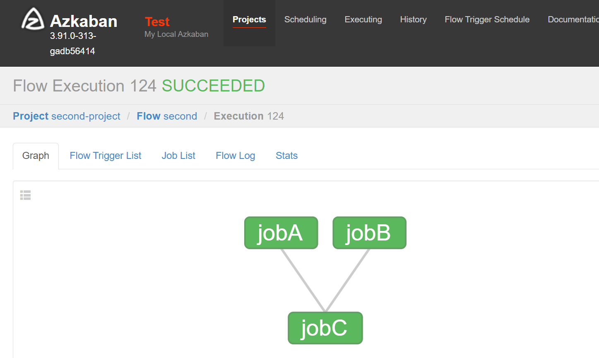
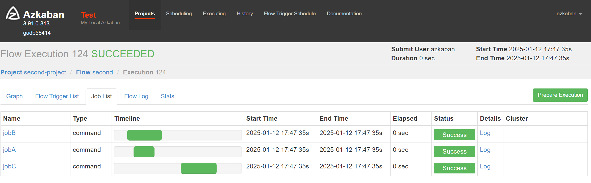

# 任务依赖

需求：jobA、jobB 都执行完后，才会执行jobC。

#### 1、配置文件准备

[second.project](06-job/second.project)

```yaml
azkaban-flow-version: 2.0
```

[second.flow](06-job/second.flow)

```yaml
nodes:
  - name: jobA # job名称
    type: command # job类型
    config:
      command: echo "jobA execute ..." # 执行命令

  - name: jobB # job名称
    type: command # job类型
    config:
      command: echo "jobB execute ..." # 执行命令

  - name: jobC # job名称
    type: command # job类型
    dependsOn: # 依赖的job名称
      - jobA
      - jobB
    config:
      command: echo "jobC execute ..." # 执行命令
```

压缩 zip 文件

#### 2、web配置执行任务





