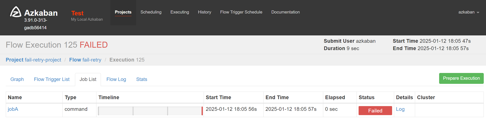
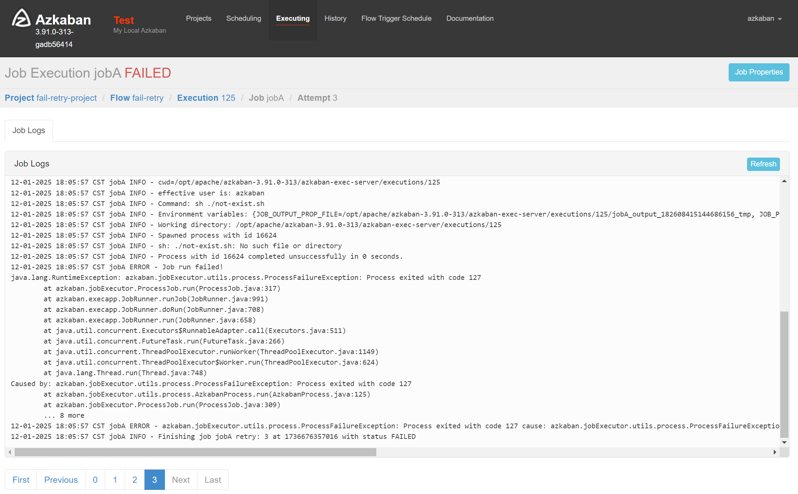
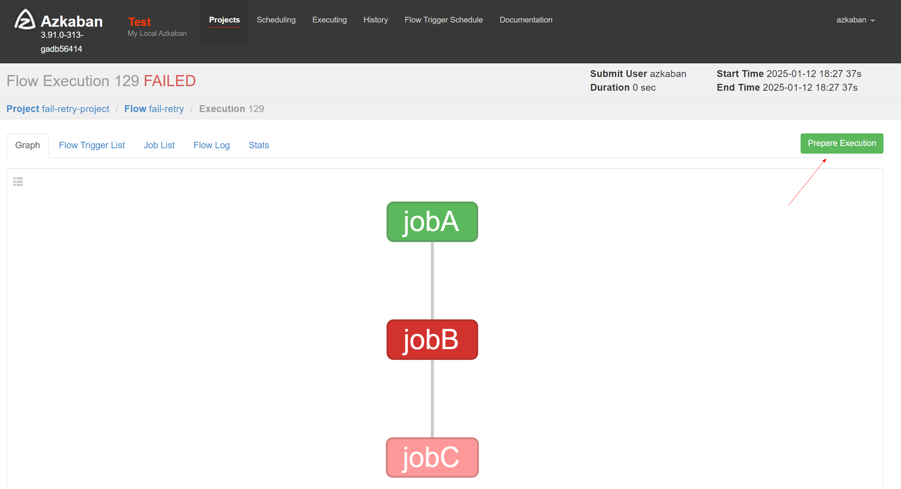
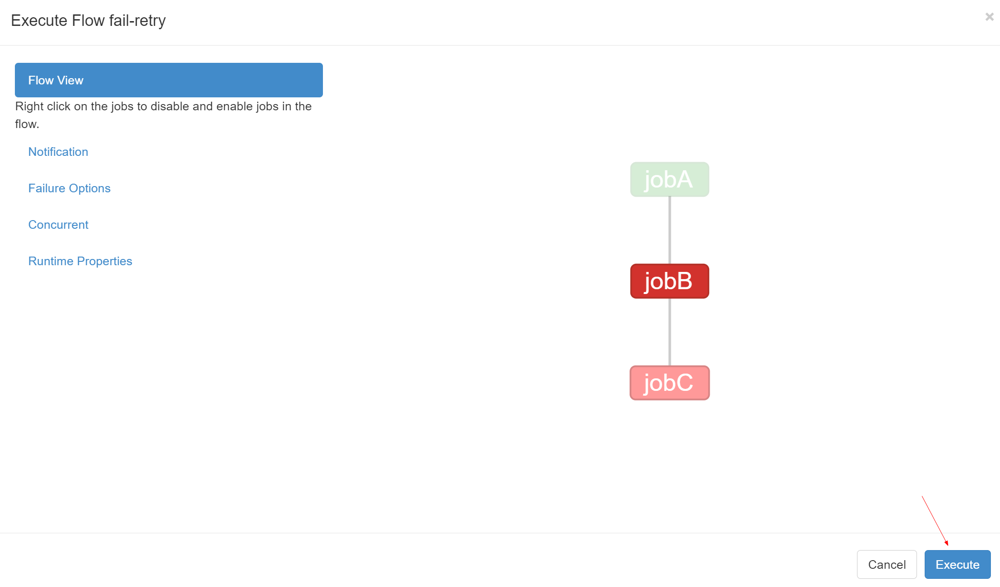
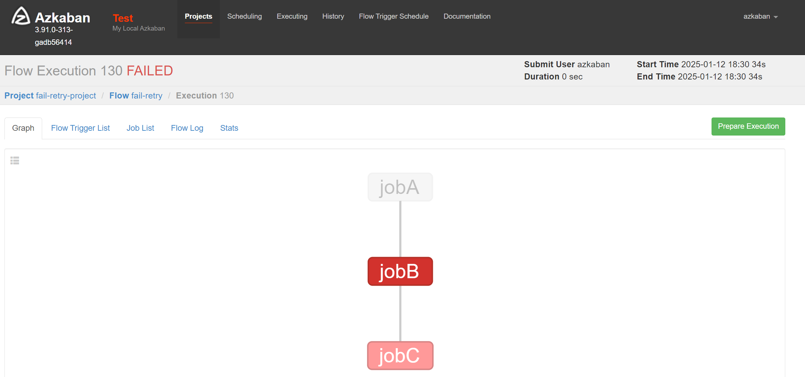
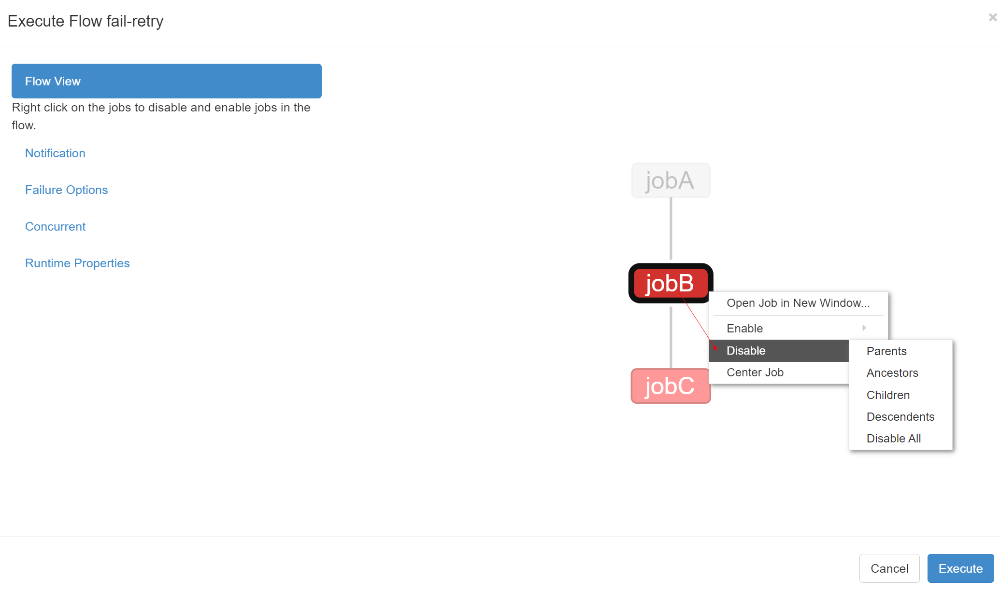
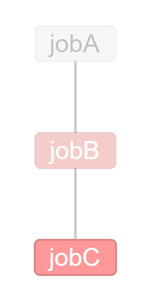
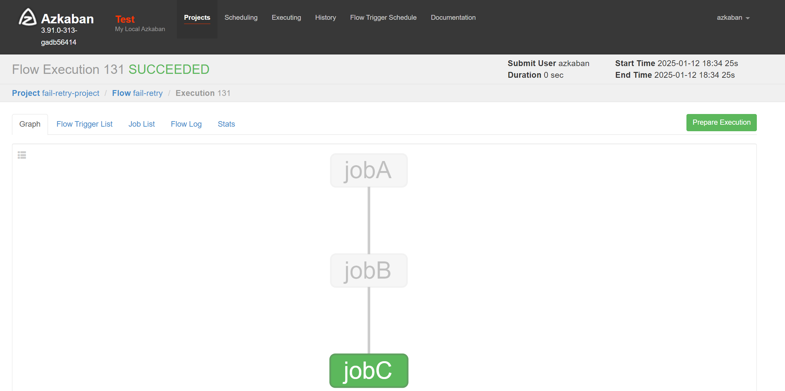

# 失败重试

需求：执行任务失败后，需要重试3次，重试时间间隔为10000ms。

### 一、自动失败重试案例

> 适用于服务暂时性异常时，自动重试。

#### 1、配置文件准备

[fail-retry-auto.project](07-job/auto/fail-retry.project)

```yaml
azkaban-flow-version: 2.0
```

[fail-retry-auto.flow](07-job/auto/fail-retry.flow)

```yaml
# 全局配置 -- 作用于每个任务，如果任务都单独配置，优先使用任务上的单独配置
config:
  retries: 3 # 重试次数
  retry.backoff: 3000  # 重试的时间间隔，时间单位：ms

nodes:
  - name: jobA # job名称
    type: command # job类型
    # 单个配置
    config:
      command: sh ./not-exist.sh # 执行命令
      retries: 2 # 重试次数
      retry.backoff: 5000  # 重试的时间间隔，时间单位：ms
```

压缩 zip 文件

#### 2、web配置执行任务




### 二、手动失败重试案例

> 适用于服务宕机，长时间异常，手动重试。

场景：jobA -> jobB -> jobC

jobB执行失败，手动重试的时候，jobA之前已经执行成功--无需再次执行，从失败的地方开始执行：jobB -> jobC。

#### 1、配置文件准备

[fail-retry-manual.project](07-job/manual/fail-retry.project)

```yaml
azkaban-flow-version: 2.0
```

[fail-retry-manual.flow](07-job/manual/fail-retry.flow)

```yaml
nodes:
  - name: jobA # job名称
    type: command # job类型
    config:
      command: echo "jobA execute ..." # 执行命令

  - name: jobB # job名称
    type: command # job类型
    dependsOn: # 依赖的job名称
      - jobA
    config:
      command: sh ./not-exist.sh # 执行命令

  - name: jobC # job名称
    type: command # job类型
    dependsOn: # 依赖的job名称
      - jobB
    config:
      command: echo "jobC execute ..." # 执行命令
```

压缩 zip 文件

#### 2、web配置执行任务

执行失败情况下是这样的


点击`Prepare Execution`，可以从失败的地方开始执行，如下图所示，可以看见jobA是灰的，会跳过执行。

执行后，因为案例中给的jobB一直会执行失败，所以效果如下


我们也可以在执行的时候，手动右击禁用指定任务，达到跳过执行。



