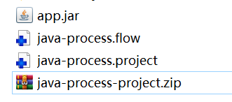
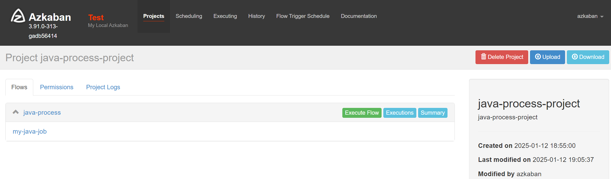
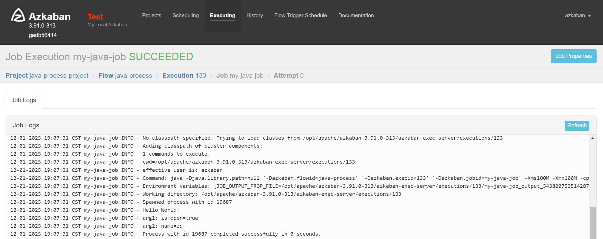

# JavaProcess任务类型调度

#### 1、java程序准备

简单创建一个工程 [azkaban-java-demo](./08-job/azkaban-java-demo)，里面创建一个App.java文件，内容如下：

```java
public class App {
  public static void main(String[] args) {
    System.out.println("Hello World!");
    for (int i = 0; i < args.length; i++) {
      System.out.println("arg" + (i + 1) + ": " + args[i]);
    }
  }
}
```

#### 2、配置文件准备

[java-process.project](08-job/java-process.project)

```yaml
azkaban-flow-version: 2.0
```

[java-process.flow](08-job/java-process.flow)

```yaml
nodes:
  - name: my-java-job # job名称
    type: javaprocess # job类型
    config:
      Xms: 100M # jvm参数-最小堆内存
      Xmx: 100M # jvm参数-最大堆内存
      #      classpath: ./ # 类路径 -- 这里jar包和配置文件在同一目录下，可以不写
      java.class: com.zhengqing.App # 要运行的java类，其中必须包含main方法
      main.args: is-open=true name=zq # main方法的参数
```

压缩 zip 文件


#### 3、web配置执行任务


查看执行日志

