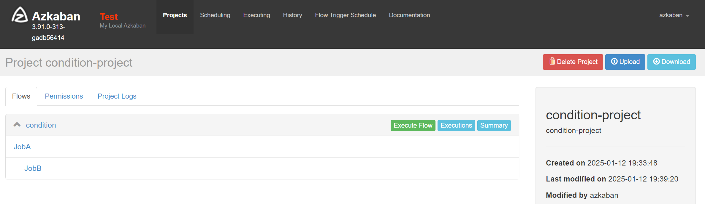
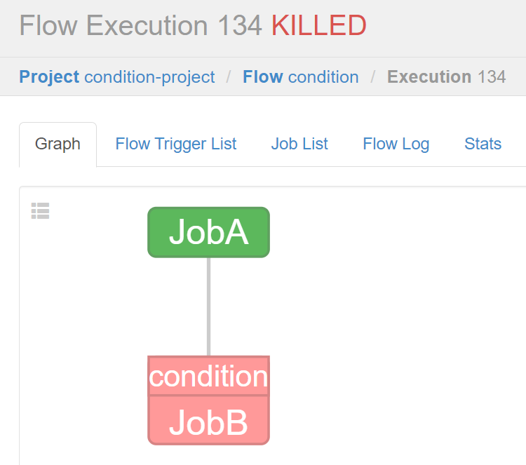
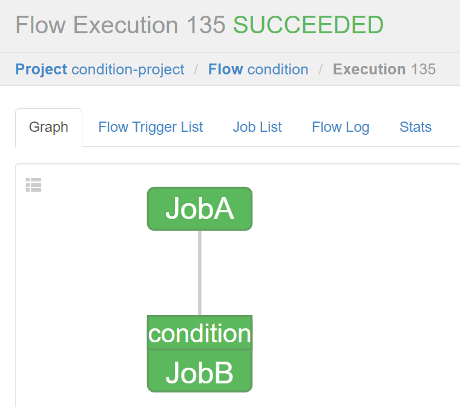
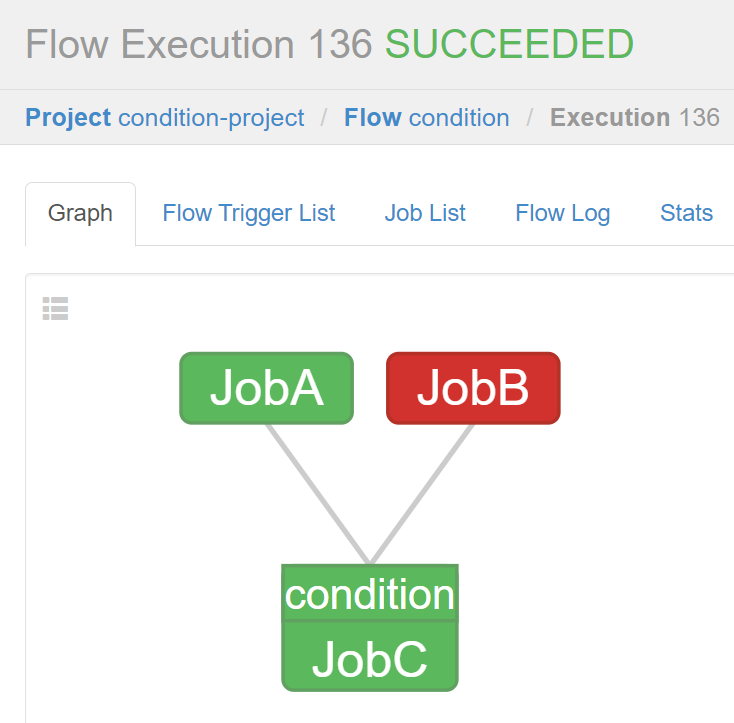

# 条件工作流

作用：允许用户自定义执行条件来决定是否运行某些 Job。

条件可以由当前 Job 的 父Job 输出的`运行时参数`构成，也可以使用`预定义宏`。

在这些条件下，用户可以在确定 Job 执行逻辑时获得更大的灵活性。
例如：1个子job依赖2个父job，只要父 Job 之一成功，就可以运行当前 Job。

### 一、运行时参数

#### 原理

1. 父Job 将参数写入 `JOB_OUTPUT_PROP_FILE` 环境变量所指向的文件
2. 子Job 使用 `${jobName:param}` 来获取 父Job 输出的参数并定义执行条件

#### 支持的运算符

1. `==` 等于
2. `!=` 不等于
3. `>` 大于
4. `>=` 大于等于
5. `<` 小于
6. `<=` 小于等于
7. `&&` 与
8. `||` 或
9. `!` 非

#### 需求

- JobA 执行一个 shell 脚本。
- JobB 执行一个 shell 脚本，但 JobB 不需要每天都执行，而只需要每个周一执行。

#### 实现

##### 1、配置文件准备

[condition.project](09-job/JOB_OUTPUT_PROP_FILE/condition.project)

```yaml
azkaban-flow-version: 2.0
```

[condition.flow](09-job/JOB_OUTPUT_PROP_FILE/condition.flow)

```yaml
nodes:
  - name: JobA
    type: command
    config:
      command: sh JobA.sh

  - name: JobB
    type: command
    dependsOn:
      - JobA
    config:
      command: sh JobB.sh
    # 指定执行条件：JobA执行完后 wk为0，才执行JobB
    condition: ${JobA:wk} == 0
```

[JobA.sh](09-job/JOB_OUTPUT_PROP_FILE/JobA.sh)

```shell
#!/bin/bash
echo "do JobA"
wk=`date +%w`
echo "{\"wk\":$wk}" > $JOB_OUTPUT_PROP_FILE
```

[JobB.sh](09-job/JOB_OUTPUT_PROP_FILE/JobB.sh)

```shell
#!/bin/bash
echo "do JobB"
```

##### 2、web配置执行任务



不满足条件执行效果


满足条件执行效果


### 二、预定义宏

Azkaban 提供了一系列预定义的宏（macros），用于在作业配置文件中引用环境变量、时间戳等动态信息。
这些宏可以在YAML或properties格式的配置文件中使用，帮助简化配置并提高灵活性。

#### 常见预定义宏

1. **时间相关宏**：

- `${now}`：当前时间戳（毫秒）
- `${date}`：当前日期（格式为`yyyy-MM-dd`）
- `${time}`：当前时间（格式为`HH:mm:ss`）
- `${datetime}`：当前日期和时间（格式为`yyyy-MM-dd HH:mm:ss`）

2. **环境变量宏**：

- `${AZKABAN_JOB_TYPE}`：当前作业类型
- `${AZKABAN_FLOW_ID}`：当前工作流ID
- `${AZKABAN_JOB_ID}`：当前作业ID
- `${AZKABAN_EXEC_ID}`：当前执行ID
- `${AZKABAN_PROJECT_NAME}`：项目名称
- `${AZKABAN_PROJECT_VERSION}`：项目版本
- `${AZKABAN_USER}`：触发执行的用户

3. **路径和文件宏**：

- `${job.file}`：当前作业配置文件的路径
- `${job.dir}`：当前作业目录
- `${flow.dir}`：当前工作流目录
- `${project.dir}`：项目根目录

4. **其他常用宏**：

- `${retries}`：当前重试次数
- `${attempt}`：当前尝试次数（包括重试）
- `${success.nodes}`：成功完成的节点列表
- `${failed.nodes}`：失败的节点列表

##### 使用示例

假设你有一个Java任务，并且希望在日志文件名中包含当前时间和作业ID：

```yaml
nodes:
  - name: java-app
    type: javaprocess
    config:
      java.class: com.test.Test
      main.args: is-open=true logFile=${job.dir}/log_${datetime}_${AZKABAN_JOB_ID}.log
```

在这个例子中，`${datetime}` 和 `${AZKABAN_JOB_ID}` 将被替换为实际的时间戳和作业ID，生成的日志文件名将类似于 `log_2025-01-12_20:00:00_1234.log`。

Azkaban 中预置了几个特殊的判断条件，称为预定义宏。

#### 条件判断宏

预定义宏会根据所有父 Job 的完成情况进行判断，再决定是否执行。

1. `all_success`: 表示父 Job 全部成功才执行(默认)
2. `all_done`: 表示父 Job 全部完成才执行
3. `all_failed`: 表示父 Job 全部失败才执行
4. `one_success`: 表示父 Job 至少一个成功才执行
5. `one_failed`: 表示父 Job 至少一个失败才执行

#### 需求

有3个job：JobA、JobB、JobC；JobC要求 JobA、JobB 中有一个成功即可执行。

#### 实现

##### 1、配置文件准备

[condition.project](09-job/MACRO/condition.project)

```yaml
azkaban-flow-version: 2.0
```

[condition.flow](09-job/MACRO/condition.flow)

```yaml
nodes:
  - name: JobA
    type: command
    config:
      command: echo "do JobA"

  - name: JobB
    type: command
    config:
      command: sh ./not-exist.sh

  - name: JobC
    type: command
    dependsOn:
      - JobA
      - JobB
    config:
      command: echo "do JobC"
    # 执行条件：依赖于JobA和JobB，只有当至少一个父任务成功时才会执行。
    condition: one_success
```

##### 2、web配置执行任务


