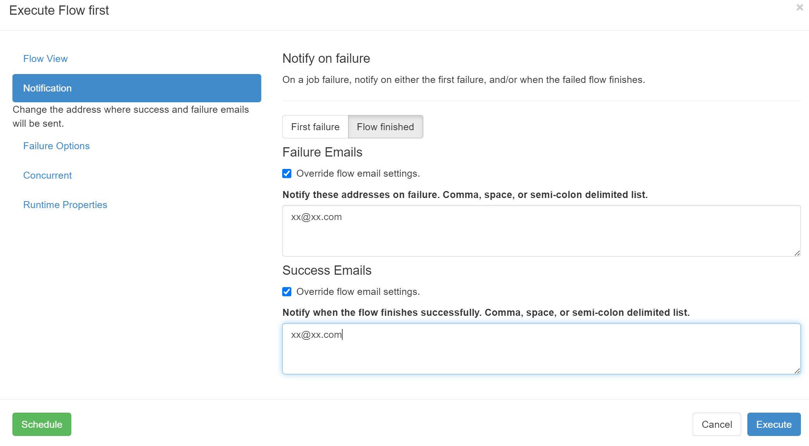

# 报警通知

对失败的任务进行报警通知。

### 邮件报警

#### 1、配置邮件发件人

修改 `azkaban-web-server/azkaban.properties` 配置邮件发件人信息。

> 配置见 https://github.com/azkaban/azkaban/blob/master/azkaban-web-server/src/main/resources/conf/azkaban.properties

```properties
# mail settings
mail.sender=xxx@xx.com
mail.host=smtp.xx.com
mail.user=xxx@xx.com
mail.password=xxx
```

修改后，重启web服务。

#### 2、配置邮件收件人



---

Azkaban 也可以配置电话报警。
