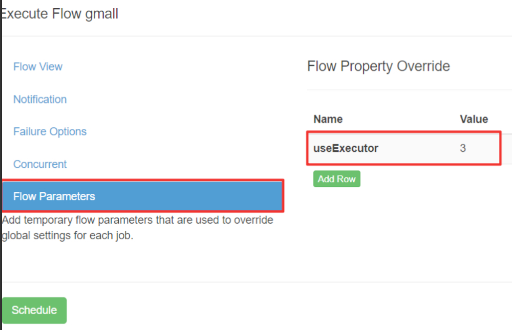

# 多Executor模式注意事项

Azkaban 多 Executor 模式是指，在集群中多个节点部署 Executor。

在这种模式下， Azkaban web Server 会根据策略，选取其中一个 Executor 去执行任务。
为确保所选的 Executor 能够准确的执行任务，我们须在以下两种方案任选其一，推荐使用方案二。

### 方案一: 指定特定的 Executor 去执行任务

在 MySQL 中 azkaban 数据库 executors 表中，查询 指定机器 的 Executor 的 id
在执行工作流程时加入 useExecutor 属性

### 方案二: 在 Executor 所在所有节点部署任务所需脚本和应用
