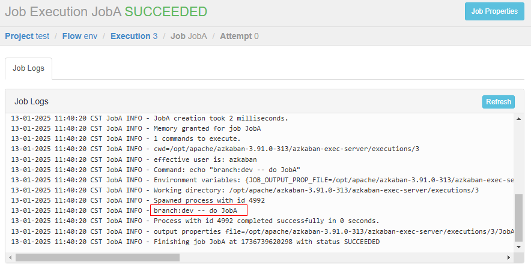
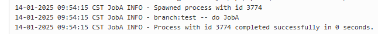

# 环境变量

### 1、配置文件准备

[env.project](./12-job/env.project)

```yaml
azkaban-flow-version: 2.0
```

[env.flow](./12-job/env.flow)

```yaml
nodes:
  - name: JobA
    type: command
    config:
      # 自定义环境变量
      env.branch: dev
      # 读取环境变量
      command: echo "branch:${env.branch} -- do JobA"
```

### 2、web配置执行任务

查看任务执行日志


临时手动环境变量配置

执行结果

