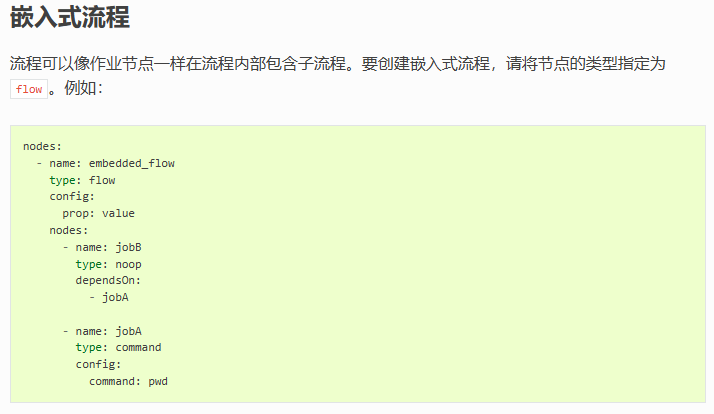
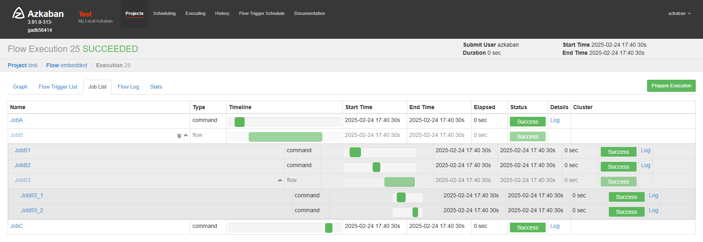

# 父子任务

> https://azkaban.readthedocs.io/en/latest/createFlows.html
> 

```yaml
nodes:
  - name: JobA
    type: command
    config:
      command: echo "JobA is done ..."

  - name: JobB
    type: flow # 表示这是一个父任务，用于组织和管理其子任务。父任务本身不执行具体的命令，而是作为一个逻辑容器。
    dependsOn:
      - JobA
    nodes:
      - name: JobB1
        type: command
        config:
          command: echo "JobB1 is done ..."
      - name: JobB2
        type: command
        dependsOn:
          - JobB1
        config:
          command: echo "JobB2 is done ..."
      - name: JobB3
        type: flow
        dependsOn:
          - JobB2
        nodes:
          - name: JobB3_1
            type: command
            config:
              command: echo "JobB3_1 is done ..."
          - name: JobB3_2
            type: command
            dependsOn:
              - JobB3_1
            config:
              command: echo "JobB3_1 is done ..."

  - name: JobC
    type: command
    dependsOn:
      - JobB
    config:
      command: echo "JobC is done ..."
```

效果

