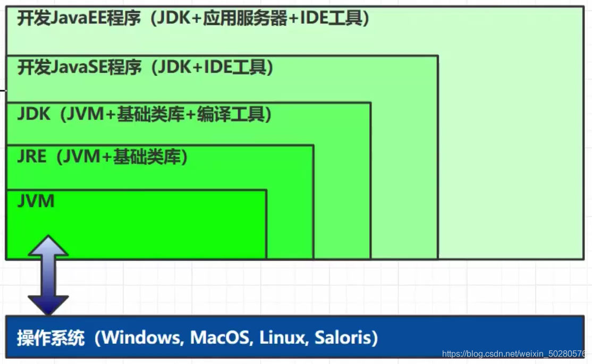

### 一、前言

#### 1、什么是 JVM ？

Java Virtual Machine ，Java 程序的**运行环境**（Java 二进制字节码的运行环境）。

* 一次编译，处处执行
* 自动的内存管理，垃圾回收机制
* 数组下标越界检查

JVM、JRE、JDK 的关系如下图所示  


#### 2、学习 JVM 有什么用？

* 面试必备
* 中高级程序员必备
* 想走的长远，就需要懂原理，比如：自动装箱、自动拆箱是怎么实现的，反射是怎么实现的，垃圾回收机制是怎么回事等待，JVM 是必须掌握的。

#### 3、常见的 JVM


我们主要学习的是 HotSpot 版本的虚拟机。

#### 4、学习路线


ClassLoader：Java 代码编译成二进制后，会经过类加载器，这样才能加载到 JVM 中运行。  
Method Area：类是放在方法区中。  
Heap：类的实例对象。  
当类调用方法时，会用到 JVM Stack、PC Register、本地方法栈。  
方法执行时的每行代码是有执行引擎中的解释器逐行执行，方法中的热点代码频繁调用的方法，由 JIT 编译器优化后执行，GC
会对堆中不用的对象进行回收。需要和操作系统打交道就需要使用到本地方法接口。

### 二、内存结构

#### 1、程序计数器

##### 1）定义

Program Counter Register 程序计数器（寄存器）  
作用：是记录下一条 jvm 指令的执行地址行号。

特点：

* 是线程私有的
* 不会存在内存溢出

##### 2）作用

```
0: getstatic #20 // PrintStream out = System.out; 
3: astore_1 // -- 
4: aload_1 // out.println(1); 
5: iconst_1 // -- 
6: invokevirtual #26 // -- 
9: aload_1 // out.println(2); 
10: iconst_2 // -- 
11: invokevirtual #26 // -- 
14: aload_1 // out.println(3); 
15: iconst_3 // -- 
16: invokevirtual #26 // -- 
19: aload_1 // out.println(4); 
20: iconst_4 // -- 
21: invokevirtual #26 // -- 
24: aload_1 // out.println(5); 
25: iconst_5 // -- 
26: invokevirtual #26 // -- 
29: return
```

* 解释器会解释指令为机器码交给 cpu 执行，程序计数器会记录下一条指令的地址行号，这样下一次解释器会从程序计数器拿到指令然后进行解释执行。
* 多线程的环境下，如果两个线程发生了上下文切换，那么程序计数器会记录线程下一行指令的地址行号，以便于接着往下执行。

#### 2、虚拟机栈

```java
package com.zhengqing.demo.daily.jvm;

import org.junit.Test;

public class TestFrames {

    @Test
    public void test() throws Exception {
        this.method1();
    }

    private void method1() {
        int a = 0;
        this.method2();
    }

    private void method2() {
        int a = 0;
        int b = 1;
    }

}
```


##### 1）定义

- 每个线程运行需要的内存空间，称为虚拟机栈
- 每个栈由多个栈帧（Frame）组成，对应着每次调用方法时所占用的内存
- 每个线程只能有一个活动栈帧，对应着当前正在执行的方法
-     - 如果给栈内存设置过大，那么线程数就会相应变少。 eg: 物理内存100m 栈1m 线程数=100; 物理内存100m 栈10m 线程数=10

问题辨析：

1. 垃圾回收是否涉及栈内存？  
   不会。栈内存是方法调用产生的，方法调用结束后会弹出栈。
2. 栈内存分配越大越好吗？  
   不是。因为物理内存是一定的，栈内存越大，可以支持更多的递归调用，但是可执行的线程数就会越少。默认: -Xss1024k
3. 方法内的局部变量是否线程安全？
    * 如果方法内部的变量没有逃离方法的作用访问，它是线程安全的
    * 如果是局部变量引用了对象，并逃离了方法的访问，那就要考虑线程安全问题。

##### 2）栈内存溢出

栈帧过大、过多、或者第三方类库操作，都有可能造成栈内存溢出 java.lang.StackOverflowError ，使用 -Xss1024k 指定栈内存大小！

##### 3）线程运行诊断

案例：cpu 占用过多  
解决方法：Linux 环境下运行某些程序的时候，可能导致 CPU 的占用过高，这时需要定位占用 CPU 过高的线程

###### 准备环境

```shell
cat> ./TestCpu.java <<EOF
public class TestCpu {
    public static void main(String[] args) {
        cpu();
    }
    private static void cpu() {
        while (true) {
            System.out.println("666");
        }
    }
}
EOF

javac TestCpu.java
java TestCpu
```

###### 诊断cpu过高原因

```shell
# 1、查看是哪个进程占用CPU过高
top -c

# 2、查看是哪个线程占用CPU过高  tid（线程id） -- 查询出来的为10进制的线程id
ps H -eo pid,tid,%cpu | grep 指定进程pid
# 输出指定进程的所有线程的运行堆栈 -- 这个内容太多，不方便查看
# jstack 进程pid

# 3、将10进制线程id转换为16进制格式  eg：52933 -> cec5
printf "%x\n" 52933
# 查找指定进程的指定线程堆栈信息  -A：查看后n行
# jstack [进程pid]| grep -A 10 [线程的16进制]
jstack 52932 | grep -A 30 cec5
```

过程如下图：


这样就能找到导致cpu过高的代码位置了...

#### 3、本地方法栈

一些带有 native 关键字的方法就是需要 JAVA 去调用本地的C或者C++方法，
因为 JAVA 有时候没法直接和操作系统底层交互，所以需要用到本地方法栈，服务于带 native 关键字的方法。
