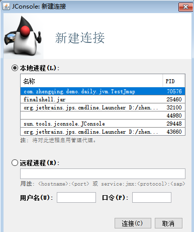
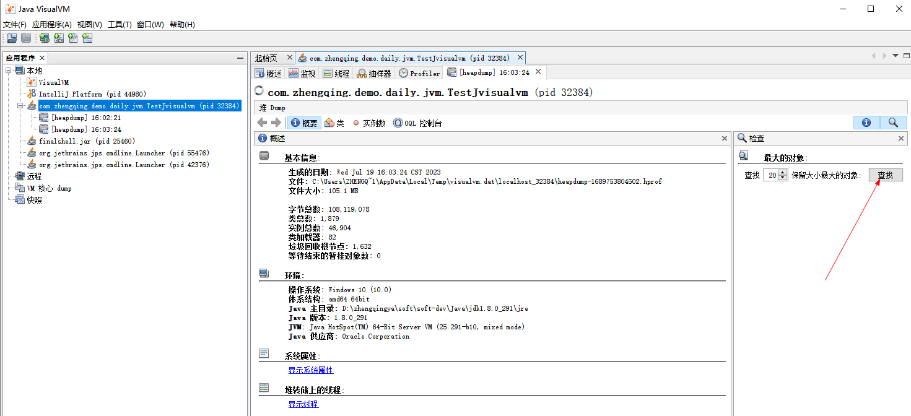
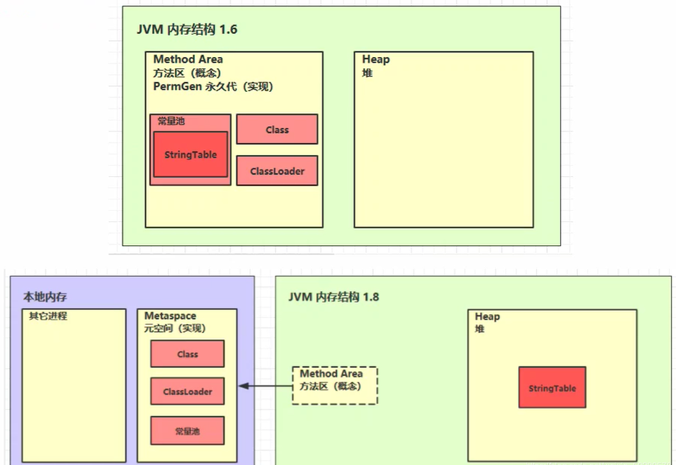
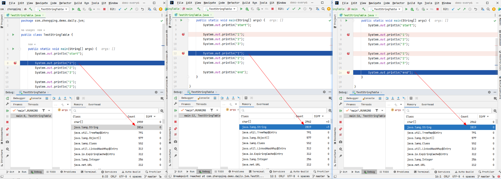
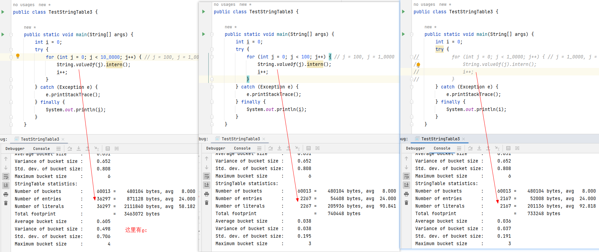
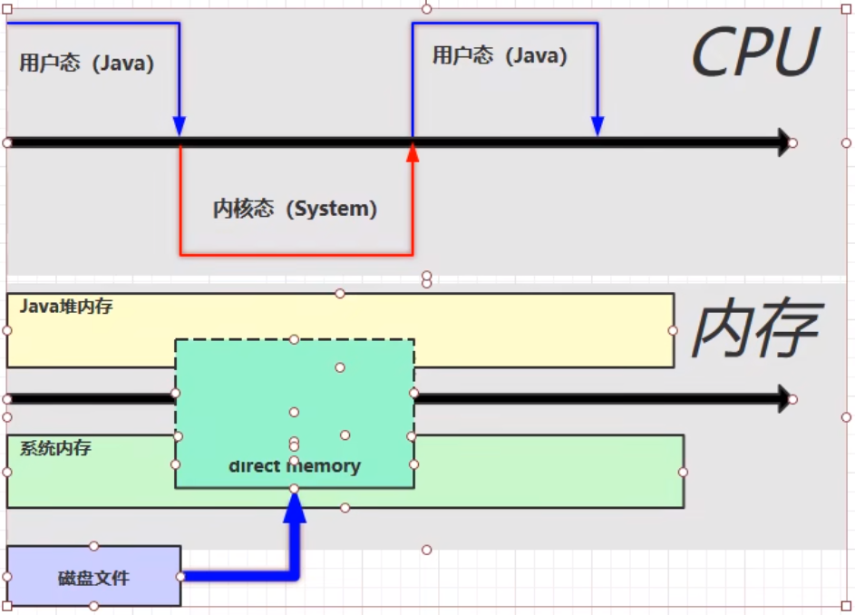

### 一、前言

#### 1、什么是 JVM ？

Java Virtual Machine ，Java 程序的**运行环境**（Java 二进制字节码的运行环境）。

* 一次编译，处处执行
* 自动的内存管理，垃圾回收机制
* 数组下标越界检查

JVM、JRE、JDK 的关系如下图所示  


#### 2、学习 JVM 有什么用？

* 面试必备
* 中高级程序员必备
* 想走的长远，就需要懂原理，比如：自动装箱、自动拆箱是怎么实现的，反射是怎么实现的，垃圾回收机制是怎么回事等待，JVM 是必须掌握的。

#### 3、常见的 JVM


我们主要学习的是 HotSpot 版本的虚拟机。

#### 4、学习路线


ClassLoader：Java 代码编译成二进制后，会经过类加载器，这样才能加载到 JVM 中运行。  
Method Area：类是放在方法区中。  
Heap：类的实例对象。  
当类调用方法时，会用到 JVM Stack、PC Register、本地方法栈。  
方法执行时的每行代码是有执行引擎中的解释器逐行执行，方法中的热点代码频繁调用的方法，由 JIT 编译器优化后执行，GC
会对堆中不用的对象进行回收。需要和操作系统打交道就需要使用到本地方法接口。

### 二、内存结构

#### 1、程序计数器

##### 1）定义

Program Counter Register 程序计数器（寄存器）  
作用：是记录下一条 jvm 指令的执行地址行号。

特点：

* 是线程私有的
* 不会存在内存溢出

##### 2）作用

```
0: getstatic #20 // PrintStream out = System.out; 
3: astore_1 // -- 
4: aload_1 // out.println(1); 
5: iconst_1 // -- 
6: invokevirtual #26 // -- 
9: aload_1 // out.println(2); 
10: iconst_2 // -- 
11: invokevirtual #26 // -- 
14: aload_1 // out.println(3); 
15: iconst_3 // -- 
16: invokevirtual #26 // -- 
19: aload_1 // out.println(4); 
20: iconst_4 // -- 
21: invokevirtual #26 // -- 
24: aload_1 // out.println(5); 
25: iconst_5 // -- 
26: invokevirtual #26 // -- 
29: return
```

* 解释器会解释指令为机器码交给 cpu 执行，程序计数器会记录下一条指令的地址行号，这样下一次解释器会从程序计数器拿到指令然后进行解释执行。
* 多线程的环境下，如果两个线程发生了上下文切换，那么程序计数器会记录线程下一行指令的地址行号，以便于接着往下执行。

#### 2、虚拟机栈

```java
package com.zhengqing.demo.daily.jvm;

import org.junit.Test;

public class TestFrames {

    @Test
    public void test() throws Exception {
        this.method1();
    }

    private void method1() {
        int a = 0;
        this.method2();
    }

    private void method2() {
        int a = 0;
        int b = 1;
    }

}
```


##### 1）定义

- 每个线程运行需要的内存空间，称为虚拟机栈
- 每个栈由多个栈帧（Frame）组成，对应着每次调用方法时所占用的内存
- 每个线程只能有一个活动栈帧，对应着当前正在执行的方法
-     - 如果给栈内存设置过大，那么线程数就会相应变少。 eg: 物理内存100m 栈1m 线程数=100; 物理内存100m 栈10m 线程数=10

问题辨析：

1. 垃圾回收是否涉及栈内存？  
   不会。栈内存是方法调用产生的，方法调用结束后会弹出栈。
2. 栈内存分配越大越好吗？  
   不是。因为物理内存是一定的，栈内存越大，可以支持更多的递归调用，但是可执行的线程数就会越少。默认: -Xss1024k
3. 方法内的局部变量是否线程安全？
    * 如果方法内部的变量没有逃离方法的作用访问，它是线程安全的
    * 如果是局部变量引用了对象，并逃离了方法的访问，那就要考虑线程安全问题。

##### 2）栈内存溢出

栈帧过大、过多、或者第三方类库操作，都有可能造成栈内存溢出 java.lang.StackOverflowError ，使用 -Xss1024k 指定栈内存大小！

##### 3）线程运行诊断

案例：cpu 占用过多  
解决方法：Linux 环境下运行某些程序的时候，可能导致 CPU 的占用过高，这时需要定位占用 CPU 过高的线程

###### 准备环境

```shell
cat> ./TestCpu.java <<EOF
public class TestCpu {
    public static void main(String[] args) {
        cpu();
    }
    private static void cpu() {
        while (true) {
            System.out.println("666");
        }
    }
}
EOF

javac TestCpu.java
java TestCpu
```

###### 诊断cpu过高原因

```shell
# 1、查看是哪个进程占用CPU过高
top -c

# 2、查看是哪个线程占用CPU过高  tid（线程id） -- 查询出来的为10进制的线程id
ps H -eo pid,tid,%cpu | grep 指定进程pid
# 输出指定进程的所有线程的运行堆栈 -- 这个内容太多，不方便查看
# jstack 进程pid

# 3、将10进制线程id转换为16进制格式  eg：52933 -> cec5
printf "%x\n" 52933
# 查找指定进程的指定线程堆栈信息  -A：查看后n行
# jstack [进程pid]| grep -A 10 [线程的16进制]
jstack 52932 | grep -A 30 cec5
```

过程如下图：


这样就能找到导致cpu过高的代码位置了...

#### 3、本地方法栈

一些带有 native 关键字的方法就是需要 JAVA 去调用本地的C或者C++方法，
因为 JAVA 有时候没法直接和操作系统底层交互，所以需要用到本地方法栈，服务于带 native 关键字的方法。

#### 4、堆

##### 1）定义

Heap 堆

* 通过new关键字创建的对象都会被放在堆内存

特点

* 它是线程共享，堆内存中的对象都需要考虑线程安全问题
* 有垃圾回收机制

##### 2）堆内存溢出

`java.lang.OutOfMemoryError: Java heap space`

可以使用 `-Xmx100M -Xms100M` 来指定堆内存大小。

##### 3）堆内存诊断

###### jmap 命令行工具

```shell
# 查看java进程
jps -l
# 查看堆内存占用情况
jmap -heap pid
```

```java
package com.zhengqing.demo.daily.jvm;

import cn.hutool.core.thread.ThreadUtil;

import java.util.concurrent.TimeUnit;

public class TestJmap {

    public static void main(String[] args) {
        System.out.println(111);
        ThreadUtil.sleep(30, TimeUnit.SECONDS);
        byte[] array = new byte[1024 * 1024 * 50]; // 50MB
        System.out.println(222);
        ThreadUtil.sleep(10, TimeUnit.SECONDS);
        array = null;
        System.gc();
        System.out.println(333);
        ThreadUtil.sleep(100, TimeUnit.SECONDS);
    }

}
```

> 调整jvm运行参数为: -Xmx10000M -Xms10000M -XX:+UseG1GC

分别执行3次`jmap -heap 进程id`后输出的堆内存占用情况如图


###### jconsole 图形化工具

`win + r` -> `jconsole`

> 这里的java程序依然使用上面jmap中的程序

选择进程



###### jvisualvm 图形化工具

```java
package com.zhengqing.demo.daily.jvm;

import cn.hutool.core.thread.ThreadUtil;
import com.google.common.collect.Lists;

import java.util.List;
import java.util.concurrent.TimeUnit;

public class TestJvisualvm {
    public static void main(String[] args) {
        List<User> list = Lists.newArrayList();
        for (int i = 0; i < 100; i++) {
            list.add(new User());
        }
        ThreadUtil.sleep(10, TimeUnit.MINUTES);
    }

    static class User {
        private byte[] array = new byte[1024 * 1024]; // 1MB
    }
}
```

`win + r` -> `jvisualvm`

堆转储 Dump




#### 5、方法区

##### 1）定义

Java 虚拟机有一个在所有 Java 虚拟机线程之间共享的方法区域。
方法区域类似于用于传统语言的编译代码的存储区域，或者类似于操作系统进程中的“文本”段。
它存储每个类的结构，例如运行时常量池、字段和方法数据，以及方法和构造函数的代码，包括特殊方法，用于类和实例初始化以及接口初始化方法区域是在虚拟机启动时创建的。
尽管方法区域在逻辑上是堆的一部分，但简单的实现可能不会选择垃圾收集或压缩它。
此规范不强制指定方法区的位置或用于管理已编译代码的策略。
方法区域可以具有固定的大小，或者可以根据计算的需要进行扩展，并且如果不需要更大的方法区域，则可以收缩。
方法区域的内存不需要是连续的！

##### 2）组成

Hotspot 虚拟机 jdk1.6 1.7 1.8 内存结构图  


##### 3）方法区内存溢出

```java
package com.zhengqing.demo.daily.jvm;

import jdk.internal.org.objectweb.asm.ClassWriter;
import jdk.internal.org.objectweb.asm.Opcodes;

public class TestMaxMetaspaceSize extends ClassLoader { // ClassLoader可以用来加载类的二进制字节码
    public static void main(String[] args) {
        int count = 0;
        try {
            TestMaxMetaspaceSize test = new TestMaxMetaspaceSize();
            for (int i = 0; i < 10000; i++, i++) {
                // Classwriter 作用是生成类的二进制字节码
                ClassWriter cw = new ClassWriter(0);
                // 版本号，public,类名，包名，父类，接口
                cw.visit(Opcodes.V1_8, Opcodes.ACC_PUBLIC, "Class" + i, null, "java/lang/Object", null);
                // 返回 byte[]
                byte[] code = cw.toByteArray();
                // 执行了类的加载
                test.defineClass("Class" + i, code, 0, code.length);// Class 对象
                count++;
            }
        } finally {
            System.out.println(count);
        }
    }
}
```

运行时修改jvm参数`-XX:MaxMetaspaceSize=10m` 控制元空间大小 & 查看日志

> 这里并没有出现黑马视频中的`java.lang.OutOfMemoryError: Metaspace`异常

```shell
D:\zhengqingya\soft\soft-dev\Java\jdk1.8.0_291\bin\java.exe ... com.zhengqing.demo.daily.jvm.TestMaxMetaspaceSize
Connected to the target VM, address: '127.0.0.1:52251', transport: 'socket'
3331
Exception in thread "main" java.lang.OutOfMemoryError: Compressed class space
	at java.lang.ClassLoader.defineClass1(Native Method)
	at java.lang.ClassLoader.defineClass(ClassLoader.java:756)
	at java.lang.ClassLoader.defineClass(ClassLoader.java:635)
	at com.zhengqing.demo.daily.jvm.TestMaxMetaspaceSize.main(TestMaxMetaspaceSize.java:19)
```

* 1.8 之前会导致永久代内存溢出
    * 使用 -XX:MaxPermSize=10m 指定永久代内存大小
* 1.8 之后会导致元空间内存溢出
    * 使用 -XX:MaxMetaspaceSize=10m 指定元空间大小

##### 4）运行时常量池

二进制字节码包含（类的基本信息，常量池，类方法定义，包含了虚拟机的指令）  
首先看看常量池是什么，编译如下代码：

```shell
cat> ./Test.java <<EOF
public class Test {
    public static void main(String[] args) {
        System.out.println("Hello World!");
    }
}
EOF

javac Test.java
# 反编译类文件 -- 用于查看Java类的详细信息，包括类的成员、方法、常量池等。
javap -v Test.class
```

反编译结果

> tips: 其中 `# ☆` 开头的是我自己加的注释内容...

```shell
Classfile /tmp/test/Test.class
  Last modified 2023-7-19; size 414 bytes
  MD5 checksum 9746d84e1b97a63d6d5ca7b70d7961f0
  Compiled from "Test.java"
public class Test
  minor version: 0
  major version: 52
  flags: ACC_PUBLIC, ACC_SUPER
# ☆ 常量池表
Constant pool:
   #1 = Methodref          #6.#15         // java/lang/Object."<init>":()V
   #2 = Fieldref           #16.#17        // java/lang/System.out:Ljava/io/PrintStream;
   #3 = String             #18            // Hello World!
   #4 = Methodref          #19.#20        // java/io/PrintStream.println:(Ljava/lang/String;)V
   #5 = Class              #21            // Test
   #6 = Class              #22            // java/lang/Object
   #7 = Utf8               <init>
   #8 = Utf8               ()V
   #9 = Utf8               Code
  #10 = Utf8               LineNumberTable
  #11 = Utf8               main
  #12 = Utf8               ([Ljava/lang/String;)V
  #13 = Utf8               SourceFile
  #14 = Utf8               Test.java
  #15 = NameAndType        #7:#8          // "<init>":()V
  #16 = Class              #23            // java/lang/System
  #17 = NameAndType        #24:#25        // out:Ljava/io/PrintStream;
  #18 = Utf8               Hello World!
  #19 = Class              #26            // java/io/PrintStream
  #20 = NameAndType        #27:#28        // println:(Ljava/lang/String;)V
  #21 = Utf8               Test
  #22 = Utf8               java/lang/Object
  #23 = Utf8               java/lang/System
  #24 = Utf8               out
  #25 = Utf8               Ljava/io/PrintStream;
  #26 = Utf8               java/io/PrintStream
  #27 = Utf8               println
  #28 = Utf8               (Ljava/lang/String;)V
{
  public Test();
    descriptor: ()V
    flags: ACC_PUBLIC
    Code:
      stack=1, locals=1, args_size=1
         0: aload_0
         1: invokespecial #1                  // Method java/lang/Object."<init>":()V
         4: return
      LineNumberTable:
        line 1: 0

  public static void main(java.lang.String[]);
    descriptor: ([Ljava/lang/String;)V
    flags: ACC_PUBLIC, ACC_STATIC
    Code:
      stack=2, locals=1, args_size=1
         # ☆ 每条指令都会对应常量池表中一个地址，常量池表中的地址可能对应着一个类名、方法名、参数类型等信息。  eg: 这里的#2去找上面常量池表中的#2 -> #16.#17 -> #23 和 #24:#25
         0: getstatic     #2                  // Field java/lang/System.out:Ljava/io/PrintStream;
         3: ldc           #3                  // String Hello World!
         5: invokevirtual #4                  // Method java/io/PrintStream.println:(Ljava/lang/String;)V
         8: return
      LineNumberTable:
        line 3: 0
        line 4: 8
}
SourceFile: "Test.java"
```

- **常量池**：就是一张表，虚拟机指令根据这张常量表找到要执行的类名、方法名、参数类型、字面量信息
- **运行时常量池**：常量池是 *.class 文件中的，当该类被加载以后，它的常量池信息就会放入运行时常量池，并把里面的符号地址变为真实地址

##### 5）StringTable

- 常量池中的字符串仅是符号，只有在被用到时才会转化为对象
- 利用串池的机制，来避免重复创建字符串对象 
- 字符串变量拼接的原理是StringBuilder
- 字符串常量拼接的原理是编译器优化
- 可以使用intern方法，主动将串池中还没有的字符串对象放入串池中

**intern方法 1.8**  
调用字符串对象的 intern 方法，会将该字符串对象尝试放入到串池中

* 如果串池中没有该字符串对象，则放入成功；
* 如果有该字符串对象，则放入失败；
* 无论放入是否成功，都会返回串池中的字符串对象

注意：此时如果调用 intern 方法成功，堆内存与串池中的字符串对象是同一个对象；如果失败，则不是同一个对象

例1：

```
public class Main {
	public static void main(String[] args) {
		// "a" "b" 被放入串池中，str 则存在于堆内存之中
		String str = new String("a") + new String("b");
		// 调用 str 的 intern 方法，这时串池中没有 "ab" ，则会将该字符串对象放入到串池中，此时堆内存与串池中的 "ab" 是同一个对象
		String st2 = str.intern();
		// 给 str3 赋值，因为此时串池中已有 "ab" ，则直接将串池中的内容返回
		String str3 = "ab";
		// 因为堆内存与串池中的 "ab" 是同一个对象，所以以下两条语句打印的都为 true
		System.out.println(str == st2);
		System.out.println(str == str3);
	}
}
```

例2：

```
public class Main {
	public static void main(String[] args) {
        // 此处创建字符串对象 "ab" ，因为串池中还没有 "ab" ，所以将其放入串池中
		String str3 = "ab";
        // "a" "b" 被放入串池中，str 则存在于堆内存之中
		String str = new String("a") + new String("b");
        // 此时因为在创建 str3 时，"ab" 已存在与串池中，所以放入失败，但是会返回串池中的 "ab" 
		String str2 = str.intern();
        // false
		System.out.println(str == str2);
        // false
		System.out.println(str == str3);
        // true
		System.out.println(str2 == str3);
	}
}
```

##### 6）StringTable 的位置

- `jdk1.6`：StringTable 位置是在永久代中
- `jdk1.8`：StringTable 位置是在堆中

jdk1.8测试

```java
package com.zhengqing.demo.daily.jvm;

import com.google.common.collect.Lists;

import java.util.List;

// jvm: -Xmx10M -Xms10M -XX:+UseG1GC
public class TestStringTable2 {

    public static void main(String[] args) {
        List<String> list = Lists.newArrayList();
        for (int i = 0; i < 100_0000; i++) {
            list.add(String.valueOf(i).intern());
        }
    }

}
```

运行报错日志：

```shell
Exception in thread "main" java.lang.OutOfMemoryError: Java heap space
	at java.lang.Integer.toString(Integer.java:401)
	at java.lang.String.valueOf(String.java:3099)
	at com.zhengqing.demo.daily.jvm.TestStringTable2.main(TestStringTable2.java:13)
```

##### 7）StringTable 垃圾回收

- -Xmx10m 指定堆内存大小
- -XX:+PrintStringTableStatistics 打印字符串常量池信息
- -XX:+PrintGCDetails
- -verbose:gc 打印 gc 的次数，耗费时间等信息

```java
package com.zhengqing.demo.daily.jvm;

/**
 * 演示 StringTable 垃圾回收
 * -Xmx10M -Xms10M -XX:+PrintStringTableStatistics -XX:+PrintGCDetails -verbose:gc
 */
public class TestStringTable3 {

    public static void main(String[] args) {
        int i = 0;
        try {
            for (int j = 0; j < 10_0000; j++) { // j = 100, j = 1_0000
                String.valueOf(j).intern();
                i++;
            }
        } catch (Exception e) {
            e.printStackTrace();
        } finally {
            System.out.println(i);
        }
    }

}
```

j=10_0000时的日志，触发了gc

```shell
[GC (Allocation Failure) [PSYoungGen: 2048K->504K(2560K)] 2048K->1036K(9728K), 0.0006461 secs] [Times: user=0.00 sys=0.00, real=0.00 secs] 
[GC (Allocation Failure) [PSYoungGen: 2552K->504K(2560K)] 3084K->1607K(9728K), 0.0009464 secs] [Times: user=0.00 sys=0.00, real=0.00 secs] 
[GC (Allocation Failure) [PSYoungGen: 2552K->504K(2560K)] 3655K->1679K(9728K), 0.0013822 secs] [Times: user=0.00 sys=0.00, real=0.00 secs] 
[GC (Allocation Failure) [PSYoungGen: 2552K->504K(2560K)] 3727K->1743K(9728K), 0.0009752 secs] [Times: user=0.00 sys=0.00, real=0.00 secs] 
100000
Heap
 PSYoungGen      total 2560K, used 2145K [0x00000000ffd00000, 0x0000000100000000, 0x0000000100000000)
  eden space 2048K, 80% used [0x00000000ffd00000,0x00000000ffe9a558,0x00000000fff00000)
  from space 512K, 98% used [0x00000000fff80000,0x00000000ffffe010,0x0000000100000000)
  to   space 512K, 0% used [0x00000000fff00000,0x00000000fff00000,0x00000000fff80000)
 ParOldGen       total 7168K, used 1239K [0x00000000ff600000, 0x00000000ffd00000, 0x00000000ffd00000)
  object space 7168K, 17% used [0x00000000ff600000,0x00000000ff735e90,0x00000000ffd00000)
 Metaspace       used 3399K, capacity 4496K, committed 4864K, reserved 1056768K
  class space    used 368K, capacity 388K, committed 512K, reserved 1048576K
SymbolTable statistics:
Number of buckets       :     20011 =    160088 bytes, avg   8.000
Number of entries       :     13663 =    327912 bytes, avg  24.000
Number of literals      :     13663 =    580920 bytes, avg  42.518
Total footprint         :           =   1068920 bytes
Average bucket size     :     0.683
Variance of bucket size :     0.686
Std. dev. of bucket size:     0.828
Maximum bucket size     :         6
StringTable statistics:
Number of buckets       :     60013 =    480104 bytes, avg   8.000
Number of entries       :     30691 =    736584 bytes, avg  24.000
Number of literals      :     30691 =   1778512 bytes, avg  57.949
Total footprint         :           =   2995200 bytes
Average bucket size     :     0.511
Variance of bucket size :     0.469
Std. dev. of bucket size:     0.685
Maximum bucket size     :         4
```



##### 8）StringTable 性能调优

* 因为StringTable是由HashTable实现的，所以可以适当增加HashTable桶的个数，来减少字符串放入串池所需要的时间

```
-XX:StringTableSize=桶个数（最少设置为 1009 以上）
```

```java
package com.zhengqing.demo.daily.jvm;

import cn.hutool.core.util.RandomUtil;

/**
 * 演示 StringTable 性能调优
 * -Xmx100M -Xms100M -XX:+PrintStringTableStatistics -XX:+PrintGCDetails -verbose:gc -XX:StringTableSize=1009
 */
public class TestStringTable4 {

    public static void main(String[] args) {
        long startTime = System.currentTimeMillis();
        String str = null;
        for (int i = 0; i < 10_0000; i++) {
            str = RandomUtil.randomString(3).intern();
        }
        long entTime = System.currentTimeMillis();
        System.out.println(entTime - startTime + "毫秒");
    }

}
```

* 考虑是否需要将字符串对象入池  
  可以通过 intern 方法减少重复入池

```java
package com.zhengqing.demo.daily.jvm;

import cn.hutool.core.thread.ThreadUtil;
import cn.hutool.core.util.RandomUtil;
import com.google.common.collect.Lists;

import java.util.List;
import java.util.concurrent.TimeUnit;

public class TestStringTable5 {

    public static void main(String[] args) {
        long startTime = System.currentTimeMillis();
        List<String> list = Lists.newArrayList();
        for (int i = 0; i < 100_0000; i++) {
            String str = RandomUtil.randomString(3).intern();
            list.add(str);
//            list.add(str.intern());
        }
        long entTime = System.currentTimeMillis();
        System.out.println(entTime - startTime + "毫秒");
        ThreadUtil.sleep(10, TimeUnit.MINUTES);
    }

}
```


#### 6、直接内存

##### 1）定义

Direct Memory

* 常见于 NIO 操作时，用于数据缓冲区
* 分配回收成本较高，但读写性能高
* 不受 JVM 内存回收管理

##### 2）直接内存-好处

文件读写流程：  


因为 java 不能直接操作文件管理，需要切换到内核态，使用本地方法进行操作，然后读取磁盘文件，会在系统内存中创建一个缓冲区，将数据读到系统缓冲区，
然后在将系统缓冲区数据，复制到 java 堆内存中。缺点是数据存储了两份，在系统内存中有一份，java 堆中有一份，造成了不必要的复制。

**使用了 DirectBuffer 文件读取流程**  


直接内存是操作系统和 Java 代码都可以访问的一块区域，无需将代码从系统内存复制到 Java 堆内存，从而提高了效率。

##### 3）直接内存-内存溢出

```java
package com.zhengqing.demo.daily.jvm;

import com.google.common.collect.Lists;

import java.nio.ByteBuffer;
import java.util.List;

/**
 * 内存溢出
 * 报错 Exception in thread "main" java.lang.OutOfMemoryError: Direct buffer memory
 */
public class TestDirectBuffer {
    public static void main(String[] args) {
        List<ByteBuffer> list = Lists.newArrayList();
        while (true) {
            list.add(ByteBuffer.allocateDirect(1024 * 1024 * 100)); // 100MB
        }
    }
}
```

##### 4）直接内存-释放原理

测试释放

```java
package com.zhengqing.demo.daily.jvm;

import java.io.IOException;
import java.nio.ByteBuffer;

public class TestDirectBuffer2 {
    public static void main(String[] args) throws IOException {
        ByteBuffer byteBuffer = ByteBuffer.allocateDirect(1024 * 1024 * 1024 * 1); // 1GB
        System.out.println("分配内存");
        System.in.read();
        System.out.println("开始释放");
        byteBuffer = null;
        System.gc();
        System.in.read();
    }
}
```


直接内存由 `unsafe.setMemory` 创建内存， `unsafe.freeMemory()` 释放内存

```java
package com.zhengqing.demo.daily.jvm;

import sun.misc.Unsafe;

import java.lang.reflect.Field;

public class TestDirectBuffer3 {
    public static int _1GB = 1024 * 1024 * 1024;

    public static void main(String[] args) throws Exception {
        Field field = Unsafe.class.getDeclaredField("theUnsafe");
        field.setAccessible(true);
        Unsafe unsafe = (Unsafe) field.get(Unsafe.class);

        long base = unsafe.allocateMemory(_1GB);
        unsafe.setMemory(base, _1GB, (byte) 0);
        System.in.read();

        unsafe.freeMemory(base);
        System.in.read();
    }
}
```


直接内存的回收不是通过 JVM 的垃圾回收来释放的，而是通过unsafe.freeMemory 来手动释放。

第一步：allocateDirect 的实现

```
public static ByteBuffer allocateDirect(int capacity) {
    return new DirectByteBuffer(capacity);
}
```

底层是创建了一个 DirectByteBuffer 对象。

第二步：DirectByteBuffer 类

```
DirectByteBuffer(int cap) {   // package-private
   
    super(-1, 0, cap, cap);
    boolean pa = VM.isDirectMemoryPageAligned();
    int ps = Bits.pageSize();
    long size = Math.max(1L, (long)cap + (pa ? ps : 0));
    Bits.reserveMemory(size, cap);

    long base = 0;
    try {
        base = unsafe.allocateMemory(size); // 申请内存
    } catch (OutOfMemoryError x) {
        Bits.unreserveMemory(size, cap);
        throw x;
    }
    unsafe.setMemory(base, size, (byte) 0);
    if (pa && (base % ps != 0)) {
        // Round up to page boundary
        address = base + ps - (base & (ps - 1));
    } else {
        address = base;
    }
    cleaner = Cleaner.create(this, new Deallocator(base, size, cap)); // 通过虚引用，来实现直接内存的释放，this为虚引用的实际对象, 第二个参数是一个回调，实现了 runnable 接口，run 方法中通过 unsafe 释放内存。
    att = null;
}
```

这里调用了一个 Cleaner 的 create 方法，且后台线程还会对虚引用的对象监测，如果虚引用的实际对象（这里是 DirectByteBuffer
）被回收以后，就会调用 Cleaner 的 clean 方法，来清除直接内存中占用的内存。

```
 public void clean() {
        if (remove(this)) {
            try {
            // 都用函数的 run 方法, 释放内存
                this.thunk.run();
            } catch (final Throwable var2) {
                AccessController.doPrivileged(new PrivilegedAction<Void>() {
                    public Void run() {
                        if (System.err != null) {
                            (new Error("Cleaner terminated abnormally", var2)).printStackTrace();
                        }

                        System.exit(1);
                        return null;
                    }
                });
            }
        }
    }
```

可以看到关键的一行代码， this.thunk.run()，thunk 是 Runnable 对象。run 方法就是回调 Deallocator 中的 run 方法，

```
public void run() {
    if (address == 0) {
        // Paranoia
        return;
    }
    // 释放内存
    unsafe.freeMemory(address);
    address = 0;
    Bits.unreserveMemory(size, capacity);
}
```

**直接内存的回收机制总结**

* 使用了 Unsafe 类来完成直接内存的分配回收，回收需要主动调用freeMemory 方法
* ByteBuffer 的实现内部使用了 Cleaner（虚引用）来检测 ByteBuffer 。一旦ByteBuffer 被垃圾回收，那么会由
  ReferenceHandler（守护线程） 来调用 Cleaner 的 clean 方法调用 freeMemory 来释放内存

##### 5）禁用显示回收对直接内存的影响

```java
package com.zhengqing.demo.daily.jvm;

import java.nio.ByteBuffer;

/**
 * -XX:+DisableExplicitGC 禁用显示的gc
 */
public class TestDirectBuffer4 {

    public static void main(String[] args) throws Exception {
        ByteBuffer byteBuffer = ByteBuffer.allocateDirect(1024 * 1024 * 1024 * 1); // 1GB
        System.out.println("分配内存");
        System.in.read();
        System.out.println("开始释放");
        byteBuffer = null;
        System.gc(); // 手动 gc 失效
        System.in.read();
    }
}
```


一般用 jvm 调优时，会加上下面的参数：

```
-XX:+DisableExplicitGC  // 静止显示的 GC
```

意思就是禁止我们手动的 GC，比如手动 System.gc() 无效，它是一种 full gc，会回收新生代、老年代，会造成程序执行的时间比较长。
所以我们就通过 unsafe 对象调用 freeMemory 的方式释放内存。

