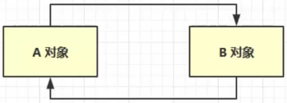
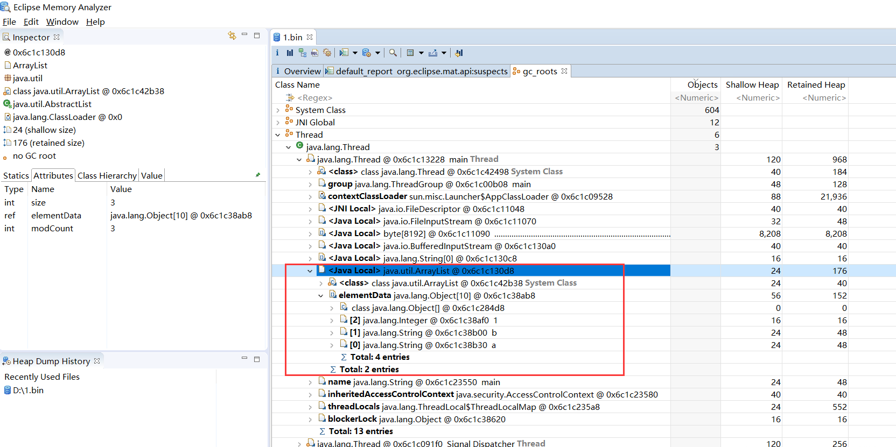
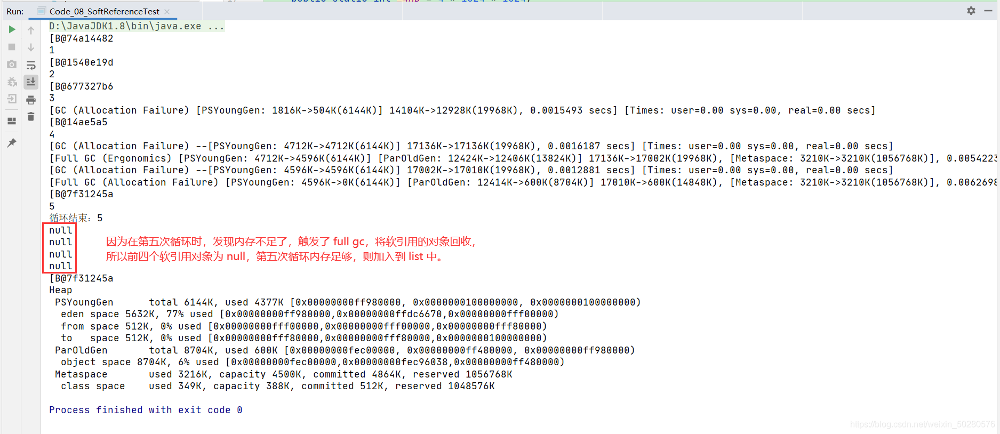
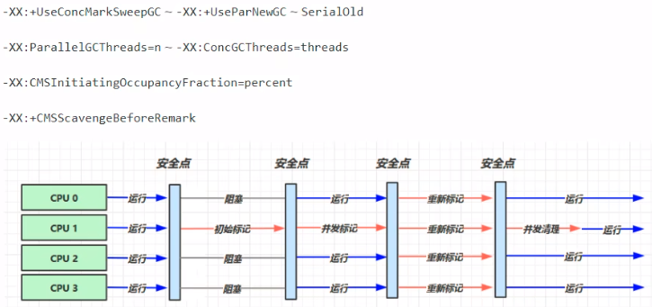
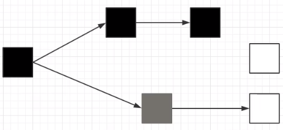
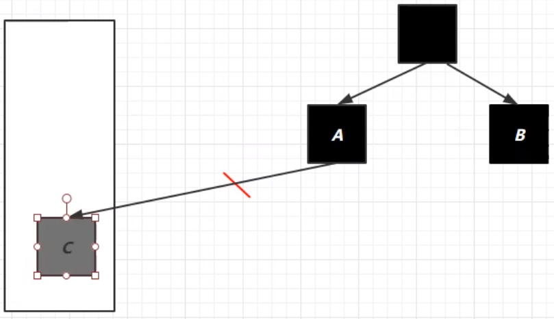
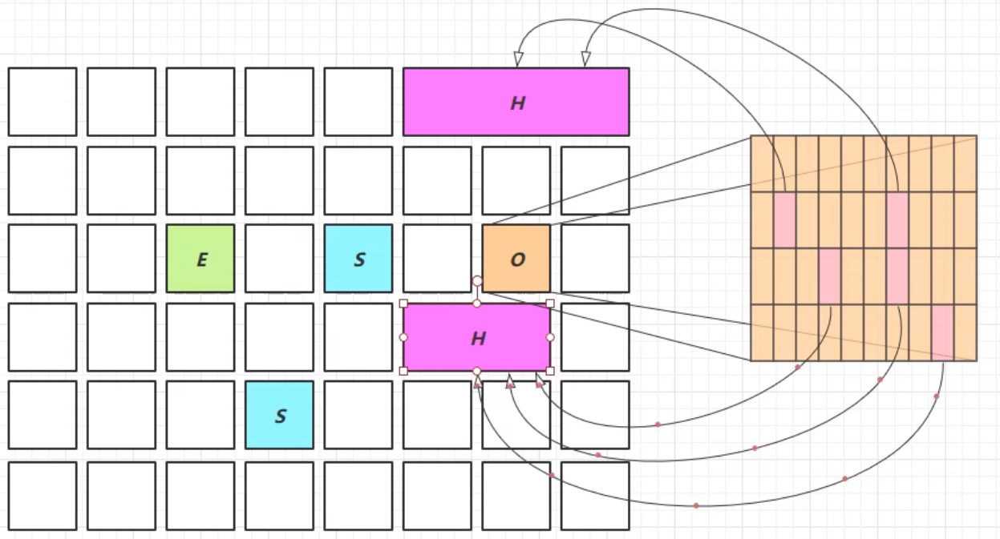

# 垃圾回收

### 一、如何判断对象可以回收

#### 1、引用计数法

当一个对象被引用时，就当引用对象的值加一，当值为 0 时，就表示该对象不被引用，可以被垃圾收集器回收。  
这个引用计数法听起来不错，但是有一个弊端，如下图所示，循环引用时，两个对象的计数都为1，导致两个对象都无法被释放。


#### 2、可达性分析算法

* JVM 中的垃圾回收器通过可达性分析来探索所有存活的对象
* 扫描堆中的对象，看能否沿着 GC Root 对象为起点的引用链找到该对象，如果找不到，则表示可以回收
* 可以作为 GC Root 的对象
    * 虚拟机栈（栈帧中的本地变量表）中引用的对象。
    * 方法区中类静态属性引用的对象
    * 方法区中常量引用的对象
    * 本地方法栈中 JNI（即一般说的Native方法）引用的对象

```
public static void main(String[] args) throws IOException {
    ArrayList<Object> list = new ArrayList<>();
    list.add("a");
    list.add("b");
    list.add(1);
    System.out.println(1);
    System.in.read();

    list = null;
    System.out.println(2);
    System.in.read();
    System.out.println("end");
}
```

对于以上代码，可以使用如下命令将堆内存信息转储成一个文件，然后使用 `Eclipse Memory Analyzer` 工具进行分析。

```shell
# 1、查看java程序进程
jps

# 2、转储文件
# dump：转储文件  
# format=b：二进制文件  
# file：文件名  
# 16104：进程id  
jmap -dump:format=b,live,file=1.bin 16104

# 3、打开 Eclipse Memory Analyzer 对 1.bin 文件进行分析
```



分析的 gc root，找到了 ArrayList 对象，然后将 list 置为null，再次转储，那么 list 对象就会被回收。

#### 3、四种引用

> 也可见 [强软弱虚引用](../../07-JUC并发编程/25-强软弱虚引用.md)


1. 强引用  
   只有所有 GC Roots 对象都不通过【强引用】引用该对象，该对象才能被垃圾回收
2. 软引用（SoftReference）  
   仅有软引用引用该对象时，在垃圾回收后，内存仍不足时会再次出发垃圾回收，回收软引用对象  
   可以配合引用队列来释放软引用自身
3. 弱引用（WeakReference）  
   仅有弱引用引用该对象时，在垃圾回收时，无论内存是否充足，都会回收弱引用对象  
   可以配合引用队列来释放弱引用自身
4. 虚引用（PhantomReference）  
   必须配合引用队列使用，主要配合 ByteBuffer 使用，被引用对象回收时，会将虚引用入队，  
   由 Reference Handler 线程调用虚引用相关方法释放直接内存
5. 终结器引用（FinalReference）  
   无需手动编码，但其内部配合引用队列使用，在垃圾回收时，终结器引用入队（被引用对象暂时没有被回收），再由 Finalizer
   线程通过终结器引用找到被引用对象并调用它的 finalize 方法，第二次 GC 时才能回收被引用对象。

**演示软引用**

```
/**
 * 演示 软引用
 * -Xmx20m -XX:+PrintGCDetails -verbose:gc
 */
public class Code_08_SoftReferenceTest {

    public static int _4MB = 4 * 1024 * 1024;

    public static void main(String[] args) throws IOException {
        method2();
    }

    // 设置 -Xmx20m , 演示堆内存不足,
    public static void method1() throws IOException {
        ArrayList<byte[]> list = new ArrayList<>();

        for(int i = 0; i < 5; i++) {
            list.add(new byte[_4MB]);
        }
        System.in.read();
    }

    // 演示 软引用
    public static void method2() throws IOException {
        ArrayList<SoftReference<byte[]>> list = new ArrayList<>();
        for(int i = 0; i < 5; i++) {
            SoftReference<byte[]> ref = new SoftReference<>(new byte[_4MB]);
            System.out.println(ref.get());
            list.add(ref);
            System.out.println(list.size());
        }
        System.out.println("循环结束：" + list.size());
        for(SoftReference<byte[]> ref : list) {
            System.out.println(ref.get());
        }
    }
}
```

method1 方法解析：  
首先会设置一个堆内存的大小为 20m，然后运行 mehtod1 方法，会抛异常，堆内存不足，因为 mehtod1 中的 list 都是强引用。  


method2 方法解析：  
在 list 集合中存放了 软引用对象，当内存不足时，会触发 full gc，将软引用的对象回收。细节如图：  


上面的代码中，当软引用引用的对象被回收了，但是软引用还存在，所以，一般软引用需要搭配一个引用队列一起使用。  
修改 method2 如下：

```
// 演示 软引用 搭配引用队列
public static void method3() throws IOException {
    ArrayList<SoftReference<byte[]>> list = new ArrayList<>();
    // 引用队列
    ReferenceQueue<byte[]> queue = new ReferenceQueue<>();

    for(int i = 0; i < 5; i++) {
        // 关联了引用队列，当软引用所关联的 byte[] 被回收时，软引用自己会加入到 queue 中去
        SoftReference<byte[]> ref = new SoftReference<>(new byte[_4MB], queue);
        System.out.println(ref.get());
        list.add(ref);
        System.out.println(list.size());
    }

    // 从队列中获取无用的 软引用对象，并移除
    Reference<? extends byte[]> poll = queue.poll();
    while(poll != null) {
        list.remove(poll);
        poll = queue.poll();
    }

    System.out.println("=====================");
    for(SoftReference<byte[]> ref : list) {
        System.out.println(ref.get());
    }
}
```


**弱引用演示**

```
public class Code_09_WeakReferenceTest {

    public static void main(String[] args) {
//        method1();
        method2();
    }

    public static int _4MB = 4 * 1024 *1024;

    // 演示 弱引用
    public static void method1() {
        List<WeakReference<byte[]>> list = new ArrayList<>();
        for(int i = 0; i < 10; i++) {
            WeakReference<byte[]> weakReference = new WeakReference<>(new byte[_4MB]);
            list.add(weakReference);

            for(WeakReference<byte[]> wake : list) {
                System.out.print(wake.get() + ",");
            }
            System.out.println();
        }
    }

    // 演示 弱引用搭配 引用队列
    public static void method2() {
        List<WeakReference<byte[]>> list = new ArrayList<>();
        ReferenceQueue<byte[]> queue = new ReferenceQueue<>();

        for(int i = 0; i < 9; i++) {
            WeakReference<byte[]> weakReference = new WeakReference<>(new byte[_4MB], queue);
            list.add(weakReference);
            for(WeakReference<byte[]> wake : list) {
                System.out.print(wake.get() + ",");
            }
            System.out.println();
        }
        System.out.println("===========================================");
        Reference<? extends byte[]> poll = queue.poll();
        while (poll != null) {
            list.remove(poll);
            poll = queue.poll();
        }
        for(WeakReference<byte[]> wake : list) {
            System.out.print(wake.get() + ",");
        }
    }

}
```

### 二、垃圾回收算法

#### 1、标记清除

定义：Mark Sweep

* 速度较快
* 会产生内存碎片


#### 2、标记整理

Mark Compact

* 速度慢
* 没有内存碎片


#### 3、复制

Copy

* 不会有内存碎片
* 需要占用两倍内存空间


### 三、分代垃圾回收


* 新创建的对象首先分配在 `eden` 区
* 新生代空间不足时，触发`minor gc`，`eden`区 和 `from`区 存活的对象使用copy复制到`to`
  中，存活的对象年龄加一，然后交换 `from` `to`
* `minor gc` 会引发 `stop the world`，暂停其他线程，等垃圾回收结束后，恢复用户线程运行
* 当幸存区对象的寿命超过阈值时，会晋升到老年代，最大的寿命是 15（4bit）
* 当老年代空间不足时，会先触发 `minor gc`，如果空间仍然不足，那么就触发 `full fc` ，停止的时间更长！

#### 1、相关 JVM 参数

| 含义               | 参数                                                          |
|------------------|-------------------------------------------------------------|
| 堆初始大小            | -Xms                                                        |
| 堆最大大小            | -Xmx 或 -XX:MaxHeapSize=size                                 |
| 新生代大小            | -Xmn 或 (-XX:NewSize=size + -XX:MaxNewSize=size )            |
| 幸存区比例（动态）        | -XX:InitialSurvivorRatio=ratio 和 -XX:+UseAdaptiveSizePolicy |
| 幸存区比例            | -XX:SurvivorRatio=ratio                                     |
| 晋升阈值             | -XX:MaxTenuringThreshold=threshold                          |
| 晋升详情             | -XX:+PrintTenuringDistribution                              |
| GC详情             | -XX:+PrintGCDetails -verbose:gc                             |
| FullGC 前 MinorGC | -XX:+ScavengeBeforeFullGC                                   |

#### 2、GC 分析

通过下面的代码，给 list 分配内存，来观察 新生代和老年代的情况，什么时候触发 `minor gc`，什么时候触发 `full gc` 等情况，
使用前需要设置 jvm 参数。

```java
package com.zhengqing.demo.daily.jvm.gc;

import java.util.ArrayList;
import java.util.List;

public class TestGc {

    private static final int _512KB = 512 * 1024;
    private static final int _1MB = 1024 * 1024;
    private static final int _6MB = 6 * 1024 * 1024;
    private static final int _7MB = 7 * 1024 * 1024;
    private static final int _8MB = 8 * 1024 * 1024;

    // -Xms20m -Xmx20m -Xmn10m -XX:+UseSerialGC -XX:+PrintGCDetails -verbose:gc
    public static void main(String[] args) {
        List<byte[]> list = new ArrayList<>();
        list.add(new byte[_6MB]);
//        list.add(new byte[_512KB]);
//        list.add(new byte[_6MB]);
//        list.add(new byte[_512KB]);
        list.add(new byte[_8MB]);
    }

}
```

### 四、垃圾回收器

**相关概念：**

- 并行收集：指多条垃圾收集线程并行工作，但此时用户线程仍处于等待状态。
- 并发收集：指用户线程与垃圾收集线程同时工作（不一定是并行的可能会交替执行）。用户程序在继续运行，而垃圾收集程序运行在另一个CPU上
- 吞吐量：即 CPU 用于运行用户代码的时间与 CPU 总消耗时间的比值
  【 吞吐量 = 运行用户代码时间 / ( 运行用户代码时间 + 垃圾收集时间 ) 】
  例如：虚拟机共运行 100 分钟，垃圾收集器花掉 1 分钟，那么吞吐量就是 99% 。

#### 1、串行

* 单线程
* 堆内存较少，适合个人电脑


```
-XX:+UseSerialGC=serial + serialOld
```

**安全点**：让其他线程都在这个点停下来，以免垃圾回收时移动对象地址，使得其他线程找不到被移动的对象  
因为是串行的，所以只有一个垃圾回收线程。且在该线程执行回收工作时，其他线程进入阻塞状态

**Serial 收集器**  
Serial 收集器是最基本的、发展历史最悠久的收集器  
**特点**：单线程、简单高效（与其他收集器的单线程相比），采用复制算法。对于限定单个 CPU 的环境来说，Serial
收集器由于没有线程交互的开销，专心做垃圾收集自然可以获得最高的单线程收集效率。收集器进行垃圾回收时，必须暂停其他所有的工作线程，直到它结束（Stop
The World）！

**ParNew 收集器**  
ParNew 收集器其实就是 Serial 收集器的多线程版本  
**特点**：多线程、ParNew 收集器默认开启的收集线程数与CPU的数量相同，在 CPU 非常多的环境中，可以使用 -XX:ParallelGCThreads
参数来限制垃圾收集的线程数。和 Serial 收集器一样存在 Stop The World 问题

**Serial Old 收集器**  
Serial Old 是 Serial 收集器的老年代版本  
**特点**：同样是单线程收集器，采用标记-整理算法

#### 2、吞吐量优先

* 多线程
* 堆内存较大，多核 cpu
* 让单位时间内，STW 的时间最短 0.2 0.2 = 0.4


```
-XX:+UseParallelGC ~ -XX:+UsePrallerOldGC
-XX:+UseAdaptiveSizePolicy
-XX:GCTimeRatio=ratio // 1/(1+radio)
-XX:MaxGCPauseMillis=ms // 200ms
-XX:ParallelGCThreads=n
```

**Parallel Scavenge 收集器**  
与吞吐量关系密切，故也称为吞吐量优先收集器  
**特点**：属于新生代收集器也是采用复制算法的收集器（用到了新生代的幸存区），又是并行的多线程收集器（与 ParNew 收集器类似）

该收集器的目标是达到一个可控制的吞吐量。还有一个值得关注的点是：GC自适应调节策略（与 ParNew 收集器最重要的一个区别）

GC自适应调节策略：  
Parallel Scavenge 收集器可设置 -XX:+UseAdptiveSizePolicy 参数。  
当开关打开时不需要手动指定新生代的大小（-Xmn）、Eden 与 Survivor 区的比例（-XX:SurvivorRation）、  
晋升老年代的对象年龄（-XX:PretenureSizeThreshold）等，虚拟机会根据系统的运行状况收集性能监控信息，动态设置这些参数以提供最优的停顿时间和最高的吞吐量，这种调节方式称为
GC 的自适应调节策略。

Parallel Scavenge 收集器使用两个参数控制吞吐量：

* XX:MaxGCPauseMillis=ms 控制最大的垃圾收集停顿时间（默认200ms）
* XX:GCTimeRatio=rario 直接设置吞吐量的大小

**Parallel Old 收集器**  
是 Parallel Scavenge 收集器的老年代版本  
**特点**：多线程，采用标记-整理算法（老年代没有幸存区）

#### 3、响应时间优先

* 多线程
* 堆内存较大，多核 cpu
* 尽可能让 STW 的单次时间最短 0.1 0.1 0.1 0.1 0.1 = 0.5



```
-XX:+UseConcMarkSweepGC ~ -XX:+UseParNewGC ~ SerialOld
-XX:ParallelGCThreads=n ~ -XX:ConcGCThreads=threads
-XX:CMSInitiatingOccupancyFraction=percent
-XX:+CMSScavengeBeforeRemark
```

**CMS 收集器**  
Concurrent Mark Sweep，一种以获取最短回收停顿时间为目标的**老年代收集器**  
**特点**：基于标记-清除算法实现。并发收集、低停顿，但是会产生内存碎片  
**应用场景**：适用于注重服务的响应速度，希望系统停顿时间最短，给用户带来更好的体验等场景下。如 web 程序、b/s 服务  
**CMS 收集器的运行过程分为下列4步：**  
**初始标记**：标记 GC Roots 能直接到的对象。速度很快但是仍存在 Stop The World 问题。  
**并发标记**：进行 GC Roots Tracing 的过程，找出存活对象且用户线程可并发执行。  
**重新标记**：为了修正并发标记期间因用户程序继续运行而导致标记产生变动的那一部分对象的标记记录。仍然存在 Stop The World
问题  
**并发清除**：对标记的对象进行清除回收，清除的过程中，可能任然会有新的垃圾产生，这些垃圾就叫浮动垃圾，如果当用户需要存入一个很大的对象时，新生代放不下去，老年代由于浮动垃圾过多，就会退化为
serial Old 收集器，将老年代垃圾进行标记-整理，当然这也是很耗费时间的！

CMS 收集器的内存回收过程是与用户线程一起并发执行的，可以搭配 ParNew 收集器（多线程，新生代，复制算法）与 Serial Old
收集器（单线程，老年代，标记-整理算法）使用。

#### 4、G1 收集器

定义： Garbage First

适用场景：

- 同时注重吞吐量和低延迟（响应时间）
- 超大堆内存（内存大的），会将堆内存划分为多个大小相等的区域
- 整体上是标记-整理算法，两个区域之间是复制算法

相关参数：
JDK8 并不是默认开启的，所需要参数开启

```
-XX:+UseG1GC
-XX:G1HeapRegionSize=size
-XX:MaxGCPauseMillis=time
```

##### 1）G1 垃圾回收阶段


- Young Collection：对新生代垃圾收集
- Young Collection + Concurrent Mark：如果老年代内存到达一定的阈值了，新生代垃圾收集同时会执行一些并发的标记。
- Mixed Collection：会对新生代 + 老年代 + 幸存区等进行混合收集，然后收集结束，会重新进入新生代收集。

##### 2）Young Collection （新生代回收）

**新生代存在 STW：**  
分代是按对象的生命周期划分，分区则是将堆空间划分连续几个不同小区间，每一个小区间独立回收，可以控制一次回收多少个小区间，方便控制
GC 产生的停顿时间！  
E：eden，S：幸存区，O：老年代  
新生代收集会产生 STW ！


##### 3）Young Collection + CM （新生代回收+CM）

- 在 Young GC 时会进行 GC Root 的初始化标记
- 老年代占用堆空间比例达到阈值时，进行并发标记（不会STW），由下面的 JVM 参数决定 -XX:InitiatingHeapOccupancyPercent=percent
  （默认45%）


##### 4）Mixed Collection （混合回收）

会对 E、S、O 进行**全面的回收**

- 最终标记 会 STW
- 拷贝存活 会 STW

`-XX:MaxGCPauseMillis=ms` 用于指定最长的停顿时间！  
问：为什么有的老年代被拷贝了，有的没拷贝？  
因为指定了最大停顿时间，如果对所有老年代都进行回收，耗时可能过高。为了保证时间不超过设定的停顿时间，会回收最有价值的老年代（回收后，能够得到更多内存）


##### 5）Full GC

G1 在老年代内存不足时（老年代所占内存超过阈值）

- 如果垃圾产生速度慢于垃圾回收速度，不会触发 Full GC，还是并发地进行清理
- 如果垃圾产生速度快于垃圾回收速度，便会触发 Full GC，然后退化成 serial Old 收集器串行的收集，就会导致停顿的时候长。

##### 6）Young Collection 跨代引用

* 新生代回收的跨代引用（老年代引用新生代）问题  
  
* 卡表 与 Remembered Set
    * Remembered Set 存在于E中，用于保存新生代对象对应的脏卡
        * 脏卡：O 被划分为多个区域（一个区域512K），如果该区域引用了新生代对象，则该区域被称为脏卡
* 在引用变更时通过 post-write barried + dirty card queue
* concurrent refinement threads 更新 Remembered Set  
  

##### 7）Remark

重新标记阶段  
在垃圾回收时，收集器处理对象的过程中

* 黑色：已被处理，需要保留的
* 灰色：正在处理中的
* 白色：还未处理的



但是在并发标记过程中，有可能A被处理了以后未引用C，但该处理过程还未结束，在处理过程结束之前A引用了C，这时就会用到remark。

过程如下：

- 之前 C 未被引用，这时 A 引用了 C ，就会给 C 加一个写屏障，写屏障的指令会被执行，将 C 放入一个队列当中，并将 C 变为 处理中状态
  
- 在并发标记阶段结束以后，重新标记阶段会 STW ，然后将放在该队列中的对象重新处理，发现有强引用引用它，就会处理它，由灰色变成黑色。
  

##### 8）JDK 8u20 字符串去重

- 优点：节省了大量内存
- 缺点：新生代回收时间略微增加，导致略微多占用 CPU

-XX:+UseStringDeduplication

```
String s1 = new String("hello"); // char[]{'h','e','l','l','o'}
String s2 = new String("hello"); // char[]{'h','e','l','l','o'}
```

过程

- 将所有新分配的字符串（底层是 char[] ）放入一个队列
- 当新生代回收时，G1 并发检查是否有重复的字符串
- 如果字符串的值一样，就让他们引用同一个字符串对象
- 注意，其与 String.intern() 的区别
    - String.intern() 关注的是字符串对象
    - 字符串去重关注的是 char[]
    - 在 JVM 内部，使用了不同的字符串表

##### 9）JDK 8u40 并发标记类卸载

在并发标记阶段结束以后，就能知道哪些类不再被使用。如果一个类加载器的所有类都不在使用，则卸载它所加载的所有类

`-XX:+ClassUnloadingWithConcurrentMark` 默认启用

##### 10）JDK 8u60 回收巨型对象

* 一个对象大于region的一半时，就称为巨型对象
* G1不会对巨型对象进行拷贝
* 回收时被优先考虑
* G1会跟踪老年代所有incoming引用，如果老年代incoming引用为0的巨型对象就可以在新生代垃圾回收时处理掉



##### 11）JDK 9 并发标记起始时间的调整

- 并发标记必须在堆空间占满前完成，否则退化为 FullGC
- JDK 9 之前需要使用 `-XX:InitiatingHeapOccupancyPercent`
- JDK 9 可以动态调整
    - `-XX:InitiatingHeapOccupancyPercent` 用来设置初始值
    - 进行数据采样并动态调整
    - 总会添加一个安全的空挡空间

##### 12）JDK 9 更高效的回收

- 250+增强
- 180+bug修复
- https://docs.oracle.com/en/java/javase/12/gctuning

### 五、垃圾回收调优

> 命令参数 https://docs.oracle.com/en/java/javase/11/tools/java.html

查看虚拟机参数命令

```shell
D:\zhengqingya\soft\soft-dev\Java\jdk1.8.0_291\bin\java -XX:+PrintFlagsFinal -version | findstr "GC"
```

可以根据参数去查询具体的信息

#### 1、调优领域

* 内存
* 锁竞争
* cpu 占用
* io
* gc

#### 2、确定目标

低延迟/高吞吐量？ 选择合适的GC

* CMS，G1，ZGC
* ParallelGC
* Zing

#### 3、最快的GC是不发生GC

首先排除减少因为自身编写的代码而引发的内存问题

查看 Full GC 前后的内存占用，考虑以下几个问题

- 数据是不是太多？ resultSet = statement.executeQuery("select * from 大表 limit n")
- 数据表示是否太臃肿？
    - 对象图
    - 对象大小 16 Integer 24 int 4
- 是否存在内存泄漏？
    - static Map map
    - 软引用
    - 弱引用
    - 第三方缓存实现

#### 4、新生代调优

新生代的特点

- 所有的 new 操作分配内存都是非常廉价的
  TLAB thread-lcoal allocation buffer
- 死亡对象回收零代价
- 大部分对象用过即死（朝生夕死）
- Minor GC 所用时间远小于 Full GC

新生代内存越大越好么？

- 不是
- 新生代内存太小：频繁触发 Minor GC ，会 STW ，会使得吞吐量下降
- 新生代内存太大：老年代内存占比有所降低，会更频繁地触发 Full GC。而且触发 Minor GC 时，清理新生代所花费的时间会更长
- 新生代内存设置为能容纳所有【并发量*(请求-响应)】的数据为宜

幸存区大到能够保存【当前活跃对象+需要晋升的对象】

晋升阈值配置得当，让长时间存活的对象尽快晋升

```
-XX:MaxTenuringThreshold=threshold
-XX:+PrintTenuringDistrubution
```

#### 5、老年代调优

以 CMS 为例：

- CMS 的老年代内存越大越好
- 先尝试不做调优，如果没有 Full GC 那么已经...，否者先尝试调优新生代。
- 观察发现 Full GC 时老年代内存占用，将老年代内存预设调大 1/4 ~ 1/3

```
-XX:CMSInitiatingOccupancyFraction=percent
```

#### 6、案例

- 案例1：Full GC 和 Minor GC 频繁
- 案例2：请求高峰期发生 Full GC，单次暂停时间特别长（CMS）
- 案例3：老年代充裕情况下，发生 Full GC（jdk1.7）
