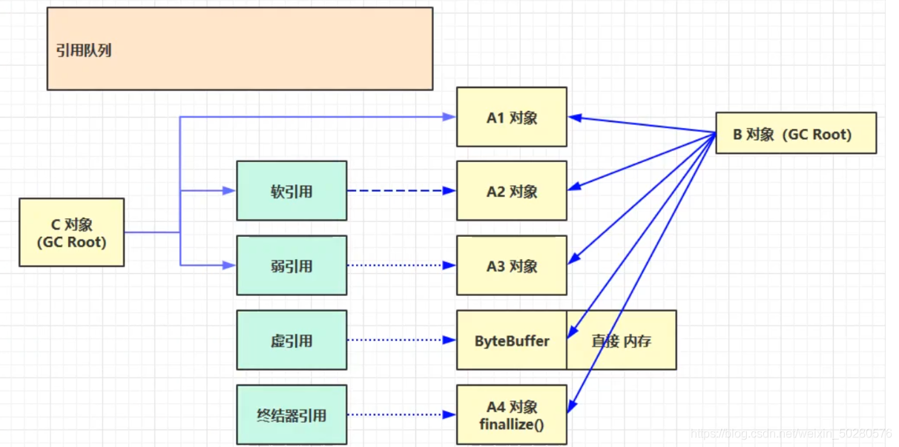
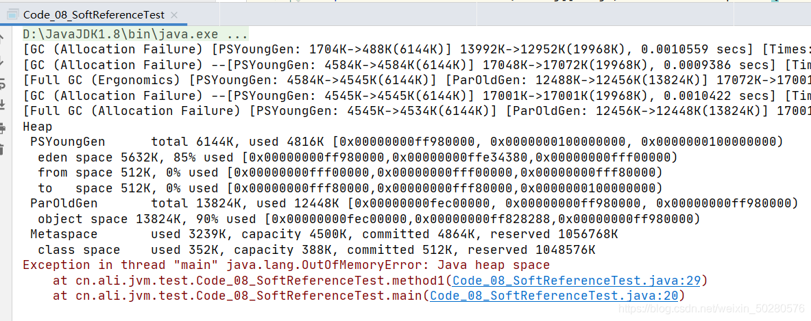
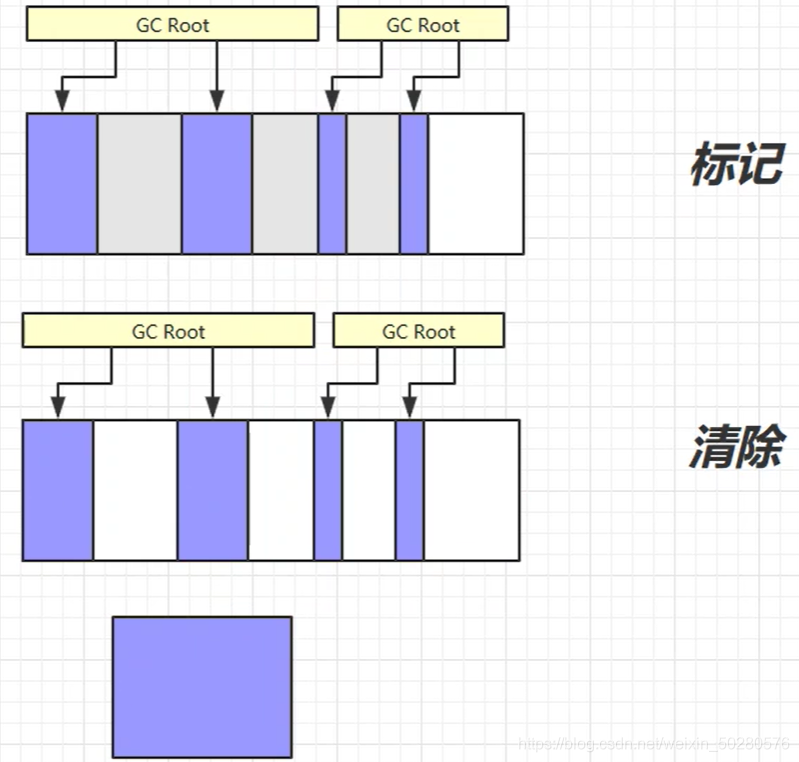
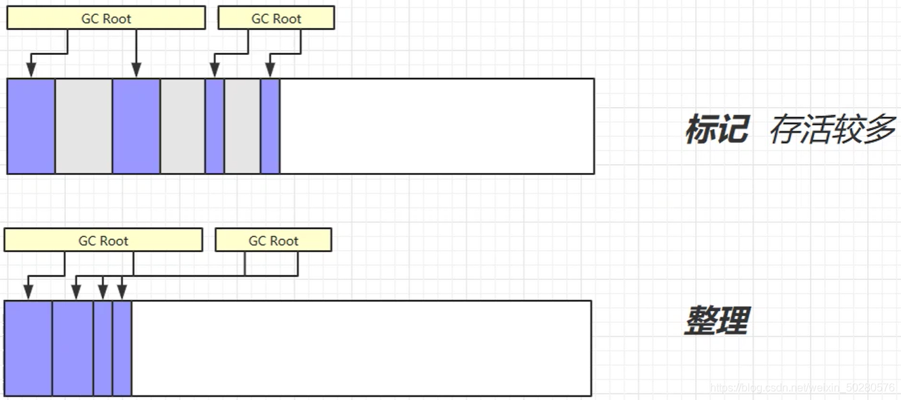
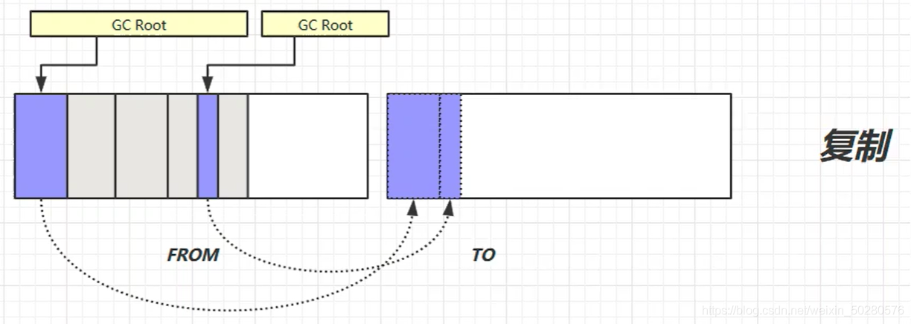
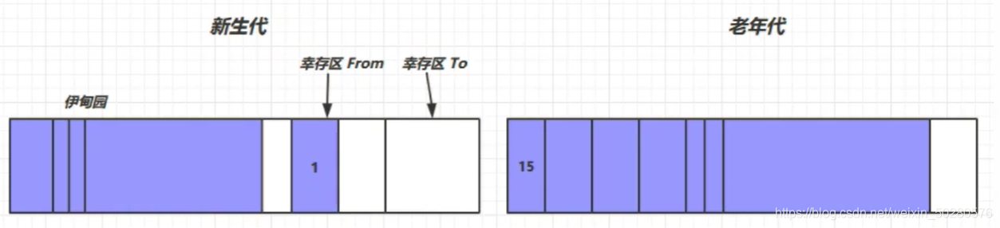

# 垃圾回收

### 一、如何判断对象可以回收

#### 1、引用计数法

当一个对象被引用时，就当引用对象的值加一，当值为 0 时，就表示该对象不被引用，可以被垃圾收集器回收。  
这个引用计数法听起来不错，但是有一个弊端，如下图所示，循环引用时，两个对象的计数都为1，导致两个对象都无法被释放。


#### 2、可达性分析算法

* JVM 中的垃圾回收器通过可达性分析来探索所有存活的对象
* 扫描堆中的对象，看能否沿着 GC Root 对象为起点的引用链找到该对象，如果找不到，则表示可以回收
* 可以作为 GC Root 的对象
    * 虚拟机栈（栈帧中的本地变量表）中引用的对象。
    * 方法区中类静态属性引用的对象
    * 方法区中常量引用的对象
    * 本地方法栈中 JNI（即一般说的Native方法）引用的对象

```
public static void main(String[] args) throws IOException {
    ArrayList<Object> list = new ArrayList<>();
    list.add("a");
    list.add("b");
    list.add(1);
    System.out.println(1);
    System.in.read();

    list = null;
    System.out.println(2);
    System.in.read();
    System.out.println("end");
}
```

对于以上代码，可以使用如下命令将堆内存信息转储成一个文件，然后使用 `Eclipse Memory Analyzer` 工具进行分析。

```shell
# 1、查看java程序进程
jps

# 2、转储文件
# dump：转储文件  
# format=b：二进制文件  
# file：文件名  
# 16104：进程id  
jmap -dump:format=b,live,file=1.bin 16104

# 3、打开 Eclipse Memory Analyzer 对 1.bin 文件进行分析
```


分析的 gc root，找到了 ArrayList 对象，然后将 list 置为null，再次转储，那么 list 对象就会被回收。

#### 3、四种引用

> 也可见 [强软弱虚引用](../07-JUC并发编程/25-强软弱虚引用.md)



1. 强引用  
   只有所有 GC Roots 对象都不通过【强引用】引用该对象，该对象才能被垃圾回收
2. 软引用（SoftReference）  
   仅有软引用引用该对象时，在垃圾回收后，内存仍不足时会再次出发垃圾回收，回收软引用对象  
   可以配合引用队列来释放软引用自身
3. 弱引用（WeakReference）  
   仅有弱引用引用该对象时，在垃圾回收时，无论内存是否充足，都会回收弱引用对象  
   可以配合引用队列来释放弱引用自身
4. 虚引用（PhantomReference）  
   必须配合引用队列使用，主要配合 ByteBuffer 使用，被引用对象回收时，会将虚引用入队，  
   由 Reference Handler 线程调用虚引用相关方法释放直接内存
5. 终结器引用（FinalReference）  
   无需手动编码，但其内部配合引用队列使用，在垃圾回收时，终结器引用入队（被引用对象暂时没有被回收），再由 Finalizer
   线程通过终结器引用找到被引用对象并调用它的 finalize 方法，第二次 GC 时才能回收被引用对象。

**演示软引用**

```
/**
 * 演示 软引用
 * -Xmx20m -XX:+PrintGCDetails -verbose:gc
 */
public class Code_08_SoftReferenceTest {

    public static int _4MB = 4 * 1024 * 1024;

    public static void main(String[] args) throws IOException {
        method2();
    }

    // 设置 -Xmx20m , 演示堆内存不足,
    public static void method1() throws IOException {
        ArrayList<byte[]> list = new ArrayList<>();

        for(int i = 0; i < 5; i++) {
            list.add(new byte[_4MB]);
        }
        System.in.read();
    }

    // 演示 软引用
    public static void method2() throws IOException {
        ArrayList<SoftReference<byte[]>> list = new ArrayList<>();
        for(int i = 0; i < 5; i++) {
            SoftReference<byte[]> ref = new SoftReference<>(new byte[_4MB]);
            System.out.println(ref.get());
            list.add(ref);
            System.out.println(list.size());
        }
        System.out.println("循环结束：" + list.size());
        for(SoftReference<byte[]> ref : list) {
            System.out.println(ref.get());
        }
    }
}
```

method1 方法解析：  
首先会设置一个堆内存的大小为 20m，然后运行 mehtod1 方法，会抛异常，堆内存不足，因为 mehtod1 中的 list 都是强引用。  


method2 方法解析：  
在 list 集合中存放了 软引用对象，当内存不足时，会触发 full gc，将软引用的对象回收。细节如图：  


上面的代码中，当软引用引用的对象被回收了，但是软引用还存在，所以，一般软引用需要搭配一个引用队列一起使用。  
修改 method2 如下：

```
// 演示 软引用 搭配引用队列
public static void method3() throws IOException {
    ArrayList<SoftReference<byte[]>> list = new ArrayList<>();
    // 引用队列
    ReferenceQueue<byte[]> queue = new ReferenceQueue<>();

    for(int i = 0; i < 5; i++) {
        // 关联了引用队列，当软引用所关联的 byte[] 被回收时，软引用自己会加入到 queue 中去
        SoftReference<byte[]> ref = new SoftReference<>(new byte[_4MB], queue);
        System.out.println(ref.get());
        list.add(ref);
        System.out.println(list.size());
    }

    // 从队列中获取无用的 软引用对象，并移除
    Reference<? extends byte[]> poll = queue.poll();
    while(poll != null) {
        list.remove(poll);
        poll = queue.poll();
    }

    System.out.println("=====================");
    for(SoftReference<byte[]> ref : list) {
        System.out.println(ref.get());
    }
}
```


**弱引用演示**

```
public class Code_09_WeakReferenceTest {

    public static void main(String[] args) {
//        method1();
        method2();
    }

    public static int _4MB = 4 * 1024 *1024;

    // 演示 弱引用
    public static void method1() {
        List<WeakReference<byte[]>> list = new ArrayList<>();
        for(int i = 0; i < 10; i++) {
            WeakReference<byte[]> weakReference = new WeakReference<>(new byte[_4MB]);
            list.add(weakReference);

            for(WeakReference<byte[]> wake : list) {
                System.out.print(wake.get() + ",");
            }
            System.out.println();
        }
    }

    // 演示 弱引用搭配 引用队列
    public static void method2() {
        List<WeakReference<byte[]>> list = new ArrayList<>();
        ReferenceQueue<byte[]> queue = new ReferenceQueue<>();

        for(int i = 0; i < 9; i++) {
            WeakReference<byte[]> weakReference = new WeakReference<>(new byte[_4MB], queue);
            list.add(weakReference);
            for(WeakReference<byte[]> wake : list) {
                System.out.print(wake.get() + ",");
            }
            System.out.println();
        }
        System.out.println("===========================================");
        Reference<? extends byte[]> poll = queue.poll();
        while (poll != null) {
            list.remove(poll);
            poll = queue.poll();
        }
        for(WeakReference<byte[]> wake : list) {
            System.out.print(wake.get() + ",");
        }
    }

}
```

### 二、垃圾回收算法

#### 1、标记清除

定义：Mark Sweep

* 速度较快
* 会产生内存碎片



#### 2、标记整理

Mark Compact

* 速度慢
* 没有内存碎片



#### 3、复制

Copy

* 不会有内存碎片
* 需要占用两倍内存空间



### 三、分代垃圾回收



* 新创建的对象首先分配在 `eden` 区
* 新生代空间不足时，触发`minor gc`，`eden`区 和 `from`区 存活的对象使用copy复制到`to`
  中，存活的对象年龄加一，然后交换 `from` `to`
* `minor gc` 会引发 `stop the world`，暂停其他线程，等垃圾回收结束后，恢复用户线程运行
* 当幸存区对象的寿命超过阈值时，会晋升到老年代，最大的寿命是 15（4bit）
* 当老年代空间不足时，会先触发 `minor gc`，如果空间仍然不足，那么就触发 `full fc` ，停止的时间更长！

#### 1、相关 JVM 参数

| 含义               | 参数                                                          |
|------------------|-------------------------------------------------------------|
| 堆初始大小            | -Xms                                                        |
| 堆最大大小            | -Xmx 或 -XX:MaxHeapSize=size                                 |
| 新生代大小            | -Xmn 或 (-XX:NewSize=size + -XX:MaxNewSize=size )            |
| 幸存区比例（动态）        | -XX:InitialSurvivorRatio=ratio 和 -XX:+UseAdaptiveSizePolicy |
| 幸存区比例            | -XX:SurvivorRatio=ratio                                     |
| 晋升阈值             | -XX:MaxTenuringThreshold=threshold                          |
| 晋升详情             | -XX:+PrintTenuringDistribution                              |
| GC详情             | -XX:+PrintGCDetails -verbose:gc                             |
| FullGC 前 MinorGC | -XX:+ScavengeBeforeFullGC                                   |

#### 2、GC 分析

通过下面的代码，给 list 分配内存，来观察 新生代和老年代的情况，什么时候触发 `minor gc`，什么时候触发 `full gc` 等情况，
使用前需要设置 jvm 参数。

```java
package com.zhengqing.demo.daily.jvm.gc;

import java.util.ArrayList;
import java.util.List;

public class TestGc {

    private static final int _512KB = 512 * 1024;
    private static final int _1MB = 1024 * 1024;
    private static final int _6MB = 6 * 1024 * 1024;
    private static final int _7MB = 7 * 1024 * 1024;
    private static final int _8MB = 8 * 1024 * 1024;

    // -Xms20m -Xmx20m -Xmn10m -XX:+UseSerialGC -XX:+PrintGCDetails -verbose:gc
    public static void main(String[] args) {
        List<byte[]> list = new ArrayList<>();
        list.add(new byte[_6MB]);
//        list.add(new byte[_512KB]);
//        list.add(new byte[_6MB]);
//        list.add(new byte[_512KB]);
        list.add(new byte[_8MB]);
    }

}
```
