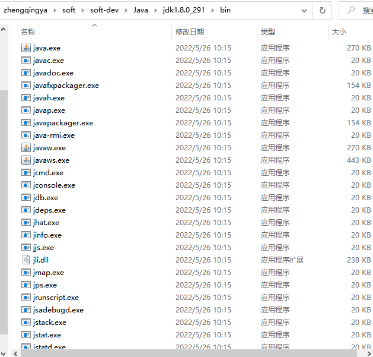
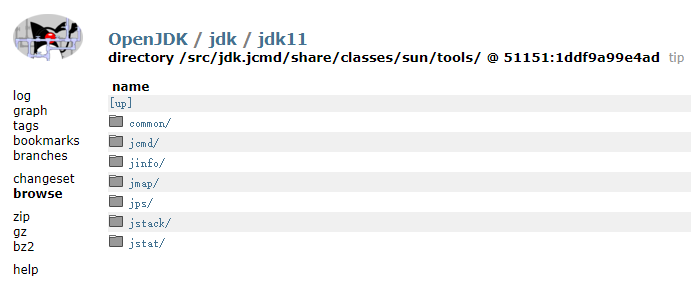

# JVM 监控及诊断工具-命令行篇

### 一、概述

性能诊断是软件工程师在日常工作中需要经常面对和解决的问题，在用户体验至上的今天，解决好应用的性能问题能带来非常大的收益。

Java 作为最流行的编程语言之一，其应用性能诊断一直受到业界广泛关注。可能造成 Java 应用出现性能问题的因素非常多，例如线程控制、磁盘读写、数据库访问、网络
I/O、垃圾收集等。想要定位这些问题，一款优秀的性能诊断工具必不可少。

- 体会 1：使用数据说明问题，使用知识分析问题，使用工具处理问题。
- 体会 2：无监控、不调优！

**简单命令行工具**

在我们刚接触 java 学习的时候，大家肯定最先了解的两个命令就是 javac，java，那么除此之外，还有没有其他的命令可以供我们使用呢？

我们进入到安装 jdk 的 bin 目录，发现还有一系列辅助工具。这些辅助工具用来获取目标 JVM 不同方面、不同层次的信息，帮助开发人员很好地解决
Java 应用程序的一些疑难杂症。

`D:\zhengqingya\soft\soft-dev\Java\jdk1.8.0_291\bin`

> 这些工具在`jdk1.8.0_291\lib\tools.jar`中

官方源码地址：https://hg.openjdk.org/jdk/jdk11/file/1ddf9a99e4ad/src/jdk.jcmd/share/classes/sun/tools

### 二、命令行工具

见 [监控工具-命令行](../../03-监控工具/01-命令行)
