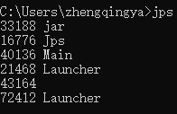

# jstat：查看 JVM 统计信息 & 排查OOM和内存泄漏

jstat（JVM Statistics Monitoring Tool）：用于监视虚拟机各种运行状态信息的命令行工具。
它可以显示本地或者远程虚拟机进程中的类装载、内存、垃圾收集、JIT 编译等运行数据。
在没有 GUI 图形界面，只提供了纯文本控制台环境的服务器上，它将是运行期定位虚拟机性能问题的首选工具。
常用于检测垃圾回收问题以及内存泄漏问题。

官方文档：https://docs.oracle.com/javase/8/docs/technotes/tools/unix/jstat.html

基本使用语法为：`jstat -<option> [-t] [-h<lines>] <vmid> [<interval> [<count>]]`

查看命令相关参数：`jstat -help`

其中 vmid 是进程 id 号，也就是 jps 之后看到的前面的号码，如下：


**option 参数**

选项 option 可以由以下值构成。

<mark>类装载相关的：</mark>

- -class：显示 ClassLoader 的相关信息：类的装载、卸载数量、总空间、类装载所消耗的时间等

<mark>垃圾回收相关的：</mark>

- -gc：显示与 GC 相关的堆信息。包括 Eden 区、两个 Survivor 区、老年代、永久代等的容量、已用空间、GC 时间合计等信息。
- -gccapacity：显示内容与-gc 基本相同，但输出主要关注 Java 堆各个区域使用到的最大、最小空间。
- -gcutil：显示内容与-gc 基本相同，但输出主要关注已使用空间占总空间的百分比。
- -gccause：与-gcutil 功能一样，但是会额外输出导致最后一次或当前正在发生的 GC 产生的原因。
- -gcnew：显示新生代 GC 状况
- -gcnewcapacity：显示内容与-gcnew 基本相同，输出主要关注使用到的最大、最小空间
- -geold：显示老年代 GC 状况
- -gcoldcapacity：显示内容与-gcold 基本相同，输出主要关注使用到的最大、最小空间
- -gcpermcapacity：显示永久代使用到的最大、最小空间。

<mark>JIT 相关的：</mark>

- -compiler：显示 JIT 编译器编译过的方法、耗时等信息
- -printcompilation：输出已经被 JIT 编译的方法

命令示例：

```shell
jps -l
# 批量修改自己的pid，然后可以将下面的命令全部cv到cmd中测试查看效果
jstat -class 50612
jstat -compiler 50612
jstat -printcompilation 50612
jstat -gc 50612 1000 3
jstat -gccapacity 50612 1000 3
jstat -gcutil 50612 1000 3
jstat -gccause 50612 1000 3
jstat -gcnew 50612 1000 3
jstat -gcnewcapacity 50612 1000 3
jstat -gcold 50612 1000 3
jstat -gcoldcapacity 50612 1000 3
jstat -gc -t 50612 1000 3
jstat -gc -t -h3 50612 1000 3
```

详细日志信息

```shell
C:\Users\zhengqingya>jps -l
33188 finalshell.jar
50612 com.zhengqing.demo.daily.jvm.gc.TestJvm
40136 org/netbeans/Main
67688 org.jetbrains.jps.cmdline.Launcher
36732 sun.tools.jps.Jps
43164
58092 org.jetbrains.jps.cmdline.Launcher

C:\Users\zhengqingya>jstat -class 50612
Loaded  Bytes  Unloaded  Bytes     Time
   505  1024.4        0     0.0       0.12

C:\Users\zhengqingya>jstat -compiler 50612
Compiled Failed Invalid   Time   FailedType FailedMethod
     140      0       0     0.04          0

C:\Users\zhengqingya>jstat -printcompilation 50612
Compiled  Size  Type Method
     140     24    1 sun/misc/VM addFinalRefCount

C:\Users\zhengqingya>jstat -gc 50612 1000 3
 S0C    S1C    S0U    S1U      EC       EU        OC         OU       MC     MU    CCSC   CCSU   YGC     YGCT    FGC    FGCT     GCT
4096.0 4096.0  0.0   4074.0 32768.0  23426.1   81920.0    23943.8   4864.0 3216.1 512.0  338.1       1    0.005   0      0.000    0.005
4096.0 4096.0  0.0   4074.0 32768.0  23426.1   81920.0    23943.8   4864.0 3216.1 512.0  338.1       1    0.005   0      0.000    0.005
4096.0 4096.0  0.0   4074.0 32768.0  23426.1   81920.0    23943.8   4864.0 3216.1 512.0  338.1       1    0.005   0      0.000    0.005

C:\Users\zhengqingya>jstat -gccapacity 50612 1000 3
 NGCMN    NGCMX     NGC     S0C   S1C       EC      OGCMN      OGCMX       OGC         OC       MCMN     MCMX      MC     CCSMN    CCSMX     CCSC    YGC    FGC
 40960.0  40960.0  40960.0 4096.0 4096.0  32768.0    81920.0    81920.0    81920.0    81920.0      0.0 1056768.0   4864.0      0.0 1048576.0    512.0      1     0
 40960.0  40960.0  40960.0 4096.0 4096.0  32768.0    81920.0    81920.0    81920.0    81920.0      0.0 1056768.0   4864.0      0.0 1048576.0    512.0      1     0
 40960.0  40960.0  40960.0 4096.0 4096.0  32768.0    81920.0    81920.0    81920.0    81920.0      0.0 1056768.0   4864.0      0.0 1048576.0    512.0      1     0

C:\Users\zhengqingya>jstat -gcutil 50612 1000 3
  S0     S1     E      O      M     CCS    YGC     YGCT    FGC    FGCT     GCT
  0.00  99.46  71.49  29.23  66.12  66.03      1    0.005     0    0.000    0.005
  0.00  99.46  71.49  29.23  66.12  66.03      1    0.005     0    0.000    0.005
  0.00  99.46  71.49  29.23  66.12  66.03      1    0.005     0    0.000    0.005

C:\Users\zhengqingya>jstat -gccause 50612 1000 3
  S0     S1     E      O      M     CCS    YGC     YGCT    FGC    FGCT     GCT    LGCC                 GCC
  0.00  99.46  71.49  29.23  66.12  66.03      1    0.005     0    0.000    0.005 Allocation Failure   No GC
  0.00  99.46  71.49  29.23  66.12  66.03      1    0.005     0    0.000    0.005 Allocation Failure   No GC
  0.00  99.46  71.49  29.23  66.12  66.03      1    0.005     0    0.000    0.005 Allocation Failure   No GC

C:\Users\zhengqingya>jstat -gcnew 50612 1000 3
 S0C    S1C    S0U    S1U   TT MTT  DSS      EC       EU     YGC     YGCT
4096.0 4096.0    0.0 4074.0  7  15 4096.0  32768.0  23426.1      1    0.005
4096.0 4096.0    0.0 4074.0  7  15 4096.0  32768.0  23426.1      1    0.005
4096.0 4096.0    0.0 4074.0  7  15 4096.0  32768.0  23426.1      1    0.005

C:\Users\zhengqingya>jstat -gcnewcapacity 50612 1000 3
  NGCMN      NGCMX       NGC      S0CMX     S0C     S1CMX     S1C       ECMX        EC      YGC   FGC
   40960.0    40960.0    40960.0   4096.0   4096.0   4096.0   4096.0    39936.0    32768.0     1     0
   40960.0    40960.0    40960.0   4096.0   4096.0   4096.0   4096.0    39936.0    32768.0     1     0
   40960.0    40960.0    40960.0   4096.0   4096.0   4096.0   4096.0    39936.0    32768.0     1     0

C:\Users\zhengqingya>jstat -gcold 50612 1000 3
   MC       MU      CCSC     CCSU       OC          OU       YGC    FGC    FGCT     GCT
  4864.0   3216.1    512.0    338.1     81920.0     23943.8      1     0    0.000    0.005
  4864.0   3216.1    512.0    338.1     81920.0     23943.8      1     0    0.000    0.005
  4864.0   3216.1    512.0    338.1     81920.0     23943.8      1     0    0.000    0.005

C:\Users\zhengqingya>jstat -gcoldcapacity 50612 1000 3
   OGCMN       OGCMX        OGC         OC       YGC   FGC    FGCT     GCT
    81920.0     81920.0     81920.0     81920.0     1     0    0.000    0.005
    81920.0     81920.0     81920.0     81920.0     1     0    0.000    0.005
    81920.0     81920.0     81920.0     81920.0     1     0    0.000    0.005

C:\Users\zhengqingya>jstat -gc -t 50612 1000 3
Timestamp        S0C    S1C    S0U    S1U      EC       EU        OC         OU       MC     MU    CCSC   CCSU   YGC     YGCT    FGC    FGCT     GCT
          211.9 4096.0 4096.0  0.0   4074.0 32768.0  23426.1   81920.0    23943.8   4864.0 3216.1 512.0  338.1       1    0.005   0      0.000    0.005
          212.9 4096.0 4096.0  0.0   4074.0 32768.0  23426.1   81920.0    23943.8   4864.0 3216.1 512.0  338.1       1    0.005   0      0.000    0.005
          213.9 4096.0 4096.0  0.0   4074.0 32768.0  23426.1   81920.0    23943.8   4864.0 3216.1 512.0  338.1       1    0.005   0      0.000    0.005

C:\Users\zhengqingya>jstat -gc -t -h3 50612 1000 3
Timestamp        S0C    S1C    S0U    S1U      EC       EU        OC         OU       MC     MU    CCSC   CCSU   YGC     YGCT    FGC    FGCT     GCT
          325.1 4096.0 4096.0  0.0   4074.0 32768.0  23426.1   81920.0    23943.8   4864.0 3216.1 512.0  338.1       1    0.005   0      0.000    0.005
          326.1 4096.0 4096.0  0.0   4074.0 32768.0  23426.1   81920.0    23943.8   4864.0 3216.1 512.0  338.1       1    0.005   0      0.000    0.005
          327.1 4096.0 4096.0  0.0   4074.0 32768.0  23426.1   81920.0    23943.8   4864.0 3216.1 512.0  338.1       1    0.005   0      0.000    0.005

C:\Users\zhengqingya>
```

解释：

| 表头   | 含义（字节）                        |
|:-----|:------------------------------|
| EC   | Eden 区的大小                     |
| EU   | Eden 区已使用的大小                  |
| S0C  | 幸存者 0 区的大小                    |
| S1C  | 幸存者 1 区的大小                    |
| S0U  | 幸存者 0 区已使用的大小                 |
| S1U  | 幸存者 1 区已使用的大小                 |
| MC   | 元空间的大小                        |
| MU   | 元空间已使用的大小                     |
| OC   | 老年代的大小                        |
| OU   | 老年代已使用的大小                     |
| CCSC | 压缩类空间的大小                      |
| CCSU | 压缩类空间已使用的大小                   |
| YGC  | 从应用程序启动到采样时 young gc 的次数      |
| YGCT | 从应用程序启动到采样时 young gc 消耗时间（秒）  |
| FGC  | 从应用程序启动到采样时 full gc 的次数       |
| FGCT | 从应用程序启动到采样时的 full gc 的消耗时间（秒） |
| GCT  | 从应用程序启动到采样时 gc 的总时间           |

- interval 参数： 用于指定输出统计数据的周期，单位为毫秒。即：查询间隔
- count 参数： 用于指定查询的总次数
- -t 参数： 可以在输出信息前加上一个 Timestamp 列，显示程序的运行时间。单位：秒
- -h 参数： 可以在周期性数据输出时，输出多少行数据后输出一个表头信息

补充： jstat 还可以用来判断是否出现内存泄漏。

- 第1步：在长时间运行的 Java 程序中，我们可以运行 jstat 命令连续获取多行性能数据，并取这几行数据中 OU 列（即已占用的老年代内存）的最小值。
- 第2步：然后，我们每隔一段较长的时间重复一次上述操作，来获得多组 OU 最小值。
  如果这些值呈上涨趋势，则说明该 Java 程序的老年代内存已使用量在不断上涨，这意味着无法回收的对象在不断增加，因此很有可能存在内存泄漏。
