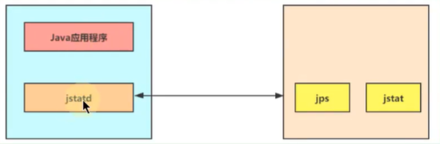

# jstatd：远程主机信息收集

之前的指令只涉及到监控本机的 Java 应用程序，而在这些工具中，一些监控工具也支持对远程计算机的监控（如 jps、jstat）。
为了启用远程监控，则需要配合使用 jstatd 工具。
命令 jstatd 是一个 RMI 服务端程序，它的作用相当于代理服务器，建立本地计算机与远程监控工具的通信。
jstatd 服务器将本机的 Java 应用程序信息传递到远程计算机。

