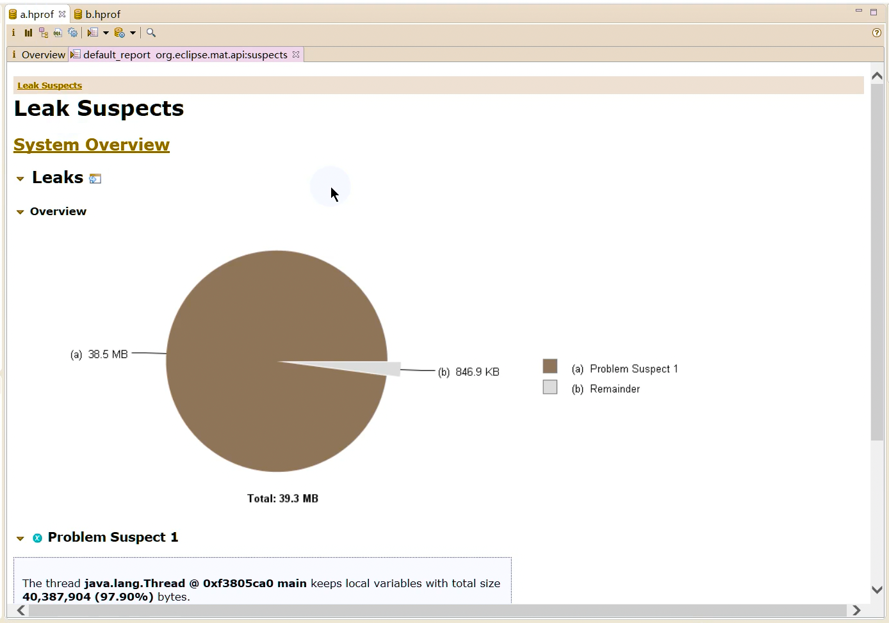
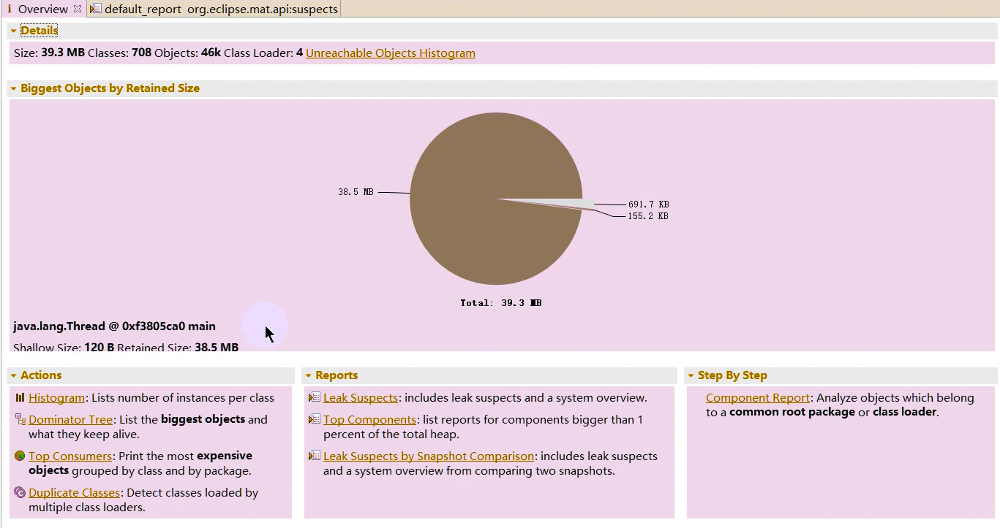
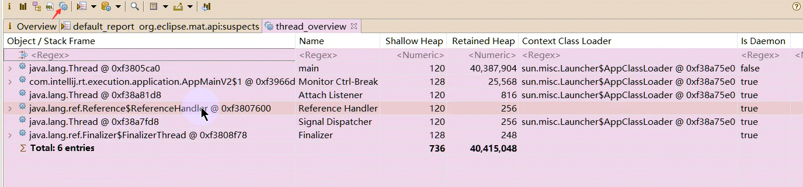
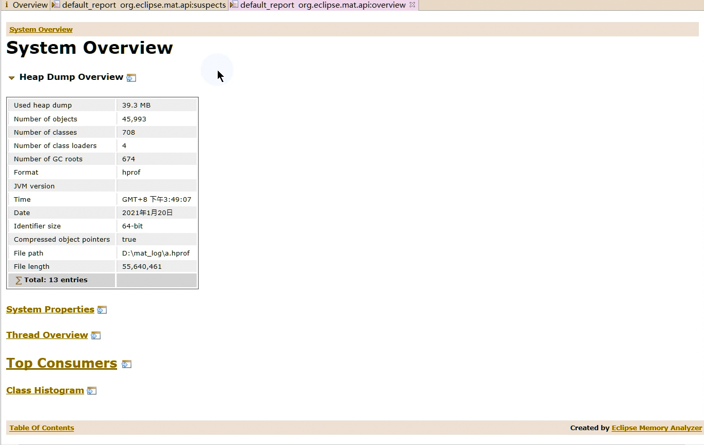

# Eclipse MAT

MAT（Memory Analyzer Tool）工具是一款功能强大的 Java 堆内存分析器。
可以用于查找内存泄漏以及查看内存消耗情况。
MAT 是基于 Eclipse 开发的，不仅可以单独使用，还可以作为插件的形式嵌入在 Eclipse 中使用。
是一款免费的性能分析工具，使用起来非常方便。

MAT 可以分析 heap dump 文件。
在进行内存分析时，只要获得了反映当前设备内存映像的 hprof 文件，通过 MAT 打开就可以直观地看到当前的内存信息。

一般说来，这些内存信息包含：

- 所有的对象信息，包括对象实例、成员变量、存储于栈中的基本类型值和存储于堆中的其他对象的引用值。
- 所有的类信息，包括 classloader、类名称、父类、静态变量等
- GCRoot 到所有的这些对象的引用路径
- 线程信息，包括线程的调用栈及此线程的线程局部变量（TLS）

MAT 不是一个万能工具，它并不能处理所有类型的堆存储文件。
但是比较主流的厂家和格式，例如 Sun，HP，SAP 所采用的 HPROF 二进制堆存储文件，以及 IBM 的 PHD 堆存储文件等都能被很好的解析。

最吸引人的还是能够快速为开发人员生成内存泄漏报表，方便定位问题和分析问题。
虽然 MAT 有如此强大的功能，但是内存分析也没有简单到一键完成的程度，很多内存问题还是需要我们从 MAT
展现给我们的信息当中通过经验和直觉来判断才能发现。

官方地址： https://www.eclipse.org/mat/downloads.php

