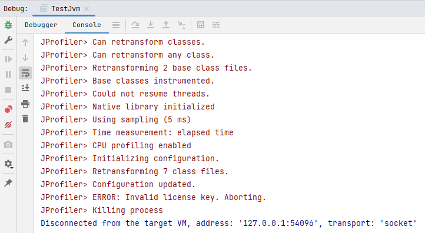
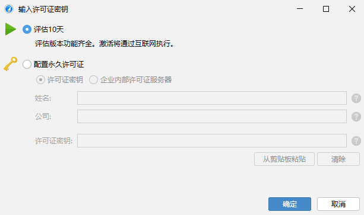

# 安装

> tips: 可以在idea中安装JProfiler插件，方便本地程序测试

### 安装客户端

下载JProfiler客户端并安装 https://www.ej-technologies.com/download/jprofiler/files

JProfiler帮助文档 https://www.ej-technologies.com/resources/jprofiler/v/13.0/help_zh_CN/doc/main/introduction.html

### 激活

> ex： jprofiler_windows-x64_13_0_4.exe

通过[`Keygen.exe`](jprofiler13激活/Keygen.exe)

### 问题

如果监控的时候遇到`JProfiler> ERROR: Invalid license key. Aborting.`，说明许可证不对...

那就反复卸载重装试用10天吧... ^_^

