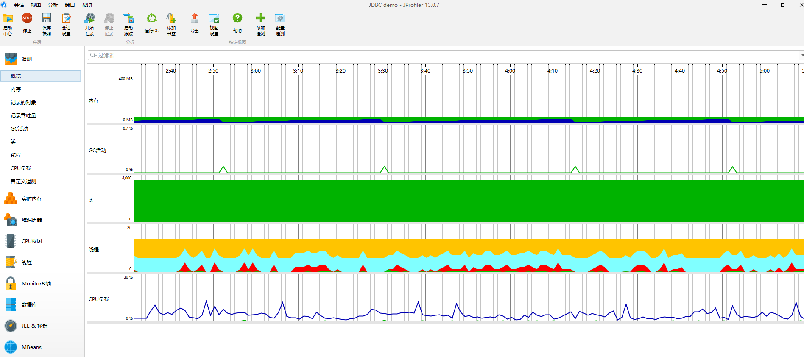

### 数据采集方式

JProfier 数据采集方式分为两种：Sampling（样本采集）和 Instrumentation（重构模式）

**Instrumentation**：这是 JProfiler 全功能模式。在 class 加载之前，JProfier 把相关功能代码写入到需要分析的 class 的
bytecode 中，对正在运行的 jvm 有一定影响。

- 优点：功能强大。在此设置中，调用堆栈信息是准确的。
- 缺点：若要分析的 class 较多，则对应用的性能影响较大，CPU 开销可能很高（取决于 Filter 的控制）。因此使用此模式一般配合 Filter
  使用，只对特定的类或包进行分析

**Sampling**：类似于样本统计，每隔一定时间（5ms）将每个线程栈中方法栈中的信息统计出来。

- 优点：对 CPU 的开销非常低，对应用影响小（即使你不配置任何 Filter）
- 缺点：一些数据/特性不能提供（例如：方法的调用次数、执行时间）

注：JProfiler 本身没有指出数据的采集类型，这里的采集类型是针对方法调用的采集类型。
因为 JProfiler 的绝大多数核心功能都依赖方法调用采集的数据，所以可以直接认为是 JProfiler 的数据采集类型。

### 遥感监测 Telemetries

### 内存视图 Live Memory

Live memory 内存剖析：class／class instance 的相关信息。例如对象的个数，大小，对象创建的方法执行栈，对象创建的热点。

- **所有对象 All Objects**：显示所有加载的类的列表和在堆上分配的实例数。只有 Java 1.5（JVMTI）才会显示此视图。
- **记录对象 Record Objects**：查看特定时间段对象的分配，并记录分配的调用堆栈。
- **分配访问树 Allocation Call Tree**：显示一棵请求树或者方法、类、包或对已选择类有带注释的分配信息的 J2EE 组件。
- **分配热点 Allocation Hot Spots**：显示一个列表，包括方法、类、包或分配已选类的 J2EE
  组件。你可以标注当前值并且显示差异值。对于每个热点都可以显示它的跟踪记录树。
- **类追踪器 Class Tracker**：类跟踪视图可以包含任意数量的图表，显示选定的类和包的实例与时间。

### 堆遍历 heap walker

### cpu 视图 cpu views

JProfiler 提供不同的方法来记录访问树以优化性能和细节。线程或者线程组以及线程状况可以被所有的视图选择。所有的视图都可以聚集到方法、类、包或
J2EE 组件等不同层上。

- **访问树 Call Tree**：显示一个积累的自顶向下的树，树中包含所有在 JVM 中已记录的访问队列。JDBC，JMS 和 JNDI
  服务请求都被注释在请求树中。请求树可以根据 Servlet 和 JSP 对 URL 的不同需要进行拆分。
- **热点 Hot Spots**：显示消耗时间最多的方法的列表。对每个热点都能够显示回溯树。该热点可以按照方法请求，JDBC，JMS 和 JNDI
  服务请求以及按照 URL 请求来进行计算。
- **访问图 Call Graph**：显示一个从已选方法、类、包或 J2EE 组件开始的访问队列的图。
- **方法统计 Method Statistis**：显示一段时间内记录的方法的调用时间细节。

### 线程视图 threads

JProfiler 通过对线程历史的监控判断其运行状态，并监控是否有线程阻塞产生，还能将一个线程所管理的方法以树状形式呈现。对线程剖析。

- **线程历史 Thread History**：显示一个与线程活动和线程状态在一起的活动时间表。
- **线程监控 Thread Monitor**：显示一个列表，包括所有的活动线程以及它们目前的活动状况。
- **线程转储 Thread Dumps**：显示所有线程的堆栈跟踪。

线程分析主要关心三个方面：

1. web 容器的线程最大数。比如：Tomcat 的线程容量应该略大于最大并发数。
2. 线程阻塞
3. 线程死锁

### 监控和锁 Monitors ＆ Locks

所有线程持有锁的情况以及锁的信息。观察 JVM 的内部线程并查看状态：

- **死锁探测图表 Current Locking Graph**：显示 JVM 中的当前死锁图表。
- **目前使用的监测器 Current Monitors**：显示目前使用的监测器并且包括它们的关联线程。
- **锁定历史图表 Locking History Graph**：显示记录在 JVM 中的锁定历史。
- **历史检测记录 Monitor History**：显示重大的等待事件和阻塞事件的历史记录。
- **监控器使用统计 Monitor Usage Statistics**：显示分组监测，线程和监测类的统计监测数据
