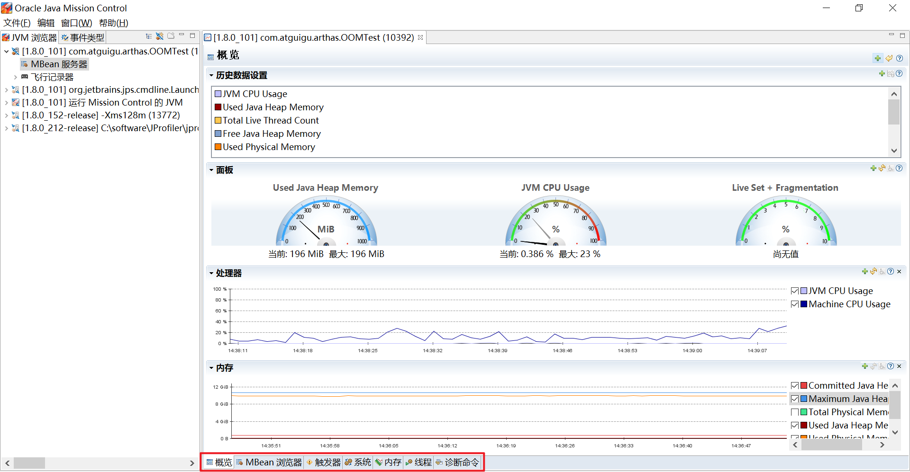
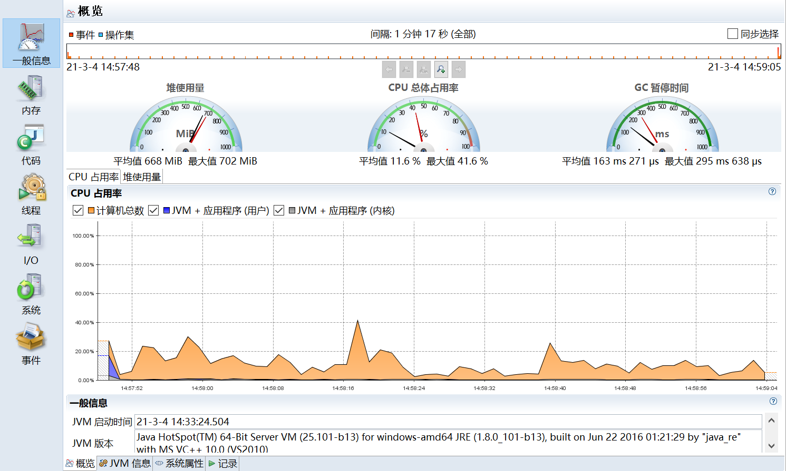
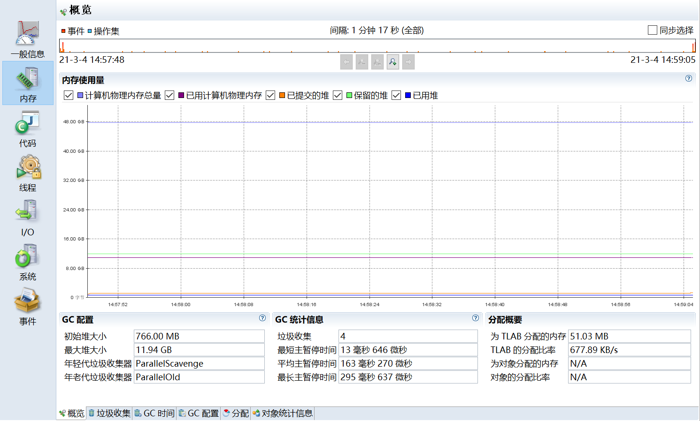
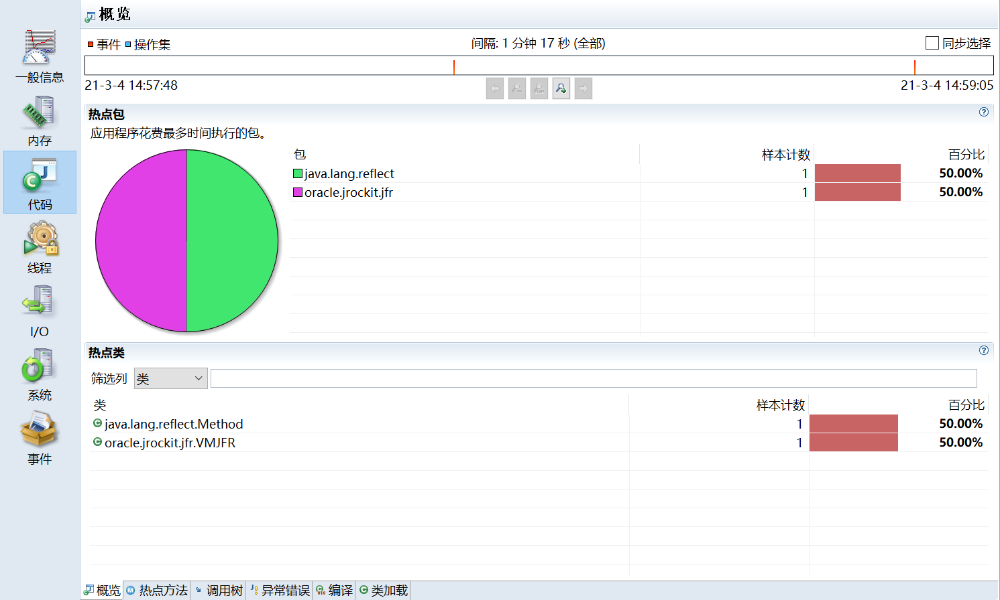
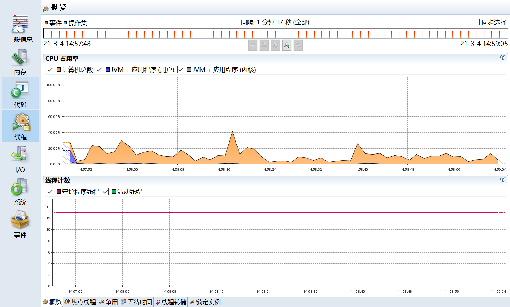
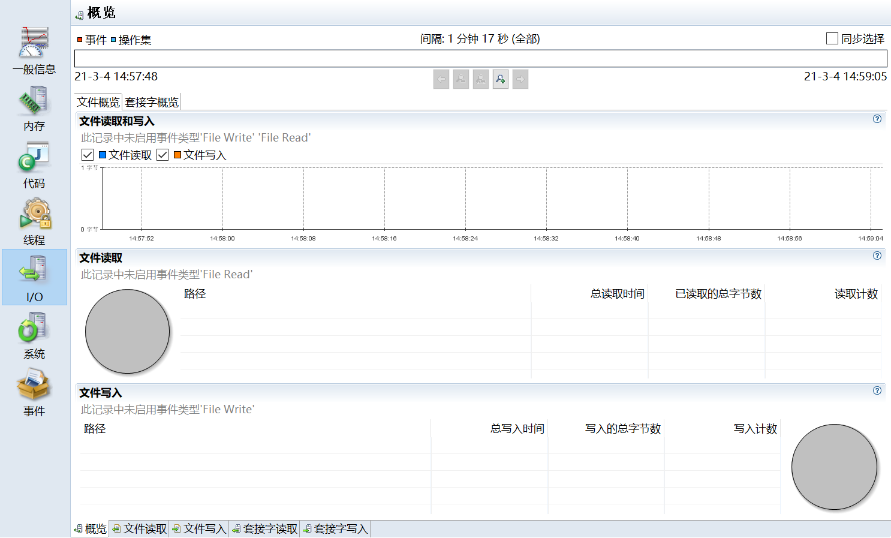
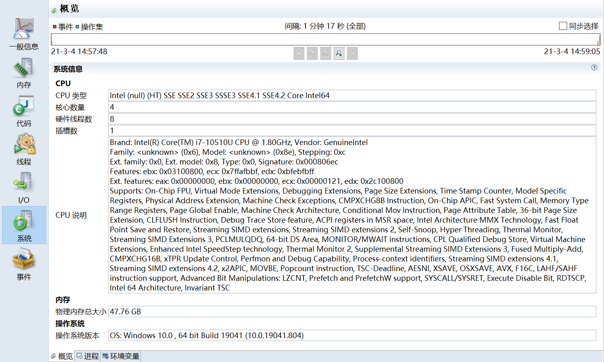
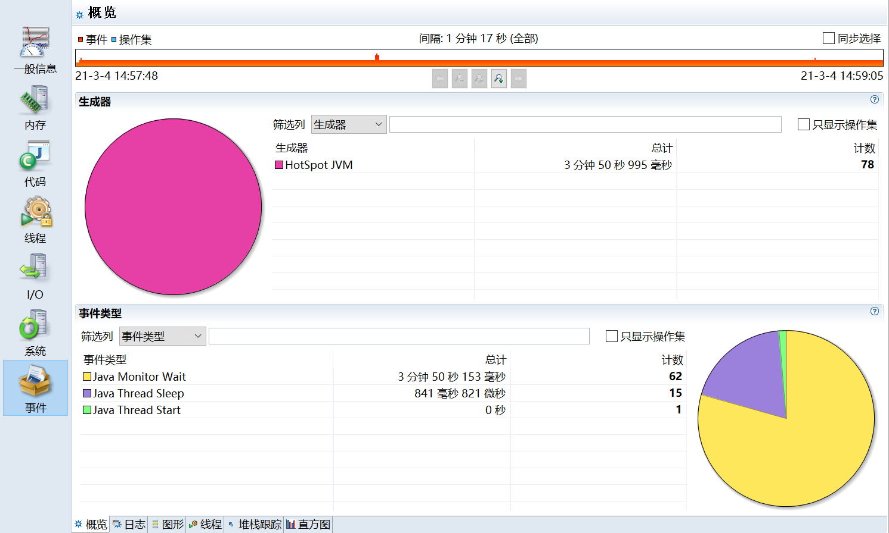

# Java Misssion Control

在 Oracle 收购 Sun 之前，Oracle 的 JRockit 虚拟机提供了一款叫做 JRockit Mission Control 的虚拟机诊断工具。

在 Oracle 收购 sun 之后，Oracle 公司同时拥有了 Hotspot 和 JRockit 两款虚拟机。
根据 Oracle 对于 Java 的战略，在今后的发展中，会将 JRokit 的优秀特性移植到 Hotspot 上。
其中一个重要的改进就是在 Sun 的 JDK 中加入了 JRockit 的支持。

在 Oracle JDK 7u40 之后，Mission Control 这款工具己经绑定在 Oracle JDK 中发布。

自 Java11 开始，本节介绍的 JFR 己经开源。
但在之前的 Java 版本，JFR 属于 Commercial Feature 通过 Java 虚拟机参数 `-XX:+UnlockCommercialFeatures` 开启。

Java Mission Control（简称 JMC) ， Java 官方提供的性能强劲的工具，是一个用于对 Java 应用程序进行管理、监视、概要分析和故障排除的工具套件。
它包含一个 GUI 客户端以及众多用来收集 Java 虚拟机性能数据的插件如 JMX Console（能够访问用来存放虚拟机齐个于系统运行数据的
MXBeans）以及虚拟机内置的高效 profiling 工具 Java Flight Recorder（JFR）。

JMC 的另一个优点就是：采用取样，而不是传统的代码植入技术，对应用性能的影响非常非常小，完全可以开着 JMC 来做压测（唯一影响可能是
full gc 多了）。

官方地址：https://github.com/JDKMissionControl/jmc

**Java Flight Recorder**

Java Flight Recorder 是 JMC 的其中一个组件，能够以极低的性能开销收集 Java 虚拟机的性能数据。与其他工具相比，JFR
的性能开销很小，在默认配置下平均低于 1%。JFR 能够直接访问虚拟机内的敌据并且不会影响虚拟机的优化。因此它非常适用于生产环境下满负荷运行的
Java 程序。

Java Flight Recorder 和 JDK Mission Control 共同创建了一个完整的工具链。JDK Mission Control 可对 Java Flight Recorder
连续收集低水平和详细的运行时信息进行高效、详细的分析。

当启用时 JFR 将记录运行过程中发生的一系列事件。
其中包括 Java 层面的事件如线程事件、锁事件，以及 Java 虚拟机内部的事件，如新建对象，垃圾回收和即时编译事件。

按照发生时机以及持续时间来划分，JFR 的事件共有四种类型，它们分别为以下四种：

- 瞬时事件（Instant Event) ，用户关心的是它们发生与否，例如异常、线程启动事件。
- 持续事件(Duration Event) ，用户关心的是它们的持续时间，例如垃圾回收事件。
- 计时事件(Timed Event) ，是时长超出指定阈值的持续事件。
- 取样事件（Sample Event)，是周期性取样的事件。

取样事件的其中一个常见例子便是方法抽样（Method Sampling），即每隔一段时问统计各个线程的栈轨迹。
如果在这些抽样取得的栈轨迹中存在一个反复出现的方法，那么我们可以推测该方法是热点方法

