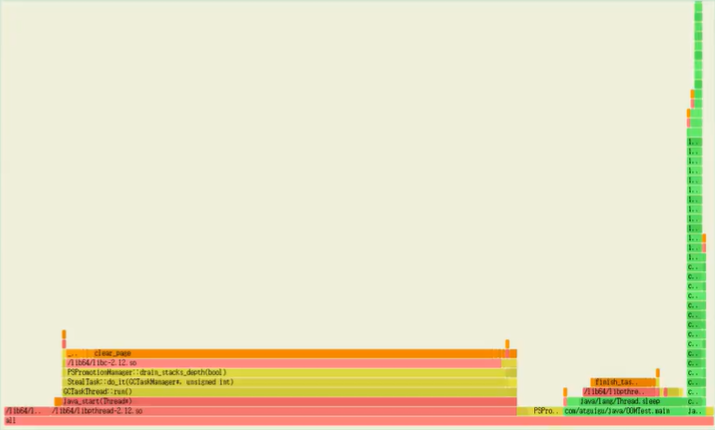
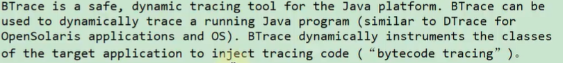

# 其他工具

### Flame Graphs（火焰图）

在追求极致性能的场景下，了解你的程序运行过程中 cpu 在干什么很重要，火焰图就是一种非常直观的展示 CPU
在程序整个生命周期过程中时间分配的工具。火焰图对于现代的程序员不应该陌生，这个工具可以非常直观的显示出调用找中的 CPU 消耗瓶颈。

网上的关于 Java 火焰图的讲解大部分来自于 Brenden Gregg 的博客
http://new.brendangregg.com/flamegraphs.html

火焰图，简单通过 x 轴横条宽度来度量时间指标，y 轴代表线程栈的层次。

### Tprofiler

一个可以在生产环境长期使用的性能分析工具

案例： 使用 JDK 自身提供的工具进行 JVM 调优可以将下 TPS 由 2.5 提升到 20（提升了 7 倍），并准确 定位系统瓶颈。

系统瓶颈有：应用里释态对象不是太多、有大量的业务线程在频繁创建一些生命周期很长的临时对象，代码里有问题。

那么，如何在海量业务代码里边准确定位这些性能代码？这里使用阿里开源工具 Tprofiler 来定位 这些性能代码，成功解决掉了 GC
过于频繁的性能瓶预，并最终在上次优化的基础上将 TPS 再提升了 4 倍，即提升到 100。

- Tprofiler 配置部署、远程操作、 日志阅谈都不太复杂，操作还是很简单的。但是其却是能够 起到一针见血、立竿见影的效果，帮我们解决了
  GC 过于频繁的性能瓶预。
- Tprofiler 最重要的特性就是能够统汁出你指定时间段内 JVM 的 top method 这些 top method 极有可能就是造成你 JVM
  性能瓶颈的元凶。这是其他大多数 JVM 调优工具所不具备的，包括 JRockit Mission Control。JRokit 首席开发者 Marcus Hirt
  在其私人博客《Lom Overhead Method Profiling cith Java Mission Control》下的评论中曾明确指出 JRMC 井不支持 TOP 方法的统计。

官方地址：http://github.com/alibaba/Tprofiler

### Btrace

常见的动态追踪工具有 BTrace、HouseHD（该项目己经停止开发）、Greys-Anatomy（国人开发 个人开发者）、Byteman（JBoss 出品），注意 Java
运行时追踪工具井不限干这几种，但是这几个是相对比较常用的。

BTrace 是 SUN Kenai 云计算开发平台下的一个开源项目，旨在为 java 提供安全可靠的动态跟踪分析工具。先看一卜日 Trace 的官方定义：

大概意思是一个 Java 平台的安全的动态追踪工具，可以用来动态地追踪一个运行的 Java 程序。BTrace 动态调整目标应用程序的类以注入跟踪代码（“字节码跟踪“）。

### YourKit

一个强大的Java性能分析工具，提供实时的CPU和内存分析，线程分析，垃圾回收分析等功能。
它可以帮助开发人员找出应用程序的瓶颈和性能问题，并提供相应的建议和优化方案。

### JProbe

Java性能分析工具，用于帮助开发人员诊断和优化Java应用程序的性能问题。

### Spring Insight

Spring框架的扩展，通过在应用程序中集成代理来收集并可视化有关应用程序的信息。
它提供实时的请求跟踪、性能指标、错误报告等功能，帮助开发人员了解应用程序的运行情况并诊断性能问题。

