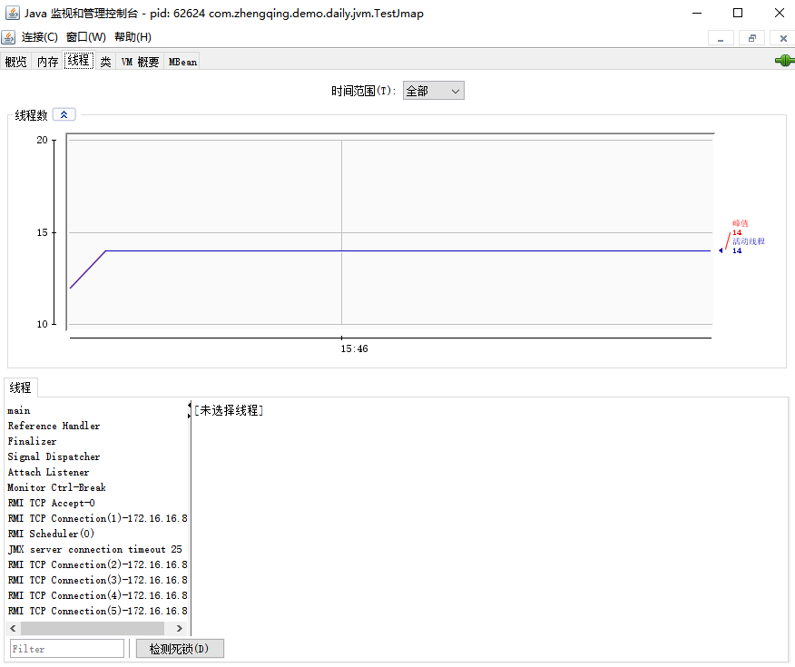

# jconsole 图形化工具

JMX的可视化管理工具

jconsole：从 Java5 开始，在 JDK 中自带的 java 监控和管理控制台。
用于对 JVM 中内存、线程和类等的监控，是一个基于 JMX（java management extensions）的 GUI 性能监控工具。

官方地址：https://docs.oracle.com/javase/7/docs/technotes/guides/management/jconsole.html

`win + r` -> `jconsole`

选择进程

查看

