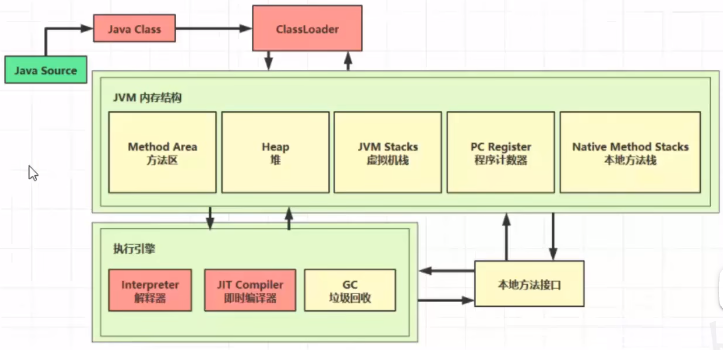
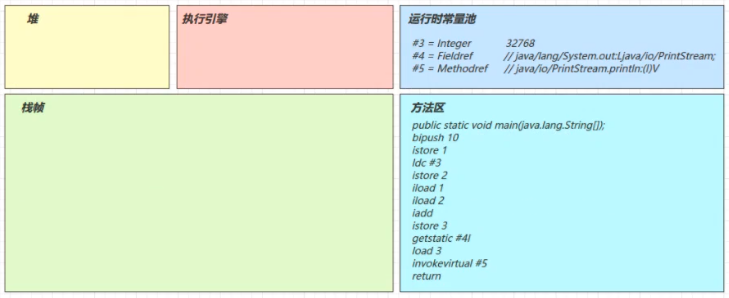
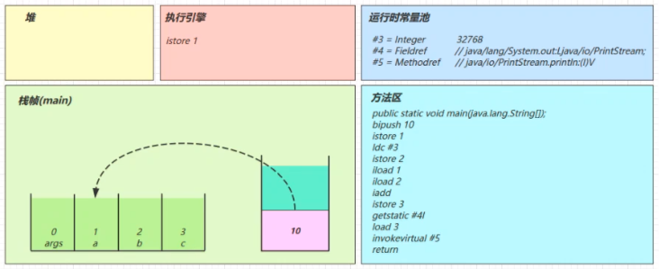
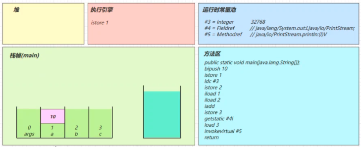
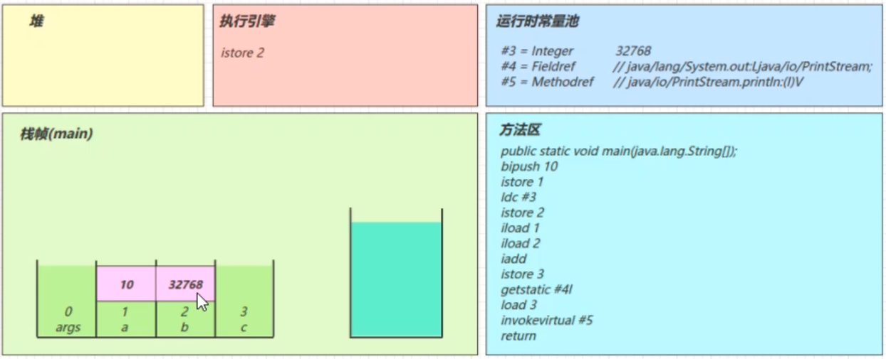
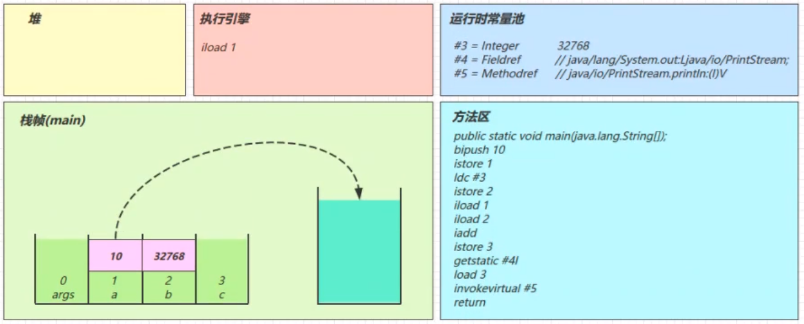
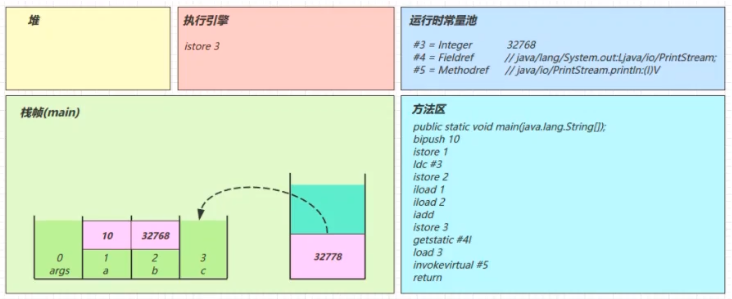
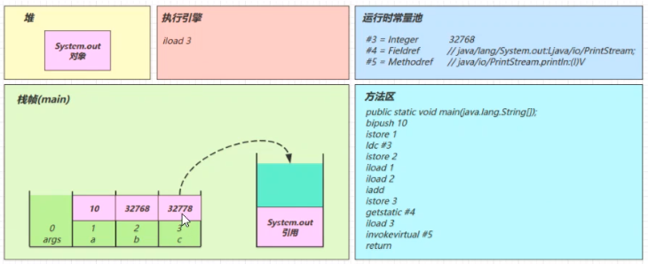
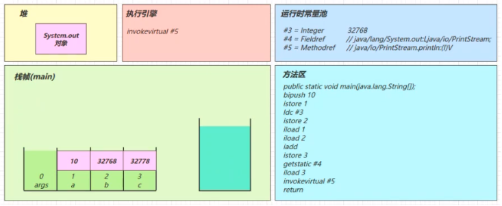

# 类加载与字节码技术



### 一、类文件结构

通过 javac 类名.java 编译 java 文件后，会生成一个 .class 的文件！

```shell
cat> ./HelloWorld.java <<EOF
public class HelloWorld {
    public static void main(String[] args) {
        System.out.println("hello world");
    }
}
EOF

javac HelloWorld.java
java HelloWorld

# 以十六进制格式显示 "HelloWorld.class" 文件的内容。该命令可以将二进制文件（如可执行文件或类文件）以可读的十六进制形式展示出来，每个字节都对应一个十六进制值。
od -t xC HelloWorld.class
```

```
0000000 ca fe ba be 00 00 00 34 00 1d 0a 00 06 00 0f 09
0000020 00 10 00 11 08 00 12 0a 00 13 00 14 07 00 15 07
0000040 00 16 01 00 06 3c 69 6e 69 74 3e 01 00 03 28 29
0000060 56 01 00 04 43 6f 64 65 01 00 0f 4c 69 6e 65 4e
0000100 75 6d 62 65 72 54 61 62 6c 65 01 00 04 6d 61 69
0000120 6e 01 00 16 28 5b 4c 6a 61 76 61 2f 6c 61 6e 67
0000140 2f 53 74 72 69 6e 67 3b 29 56 01 00 0a 53 6f 75
0000160 72 63 65 46 69 6c 65 01 00 0f 48 65 6c 6c 6f 57
0000200 6f 72 6c 64 2e 6a 61 76 61 0c 00 07 00 08 07 00
0000220 17 0c 00 18 00 19 01 00 0b 68 65 6c 6c 6f 20 77
0000240 6f 72 6c 64 07 00 1a 0c 00 1b 00 1c 01 00 0a 48
0000260 65 6c 6c 6f 57 6f 72 6c 64 01 00 10 6a 61 76 61
0000300 2f 6c 61 6e 67 2f 4f 62 6a 65 63 74 01 00 10 6a
0000320 61 76 61 2f 6c 61 6e 67 2f 53 79 73 74 65 6d 01
0000340 00 03 6f 75 74 01 00 15 4c 6a 61 76 61 2f 69 6f
0000360 2f 50 72 69 6e 74 53 74 72 65 61 6d 3b 01 00 13
0000400 6a 61 76 61 2f 69 6f 2f 50 72 69 6e 74 53 74 72
0000420 65 61 6d 01 00 07 70 72 69 6e 74 6c 6e 01 00 15
0000440 28 4c 6a 61 76 61 2f 6c 61 6e 67 2f 53 74 72 69
0000460 6e 67 3b 29 56 00 21 00 05 00 06 00 00 00 00 00
0000500 02 00 01 00 07 00 08 00 01 00 09 00 00 00 1d 00
0000520 01 00 01 00 00 00 05 2a b7 00 01 b1 00 00 00 01
0000540 00 0a 00 00 00 06 00 01 00 00 00 01 00 09 00 0b
0000560 00 0c 00 01 00 09 00 00 00 25 00 02 00 01 00 00
0000600 00 09 b2 00 02 12 03 b6 00 04 b1 00 00 00 01 00
0000620 0a 00 00 00 0a 00 02 00 00 00 03 00 08 00 04 00
0000640 01 00 0d 00 00 00 02 00 0e
0000651
```

- 前4个字节 "ca fe ba be" 是 Java 类文件的魔数（Magic Number），用于标识一个有效的 Java 类文件。
- 接着的 8 个字节 "00 00 00 34 00 1d 0a 00" 是 Java 类文件的版本信息。 34（16进制） = 52（10进制），代表JDK8
- 后续的部分包括一些常量池、字段、方法等内容的标识和描述。

如果需要更具体的信息，建议使用专门的工具（如反编译器）对整个类文件进行处理和解读，或者参考相关的Java字节码规范文档。

https://docs.oracle.com/javase/specs/jvms/se8/html/jvms-4.html

根据 JVM 规范，类文件结构如下：

```
ClassFile {
    u4             magic;
    u2             minor_version;
    u2             major_version;
    u2             constant_pool_count;
    cp_info        constant_pool[constant_pool_count-1];
    u2             access_flags;
    u2             this_class;
    u2             super_class;
    u2             interfaces_count;
    u2             interfaces[interfaces_count];
    u2             fields_count;
    field_info     fields[fields_count];
    u2             methods_count;
    method_info    methods[methods_count];
    u2             attributes_count;
    attribute_info attributes[attributes_count];
}
```

### 二、字节码指令

可参考：https://docs.oracle.com/javase/specs/jvms/se8/html/jvms-6.html#jvms-6.5

#### 1、javap工具 反编译 class 文件

```shell
# 反编译
javap -v HelloWorld.class
```

结果

```shell
Classfile /tmp/test/HelloWorld.class
  Last modified 2023-7-20; size 425 bytes
  MD5 checksum 5e7ac4f3d218915b02e862247003c66a
  Compiled from "HelloWorld.java"
public class HelloWorld
  minor version: 0
  major version: 52
  flags: ACC_PUBLIC, ACC_SUPER
Constant pool:
   #1 = Methodref          #6.#15         // java/lang/Object."<init>":()V
   #2 = Fieldref           #16.#17        // java/lang/System.out:Ljava/io/PrintStream;
   #3 = String             #18            // hello world
   #4 = Methodref          #19.#20        // java/io/PrintStream.println:(Ljava/lang/String;)V
   #5 = Class              #21            // HelloWorld
   #6 = Class              #22            // java/lang/Object
   #7 = Utf8               <init>
   #8 = Utf8               ()V
   #9 = Utf8               Code
  #10 = Utf8               LineNumberTable
  #11 = Utf8               main
  #12 = Utf8               ([Ljava/lang/String;)V
  #13 = Utf8               SourceFile
  #14 = Utf8               HelloWorld.java
  #15 = NameAndType        #7:#8          // "<init>":()V
  #16 = Class              #23            // java/lang/System
  #17 = NameAndType        #24:#25        // out:Ljava/io/PrintStream;
  #18 = Utf8               hello world
  #19 = Class              #26            // java/io/PrintStream
  #20 = NameAndType        #27:#28        // println:(Ljava/lang/String;)V
  #21 = Utf8               HelloWorld
  #22 = Utf8               java/lang/Object
  #23 = Utf8               java/lang/System
  #24 = Utf8               out
  #25 = Utf8               Ljava/io/PrintStream;
  #26 = Utf8               java/io/PrintStream
  #27 = Utf8               println
  #28 = Utf8               (Ljava/lang/String;)V
{
  public HelloWorld();
    descriptor: ()V
    flags: ACC_PUBLIC
    Code:
      stack=1, locals=1, args_size=1
         0: aload_0
         1: invokespecial #1                  // Method java/lang/Object."<init>":()V
         4: return
      LineNumberTable:
        line 1: 0

  public static void main(java.lang.String[]);
    descriptor: ([Ljava/lang/String;)V
    flags: ACC_PUBLIC, ACC_STATIC
    Code:
      stack=2, locals=1, args_size=1
         0: getstatic     #2                  // Field java/lang/System.out:Ljava/io/PrintStream;
         3: ldc           #3                  // String hello world
         5: invokevirtual #4                  // Method java/io/PrintStream.println:(Ljava/lang/String;)V
         8: return
      LineNumberTable:
        line 3: 0
        line 4: 8
}
SourceFile: "HelloWorld.java"
```

#### 2、图解方法执行流程

##### 1、代码

演示 字节码指令 和 操作数栈、常量池的关系

```
public class Demo3_1 {
	public static void main(String[] args) {
		int a = 10;
		int b = Short.MAX_VALUE + 1;
		int c = a + b;
		System.out.println(c);
    }
}
```

##### 2、图解

###### 常量池载入运行时常量池

> 常量池也属于方法区，只不过这里单独提出来了


###### 方法字节码载入方法区

（stack=2，locals=4、 对应操作数栈有 2 个空间（每个空间 4 个字节），局部变量表中有 4 个槽位。  


###### main线程开始运行，分配栈帧内存


###### 执行引擎开始执行字节码

bipush 10

- 将一个 byte 压入操作数栈（其长度会补齐 4 个字节），类似的指令还有
- sipush 将一个 short 压入操作数栈（其长度会补齐 4 个字节）
- ldc 将一个 int 压入操作数栈
- ldc2_w 将一个 long 压入操作数栈（**分两次压入**，因为 long 是 8 个字节）
- 这里小的数字都是和字节码指令存在一起，**超过 short 范围的数字存入了常量池**


###### istore 1

> 对应代码中的 int a = 10;

将操作数栈栈顶元素弹出，放入局部变量表的 slot 1 中

结果


###### ldc #3

> int b = Short.MAX_VALUE + 1;

- 读取运行时常量池中 #3 ，即 32768 (超过 short 最大值范围的数会被放到运行时常量池中)，将其加载到操作数栈中
- 注意 Short.MAX_VALUE 是 32767，所以 32768 = Short.MAX_VALUE + 1 实际是在编译期间计算好的。


###### istore 2

将操作数栈中的元素弹出，放到局部变量表的 2 号位置




###### iload1 iload2

> int c = a + b;

将局部变量表中 1 号位置和 2 号位置的元素放入操作数栈中。因为只能在操作数栈中执行运算操作  



###### iadd

将操作数栈中的两个元素弹出栈并相加，结果在压入操作数栈中。  


###### istore 3

将操作数栈中的元素弹出，放入局部变量表的3号位置。  



###### getstatic #4

> System.out.println(c);

在运行时常量池中找到 #4 ，发现是一个对象，在堆内存中找到该对象，并将其引用放入操作数栈中  


###### iload 3

将局部变量表中 3 号位置的元素压入操作数栈中。  


###### invokevirtual #5

- 找到常量池 #5 项
- 定位到方法区 java/io/PrintStream.println:(I)V 方法
- 生成新的栈帧（分配 locals、stack等）
- 传递参数，执行新栈帧中的字节码


- 执行完毕，弹出栈帧
- 清除 main 操作数栈内容



###### return

- 完成 main 方法调用，弹出 main 栈帧
- 程序结束

#### 3、通过字节码指令分析问题

代码

```
public class Code_11_ByteCodeTest {
    public static void main(String[] args) {
        int i = 0;
        int x = 0;
        while (i < 10) {
            x = x++;
            i++;
        }
        System.out.println(x); // 0
    }
}
```

为什么最终的 x 结果为 0 呢？ 通过分析字节码指令即可知晓

```
Code:
     stack=2, locals=3, args_size=1	// 操作数栈分配2个空间，局部变量表分配 3 个空间
        0: iconst_0	// 准备一个常数 0
        1: istore_1	// 将常数 0 放入局部变量表的 1 号槽位 i = 0
        2: iconst_0	// 准备一个常数 0
        3: istore_2	// 将常数 0 放入局部变量的 2 号槽位 x = 0	
        4: iload_1		// 将局部变量表 1 号槽位的数放入操作数栈中
        5: bipush        10	// 将数字 10 放入操作数栈中，此时操作数栈中有 2 个数
        7: if_icmpge     21	// 比较操作数栈中的两个数，如果下面的数大于上面的数，就跳转到 21 。这里的比较是将两个数做减法。因为涉及运算操作，所以会将两个数弹出操作数栈来进行运算。运算结束后操作数栈为空
       10: iload_2		// 将局部变量 2 号槽位的数放入操作数栈中，放入的值是 0 
       11: iinc          2, 1	// 将局部变量 2 号槽位的数加 1 ，自增后，槽位中的值为 1 
       14: istore_2	//将操作数栈中的数放入到局部变量表的 2 号槽位，2 号槽位的值又变为了0
       15: iinc          1, 1 // 1 号槽位的值自增 1 
       18: goto          4 // 跳转到第4条指令
       21: getstatic     #2                  // Field java/lang/System.out:Ljava/io/PrintStream;
       24: iload_2
       25: invokevirtual #3                  // Method java/io/PrintStream.println:(I)V
       28: return
```

#### 4、构造方法

##### 1、 `cinit()V`

```java
package com.zhengqing.demo.daily.jvm.classm;

public class TestCinit {
    static int i = 10;

    static {
        i = 20;
    }

    static {
        i = 30;
    }

    public static void main(String[] args) {
        System.out.println(i); // 30
    }
}
```

编译器会按从上至下的顺序，收集所有 static 静态代码块和静态成员赋值的代码，合并为一个特殊的方法 cinit()V ：

```
stack=1, locals=0, args_size=0
         0: bipush        10
         2: putstatic     #3                  // Field i:I
         5: bipush        20
         7: putstatic     #3                  // Field i:I
        10: bipush        30
        12: putstatic     #3                  // Field i:I
        15: return
```

##### 2、 `init()V`

```java
package com.zhengqing.demo.daily.jvm.classm;

public class TestInit {

    private String a = "s1";

    {
        this.b = 20;
    }

    private int b = 10;

    {
        this.a = "s2";
    }

    public TestInit(String a, int b) {
        this.a = a;
        this.b = b;
    }

    public static void main(String[] args) {
        TestInit d = new TestInit("s3", 30);
        System.out.println(d.a); // s3
        System.out.println(d.b); // 30
    }

}
```

编译器会按从上至下的顺序，收集所有 {} 代码块和成员变量赋值的代码，形成新的构造方法，但原始构造方法内的代码总是在后.

```
Code:
     stack=2, locals=3, args_size=3
        0: aload_0
        1: invokespecial #1                  // Method java/lang/Object."<init>":()V
        4: aload_0
        5: ldc           #2                  // String s1
        7: putfield      #3                  // Field a:Ljava/lang/String;
       10: aload_0
       11: bipush        20
       13: putfield      #4                  // Field b:I
       16: aload_0
       17: bipush        10
       19: putfield      #4                  // Field b:I
       22: aload_0
       23: ldc           #5                  // String s2
       25: putfield      #3                  // Field a:Ljava/lang/String;
       // 原始构造方法在最后执行
       28: aload_0
       29: aload_1
       30: putfield      #3                  // Field a:Ljava/lang/String;
       33: aload_0
       34: iload_2
       35: putfield      #4                  // Field b:I
       38: return
```

#### 5、方法调用

```java
package com.zhengqing.demo.daily.jvm.classm;

public class TestMethod {

    public TestMethod() {
    }

    private void test1() {
    }

    private final void test2() {
    }

    public void test3() {
    }

    public static void test4() {
    }

    public static void main(String[] args) {
        TestMethod obj = new TestMethod();
        obj.test1();
        obj.test2();
        obj.test3();
        TestMethod.test4();
    }
}
```

不同方法在调用时，对应的虚拟机指令有所区别

- 私有、构造、被 final 修饰的方法，在调用时都使用 invokespecial 指令
- 普通成员方法在调用时，使用 invokevirtual 指令。因为编译期间无法确定该方法的内容，只有在运行期间才能确定
- 静态方法在调用时使用 invokestatic 指令

```
Code:
      stack=2, locals=2, args_size=1
         0: new           #2                  //
         3: dup // 复制一份对象地址压入操作数栈中
         4: invokespecial #3                  // Method "<init>":()V
         7: astore_1
         8: aload_1
         9: invokespecial #4                  // Method test1:()V
        12: aload_1
        13: invokespecial #5                  // Method test2:()V
        16: aload_1
        17: invokevirtual #6                  // Method test3:()V
        20: invokestatic  #7                  // Method test4:()V
        23: return
```

- new 是创建【对象】，给对象分配堆内存，执行成功会将【对象引用】压入操作数栈
- dup 是赋值操作数栈栈顶的内容，本例即为【对象引用】，为什么需要两份引用呢，一个是要配合 invokespecial 调用该对象的构造方法
  “init”: ()V （会消耗掉栈顶一个引用），另一个要 配合 astore\_1 赋值给局部变量
- 终方法（final），私有方法（private），构造方法都是由 invokespecial 指令来调用，属于静态绑定
- 普通成员方法是由 invokevirtual 调用，属于动态绑定，即支持多态 成员方法与静态方法调用的另一个区别是，执行方法前是否需要【对象引用】

#### 6、多态原理

因为普通成员方法需要在运行时才能确定具体的内容，所以虚拟机需要调用 invokevirtual 指令

在执行 invokevirtual 指令时，经历了以下几个步骤

1. 先通过栈帧中的对象引用找到对象
2. 分析对象头，找到对象的实际class
3. Class结构中有vtable，它在类加载的链接阶段就已经根据方法的重写规则生成好了
4. 查表得到方法的具体地址
5. 执行方法的字节码

#### 7、异常处理

##### try-catch

```
public class Test_TryCatch {
    public static void main(String[] args) {
        int i = 0;
        try {
            i = 10;
        }catch (Exception e) {
            i = 20;
        }
    }
}
```

对应字节码指令

```
Code:
     stack=1, locals=3, args_size=1
        0: iconst_0
        1: istore_1
        2: bipush        10
        4: istore_1
        5: goto          12
        8: astore_2
        9: bipush        20
       11: istore_1
       12: return
     //多出来一个异常表
     Exception table:
        from    to  target type
            2     5     8   Class java/lang/Exception
```

* 可以看到多出来一个 Exception table 的结构，\[from, to) 是前闭后开（也就是检测 2~4 行）的检测范围，一旦这个范围内的字节码执行出现异常，则通过
  type 匹配异常类型，如果一致，进入 target 所指示行号
* 8 行的字节码指令 astore\_2 是将异常对象引用存入局部变量表的 2 号位置（为 e ）

##### 多个 single-catch

```
public class Test_MultipleCatch {
    public static void main(String[] args) {
        int i = 0;
        try {
            i = 10;
        }catch (ArithmeticException e) {
            i = 20;
        }catch (Exception e) {
            i = 30;
        }
    }
}
```

对应的字节码

```
Code:
     stack=1, locals=3, args_size=1
        0: iconst_0
        1: istore_1
        2: bipush        10
        4: istore_1
        5: goto          19
        8: astore_2
        9: bipush        20
       11: istore_1
       12: goto          19
       15: astore_2
       16: bipush        30
       18: istore_1
       19: return
     Exception table:
        from    to  target type
            2     5     8   Class java/lang/ArithmeticException
            2     5    15   Class java/lang/Exception
```

* 因为异常出现时，只能进入 Exception table 中一个分支，所以局部变量表 slot 2 位置被共用

##### finally

```
public class Test_Finally {
    public static void main(String[] args) {
        int i = 0;
        try {
            i = 10;
        } catch (Exception e) {
            i = 20;
        } finally {
            i = 30;
        }
    }
}
```

对应字节码

```
Code:
     stack=1, locals=4, args_size=1
        0: iconst_0
        1: istore_1
        // try块
        2: bipush        10
        4: istore_1
        // try块执行完后，会执行finally    
        5: bipush        30
        7: istore_1
        8: goto          27
       // catch块     
       11: astore_2 // 异常信息放入局部变量表的2号槽位
       12: bipush        20
       14: istore_1
       // catch块执行完后，会执行finally        
       15: bipush        30
       17: istore_1
       18: goto          27
       // 出现异常，但未被 Exception 捕获，会抛出其他异常，这时也需要执行 finally 块中的代码   
       21: astore_3
       22: bipush        30
       24: istore_1
       25: aload_3
       26: athrow  // 抛出异常
       27: return
     Exception table:
        from    to  target type
            2     5    11   Class java/lang/Exception
            2     5    21   any
           11    15    21   any

```

可以看到 finally 中的代码被复制了 3 份，分别放入 try 流程，catch 流程以及 catch 剩余的异常类型流程  
注意：虽然从字节码指令看来，每个块中都有 finally 块，但是 finally 块中的代码只会被执行一次

##### finally 中的 return

```
public class Test_FinallyReturn {
    public static void main(String[] args) {
        int i = Code_18_FinallyReturnTest.test();
        // 结果为 20
        System.out.println(i);
    }
    public static int test() {
        int i;
        try {
            i = 10;
            return i;
        } finally {
            i = 20;
            return i;
        }
    }
}
```

对应字节码

```
Code:
     stack=1, locals=3, args_size=0
        0: bipush        10
        2: istore_0
        3: iload_0
        4: istore_1  // 暂存返回值
        5: bipush        20
        7: istore_0
        8: iload_0
        9: ireturn	// ireturn 会返回操作数栈顶的整型值 20
       // 如果出现异常，还是会执行finally 块中的内容，没有抛出异常
       10: astore_2
       11: bipush        20
       13: istore_0
       14: iload_0
       15: ireturn	// 这里没有 athrow 了，也就是如果在 finally 块中如果有返回操作的话，且 try 块中出现异常，会吞掉异常！
     Exception table:
        from    to  target type
            0     5    10   any
```

* 由于 finally 中的 ireturn 被插入了所有可能的流程，因此返回结果肯定以finally的为准
* 至于字节码中第 2 行，似乎没啥用，且留个伏笔，看下个例子
* 跟上例中的 finally 相比，发现没有 athrow 了，这告诉我们：如果在 finally 中出现了 return，会吞掉异常
* 所以不要在finally中进行返回操作

##### 被吞掉的异常

```
public static int test() {
    int i;
    try {
       i = 10;
       //  这里应该会抛出异常
       i = i/0;
       return i;
    } finally {
       i = 20;
       return i;
    }
}
```

会发现打印结果为 20 ，并未抛出异常

##### finally 不带 return

```
public static int test() {
    int i = 10;
    try {
        return i;
    } finally {
        i = 20;
    }
}
```

对应字节码

```
Code:
     stack=1, locals=3, args_size=0
        0: bipush        10
        2: istore_0 // 赋值给i 10
        3: iload_0	// 加载到操作数栈顶
        4: istore_1 // 加载到局部变量表的1号位置
        5: bipush        20
        7: istore_0 // 赋值给i 20
        8: iload_1 // 加载局部变量表1号位置的数10到操作数栈
        9: ireturn // 返回操作数栈顶元素 10
       10: astore_2
       11: bipush        20
       13: istore_0
       14: aload_2 // 加载异常
       15: athrow // 抛出异常
     Exception table:
        from    to  target type
            3     5    10   any
```

#### 8、Synchronized

```
public class Test_Sync {
    public static void main(String[] args) {
        Object lock = new Object();
        synchronized (lock) {
            System.out.println("ok");
        }
    }
}
```

对应字节码

```
Code:
      stack=2, locals=4, args_size=1
         0: new           #2                  // class java/lang/Object
         3: dup // 复制一份栈顶，然后压入栈中。用于函数消耗
         4: invokespecial #1                  // Method java/lang/Object."<init>":()V
         7: astore_1 // 将栈顶的对象地址方法 局部变量表中 1 中
         8: aload_1 // 加载到操作数栈
         9: dup // 复制一份，放到操作数栈，用于加锁时消耗
        10: astore_2 // 将操作数栈顶元素弹出，暂存到局部变量表的 2 号槽位。这时操作数栈中有一份对象的引用
        11: monitorenter // 加锁
        12: getstatic     #3                  // Field java/lang/System.out:Ljava/io/PrintStream;
        15: ldc           #4                  // String ok
        17: invokevirtual #5                  // Method java/io/PrintStream.println:(Ljava/lang/String;)V
        20: aload_2 // 加载对象到栈顶
        21: monitorexit // 释放锁
        22: goto          30
        // 异常情况的解决方案 释放锁！
        25: astore_3
        26: aload_2
        27: monitorexit
        28: aload_3
        29: athrow
        30: return
        // 异常表！
      Exception table:
         from    to  target type
            12    22    25   any
            25    28    25   any
```

### 三、编译期处理

所谓的 **语法糖** ，其实就是指 java 编译器把 .java 源码编译为 .class 字节码的过程中，自动生成和转换的一些代码，主要是为了减轻程序员的负担，算是
java 编译器给我们的一个额外福利  
**注意**，以下代码的分析，借助了 javap 工具，idea 的反编译功能，idea 插件 jclasslib 等工具。另外， 编译器转换的**结果直接就是
class 字节码**，只是为了便于阅读，给出了 几乎等价 的 java 源码方式，并不是编译器还会转换出中间的 java 源码，切记。

#### 1、默认构造器

```java
public class Candy1 {

}
```

经过编译期优化后

```java
public class Candy1 {
    // 这个无参构造器是java编译器帮我们加上的
    public Candy1() {
        // 即调用父类 Object 的无参构造方法，即调用 java/lang/Object." <init>":()V
        super();
    }
}
```

#### 2、自动拆装箱

基本类型和其包装类型的相互转换过程，称为拆装箱  
在 JDK 5 以后，它们的转换可以在编译期自动完成

```java
public class Candy2 {
    public static void main(String[] args) {
        Integer x = 1;
        int y = x;
    }
}
```

转换过程如下

```java
public class Candy2 {
    public static void main(String[] args) {
        // 基本类型赋值给包装类型，称为装箱
        Integer x = Integer.valueOf(1);
        // 包装类型赋值给基本类型，称谓拆箱
        int y = x.intValue();
    }
}
```

#### 3、泛型集合取值

泛型也是在 JDK 5 开始加入的特性，但 java 在编译泛型代码后会执行泛型擦除的动作，即泛型信息在编译为字节码之后就丢失了，实际的类型都当做了
Object 类型来处理：

```java
public class Candy3 {
    public static void main(String[] args) {
        List<Integer> list = new ArrayList<>();
        list.add(10);
        Integer x = list.get(0);
    }
}
```

对应字节码

```
Code:
    stack=2, locals=3, args_size=1
       0: new           #2                  // class java/util/ArrayList
       3: dup
       4: invokespecial #3                  // Method java/util/ArrayList."<init>":()V
       7: astore_1
       8: aload_1
       9: bipush        10
      11: invokestatic  #4                  // Method java/lang/Integer.valueOf:(I)Ljava/lang/Integer;
      // 这里进行了泛型擦除，实际调用的是add(Objcet o)
      14: invokeinterface #5,  2            // InterfaceMethod java/util/List.add:(Ljava/lang/Object;)Z

      19: pop
      20: aload_1
      21: iconst_0
      // 这里也进行了泛型擦除，实际调用的是get(Object o)   
      22: invokeinterface #6,  2            // InterfaceMethod java/util/List.get:(I)Ljava/lang/Object;
// 这里进行了类型转换，将 Object 转换成了 Integer
      27: checkcast     #7                  // class java/lang/Integer
      30: astore_2
      31: return
```

所以调用 get 函数取值时，有一个类型转换的操作。

```
Integer x = (Integer) list.get(0);
```

如果要将返回结果赋值给一个 int 类型的变量，则还有自动拆箱的操作

```
int x = (Integer) list.get(0).intValue();
```

使用反射可以得到，参数的类型以及泛型类型。泛型反射代码如下：

```
public static void main(String[] args) throws NoSuchMethodException {
    // 1. 拿到方法
    Method method = Code_20_ReflectTest.class.getMethod("test", List.class, Map.class);
    // 2. 得到泛型参数的类型信息
    Type[] types = method.getGenericParameterTypes();
    for(Type type : types) {
        // 3. 判断参数类型是否，带泛型的类型。
        if(type instanceof ParameterizedType) {
            ParameterizedType parameterizedType = (ParameterizedType) type;

            // 4. 得到原始类型
            System.out.println("原始类型 - " + parameterizedType.getRawType());
            // 5. 拿到泛型类型
            Type[] arguments = parameterizedType.getActualTypeArguments();
            for(int i = 0; i < arguments.length; i++) {
                System.out.printf("泛型参数[%d] - %s\n", i, arguments[i]);
            }
        }
    }
}

public Set<Integer> test(List<String> list, Map<Integer, Object> map) {
    return null;
}
```

输出：

```
原始类型 - interface java.util.List
泛型参数[0] - class java.lang.String
原始类型 - interface java.util.Map
泛型参数[0] - class java.lang.Integer
泛型参数[1] - class java.lang.Object
```

#### 4、可变参数

可变参数也是 JDK 5 开始加入的新特性： 例如：

```java
public class Candy4 {
    public static void foo(String... args) {
        // 将 args 赋值给 arr ，可以看出 String... 实际就是 String[]  
        String[] arr = args;
        System.out.println(arr.length);
    }

    public static void main(String[] args) {
        foo("hello", "world");
    }
}
```

可变参数 String… args 其实是一个 String[] args ，从代码中的赋值语句中就可以看出来。 同样java编译器会在编译期间将上述代码变换为：

```java
public class Candy4 {
    public Candy4 {
    }

    public static void foo(String[] args) {
        String[] arr = args;
        System.out.println(arr.length);
    }

    public static void main(String[] args) {
        foo(new String[]);
    }
}
```

注意，如果调用的是 foo() ，即未传递参数时，等价代码为 foo(new String[]{}) ，创建了一个空数组，而不是直接传递的 null .

#### 5、foreach 循环

仍是 JDK 5 开始引入的语法糖，数组的循环：

```java
public class Candy5 {
    public static void main(String[] args) {
        // 数组赋初值的简化写法也是一种语法糖。
        int[] arr = {1, 2, 3, 4, 5};
        for (int x : arr) {
            System.out.println(x);
        }
    }
}
```

编译器会帮我们转换为

```java
public class Candy5 {
    public Candy5() {
    }

    public static void main(String[] args) {
        int[] arr = new int[]{1, 2, 3, 4, 5};
        for (int i = 0; i < arr.length; ++i) {
            int x = arr[i];
            System.out.println(x);
        }
    }
}
```

如果是集合使用 foreach

```java
public class Candy5 {
    public static void main(String[] args) {
        List<Integer> list = Arrays.asList(1, 2, 3, 4, 5);
        for (Integer x : list) {
            System.out.println(x);
        }
    }
}
```

集合要使用 foreach ，需要该集合类实现了 Iterable 接口，因为集合的遍历需要用到迭代器 Iterator.

```java
public class Candy5 {
    public Candy5() {
    }

    public static void main(String[] args) {
        List<Integer> list = Arrays.asList(1, 2, 3, 4, 5);
        // 获得该集合的迭代器
        Iterator<Integer> iterator = list.iterator();
        while (iterator.hasNext()) {
            Integer x = iterator.next();
            System.out.println(x);
        }
    }
}
```

#### 6、switch 字符串

从 JDK 7 开始，switch 可以作用于字符串和枚举类，这个功能其实也是语法糖，例如：

```java
public class Cnady6 {
    public static void main(String[] args) {
        String str = "hello";
        switch (str) {
            case "hello":
                System.out.println("h");
                break;
            case "world":
                System.out.println("w");
                break;
            default:
                break;
        }
    }
}
```

在编译器中执行的操作

```java
public class Candy6 {
    public Candy6() {

    }

    public static void main(String[] args) {
        String str = "hello";
        int x = -1;
        // 通过字符串的 hashCode + value 来判断是否匹配
        switch (str.hashCode()) {
            // hello 的 hashCode
            case 99162322:
                // 再次比较，因为字符串的 hashCode 有可能相等
                if (str.equals("hello")) {
                    x = 0;
                }
                break;
            // world 的 hashCode
            case 11331880:
                if (str.equals("world")) {
                    x = 1;
                }
                break;
            default:
                break;
        }

        // 用第二个 switch 在进行输出判断
        switch (x) {
            case 0:
                System.out.println("h");
                break;
            case 1:
                System.out.println("w");
                break;
            default:
                break;
        }
    }
}
```

过程说明：

在编译期间，单个的 switch 被分为了两个

- 第一个用来匹配字符串，并给 x 赋值
    - 字符串的匹配用到了字符串的 hashCode ，还用到了 equals 方法
    - 使用 hashCode 是为了提高比较效率，使用 equals 是防止有 hashCode 冲突（如 BM 和 C .）
- 第二个用来根据x的值来决定输出语句

#### 7、switch 枚举

```java
enum SEX {
    MALE, FEMALE;
}

public class Candy7 {
    public static void main(String[] args) {
        SEX sex = SEX.MALE;
        switch (sex) {
            case MALE:
                System.out.println("man");
                break;
            case FEMALE:
                System.out.println("woman");
                break;
            default:
                break;
        }
    }
}
```

编译器中执行的代码如下

```java
enum SEX {
    MALE, FEMALE;
}

public class Candy7 {
    /**
     * 定义一个合成类（仅 jvm 使用，对我们不可见）     
     * 用来映射枚举的 ordinal 与数组元素的关系     
     * 枚举的 ordinal 表示枚举对象的序号，从 0 开始     
     * 即 MALE 的 ordinal()=0，FEMALE 的 ordinal()=1     
     */
    static class $MAP {
        // 数组大小即为枚举元素个数，里面存放了 case 用于比较的数字
        static int[] map = new int[2];

        static {
            // ordinal 即枚举元素对应所在的位置，MALE 为 0 ，FEMALE 为 1
            map[SEX.MALE.ordinal()] = 1;
            map[SEX.FEMALE.ordinal()] = 2;
        }
    }

    public static void main(String[] args) {
        SEX sex = SEX.MALE;
        // 将对应位置枚举元素的值赋给 x ，用于 case 操作
        int x = $MAP.map[sex.ordinal()];
        switch (x) {
            case 1:
                System.out.println("man");
                break;
            case 2:
                System.out.println("woman");
                break;
            default:
                break;
        }
    }
}
```

#### 8、枚举类

JDK 7 新增了枚举类，以前面的性别枚举为例：

```java
enum SEX {
    MALE, FEMALE;
}
```

转换后的代码

```java
public final class Sex extends Enum<Sex> {
    // 对应枚举类中的元素
    public static final Sex MALE;
    public static final Sex FEMALE;
    private static final Sex[] $VALUES;

    static {
        // 调用构造函数，传入枚举元素的值及 ordinal
        MALE = new Sex("MALE", 0);
        FEMALE = new Sex("FEMALE", 1);
        $VALUES = new Sex[]{MALE, FEMALE};
    }

    // 调用父类中的方法
    private Sex(String name, int ordinal) {
        super(name, ordinal);
    }

    public static Sex[] values() {
        return $VALUES.clone();
    }

    public static Sex valueOf(String name) {
        return Enum.valueOf(Sex.class, name);
    }

}
```

#### 9、try-with-resources

JDK 7 开始新增了对需要关闭的资源处理的特殊语法，‘try-with-resources’

```
try(资源变量 = 创建资源对象) {
	
} catch() {

}
```

其中资源对象需要实现 AutoCloseable 接口，例如 InputStream 、 OutputStream 、 Connection 、 Statement 、 ResultSet 等接口都实现了
AutoCloseable ，使用 try-with- resources 可以不用写 finally 语句块，编译器会帮助生成关闭资源代码，例如：

```java
public class Candy9 {
    public static void main(String[] args) {
        try (InputStream is = new FileInputStream("d:\\1.txt")) {
            System.out.println(is);
        } catch (IOException e) {
            e.printStackTrace();
        }
    }
}
```

会被转换为：

```java
public class Candy9 {

    public Candy9() {
    }

    public static void main(String[] args) {
        try {
            InputStream is = new FileInputStream("d:\\1.txt");
            Throwable t = null;
            try {
                System.out.println(is);
            } catch (Throwable e1) {
                // t 是我们代码出现的异常 
                t = e1;
                throw e1;
            } finally {
                // 判断了资源不为空 
                if (is != null) {
                    // 如果我们代码有异常
                    if (t != null) {
                        try {
                            is.close();
                        } catch (Throwable e2) {
                            // 如果 close 出现异常，作为被压制异常添加
                            t.addSuppressed(e2);
                        }
                    } else {
                        // 如果我们代码没有异常，close 出现的异常就是最后 catch 块中的 e 
                        is.close();
                    }
                }
            }
        } catch (IOException e) {
            e.printStackTrace();
        }
    }
}
```

为什么要设计一个 addSuppressed(Throwable e) （添加被压制异常）的方法呢？是为了防止异常信息的丢失（想想 try-with-resources
生成的 fianlly 中如果抛出了异常）：

```
public class Test6 { 
	public static void main(String[] args) { 
		try (MyResource resource = new MyResource()) { 
			int i = 1/0; 
		} catch (Exception e) { 
			e.printStackTrace(); 
		} 
	} 
}
class MyResource implements AutoCloseable { 
	public void close() throws Exception { 
		throw new Exception("close 异常"); 
	} 
}
```

输出：

```
java.lang.ArithmeticException: / by zero 
	at test.Test6.main(Test6.java:7) 
	Suppressed: java.lang.Exception: close 异常 
		at test.MyResource.close(Test6.java:18) 
		at test.Test6.main(Test6.java:6)
```

#### 10、方法重写时的桥接方法

我们都知道，方法重写时对返回值分两种情况：

- 父子类的返回值完全一致
- 子类返回值可以是父类返回值的子类（比较绕口，见下面的例子）

```java
class A {
    public Number m() {
        return 1;
    }
}

class B extends A {
    @Override
    // 子类 m 方法的返回值是 Integer 是父类 m 方法返回值 Number 的子类 	
    public Integer m() {
        return 2;
    }
}
```

对于子类，java 编译器会做如下处理：

```
class B extends A {
    public Integer m() {
        return 2;
    }

    // 此方法才是真正重写了父类 public Number m() 方法 
    public synthetic bridge Number m() {
        // 调用 public Integer m() 
        return m();
    }
}
```

其中桥接方法比较特殊，仅对 java 虚拟机可见，并且与原来的 public Integer m() 没有命名冲突，可以  
用下面反射代码来验证：

```
public static void main(String[] args) {
    for(Method m : B.class.getDeclaredMethods()) {
        System.out.println(m);
    }
}
```

结果：

```
public java.lang.Integer cn.ali.jvm.test.B.m()
public java.lang.Number cn.ali.jvm.test.B.m()
```

#### 11、匿名内部类

```java
public class Candy10 {
    public static void main(String[] args) {
        Runnable runnable = new Runnable() {
            @Override
            public void run() {
                System.out.println("running...");
            }
        };
    }
}
```

转换后的代码

```java
public class Candy10 {
    public static void main(String[] args) {
        // 用额外创建的类来创建匿名内部类对象
        Runnable runnable = new Candy10$1();
    }
}

// 创建了一个额外的类，实现了 Runnable 接口
final class Candy10$1 implements Runnable {
    public Demo8$1() {
    }

    @Override
    public void run() {
        System.out.println("running...");
    }
}
```

引用局部变量的匿名内部类，源代码：

```java
public class Candy11 {
    public static void test(final int x) {
        Runnable runnable = new Runnable() {
            @Override
            public void run() {
                System.out.println("ok:" + x);
            }
        };
    }
}
```

转换后代码：

```java
// 额外生成的类 
final class Candy11$1 implements Runnable {
    int val$x;

    Candy11$1(int x) {
        this.val$x = x;
    }

    public void run() {
        System.out.println("ok:" + this.val$x);
    }
}

public class Candy11 {
    public static void test(final int x) {
        Runnable runnable = new Candy11$1(x);
    }
}
```

注意：这同时解释了为什么匿名内部类引用局部变量时，局部变量必须是 final 的：因为在创建 Candy11$1 对象时，将 x 的值赋值给了
Candy11$1 对象的 值后，如果不是 final 声明的 x 值发生了改变，匿名内部类则值不一致。
