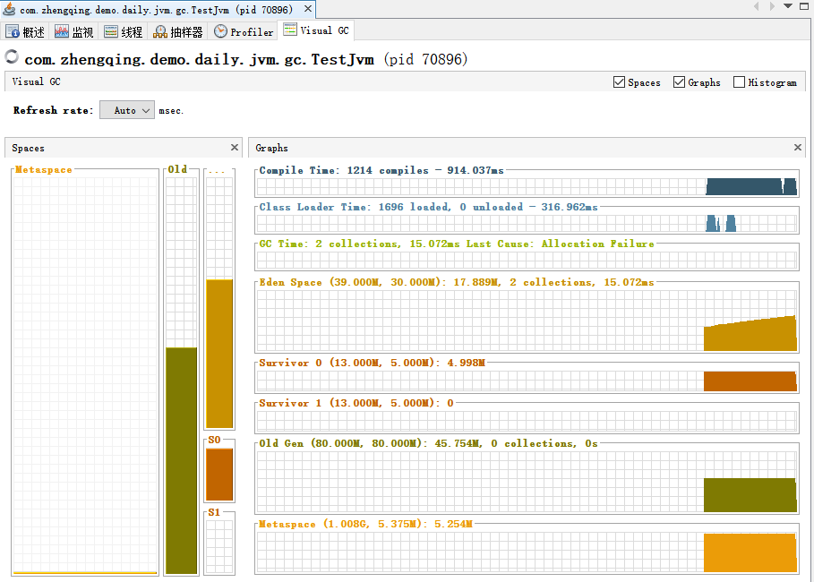
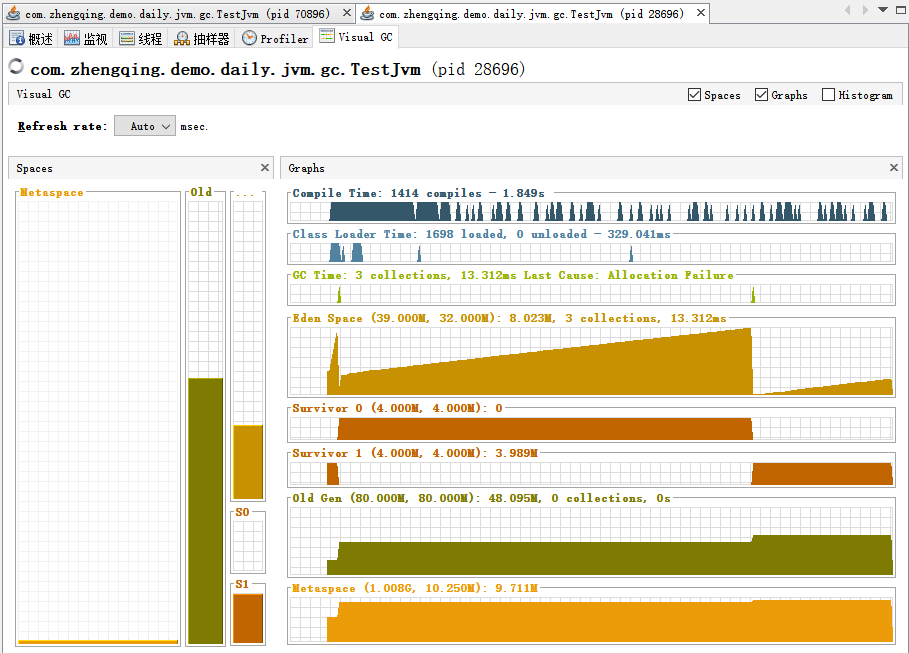

# JVM实战参数

```shell
-Xmx100M -Xms100M \  # ☆ 最小堆、最大堆 (2个设置相等即可) 如果出现频繁的full gc，则可以适当扩大该值，避免内存不足导致频繁的gc操作。
-XX:+UseG1GC \  # ☆ 使用G1垃圾回收器，它具有更好的分代收集策略和回收效率，适用于较大的堆内存环境下。
-XX:+HeapDumpOnOutOfMemoryError \  # ☆ jvm出现oom时dump出当前内存中的信息以支持后续的内存分析。也就是在线上环境蹦的时候自动导出堆dump文件 `dump.hprof`
-XX:HeapDumpPath=./dump.hprof \  # 导出堆dump文件路径，如果没有指定文件名，生成的文件格式为 `java_pid62696.hprof`，这里指定后为 `dump.hprof` （ tips: 需要保证目录文件夹存在，同一个pid程序的多次oom生成同一个文件 ）
-XX:MaxGCPauseMillis=200 \  # 控制每次gc操作的最大暂停时间（单位：毫秒），也就是在执行回收时，应该尽量控制一次gc暂停的时间不超过该值。这个值设置得越小，就越容易触发回收，也就意味着更频繁地进行gc操作；相反，如果将此值设置得太大，则可能会导致gc暂停时间变长，甚至会出现"stop the world"的情况。
-XX:+PrintGCDetails \  # 打印gc日志信息以进行性能调整和优化。
-XX:+PrintGCDateStamps \  # gc时间
-Xloggc:gc.log \  # 输出gc日志 eg:这里是输出到项目根路径下的`gc.log`文件中
-verbose:gc \  # 控制台打印gc日志 和 -Xloggc 互斥，即输出到日志文件中就不会在控制台中打印，此参数一般用于本地测试使用
```

---

### 堆参数

> 了解其内存分配

测试程序

```java
package com.zhengqing.demo.daily.jvm.gc;

import cn.hutool.core.thread.ThreadUtil;

import java.util.ArrayList;
import java.util.List;
import java.util.concurrent.TimeUnit;

/**
 * jvm参数： -Xmx120M -Xms120M -XX:+UseAdaptiveSizePolicy -XX:SurvivorRatio=8 -XX:NewRatio=2
 * -Xmx120M：指定 JVM 堆的最大内存大小为 120MB。这表示 JVM 运行时可以使用的堆内存上限。
 * -Xms120M：指定 JVM 堆的初始内存大小为 120MB。这表示 JVM 在启动时分配给堆的初始内存量。
 * -XX:+UseAdaptiveSizePolicy：启用自适应的内存调整策略。该选项允许 JVM 根据当前应用程序的需求自动调整内存大小。
 * -XX:SurvivorRatio=8：设置 Eden 空间与 Survivor 空间的比率为 8:1。 Eden 空间是新对象分配的地方，而 Survivor 空间用于存放一部分存活对象。
 * -XX:NewRatio=2：设置新生代与老年代内存大小的比率为 1:2。新生代主要用于存放新创建的对象，而老年代主要用于存放存活时间较长的对象。
 */
public class TestJvm {
    public static void main(String[] args) {
        List<byte[]> list = new ArrayList<>();
        for (int i = 0; i < 500; i++) {
            final int _100kb = 1024 * 100;
            byte[] arr = new byte[_100kb];
            list.add(arr);
            ThreadUtil.sleep(20, TimeUnit.MILLISECONDS);
        }
        ThreadUtil.sleep(10, TimeUnit.MINUTES);
    }
}
```

#### 默认配置

> 这里为了方便看见效果，设置了堆内存120m，即jvm参数为：`-Xmx120M -Xms120M`



默认情况下：

- 新生代占1/3（40m）
- 老年代占2/3（80m）
- 年轻代和老年代 1:2（40m：80m）
- 由于默认jvm参数`-XX:+UseAdaptiveSizePolicy`开启，即会自动进行`E`和`S`区比例分配，
  所以`Eden`、`Survivore 0`和`Survivore 1`区在这里占新生代的6:1:1（30m:5m:5m）
  而不是jvm参数中的`-XX:SurvivorRatio=8`（Eden区与Survivor区的比值，默认为8）

#### 显式配置

jvm参数：`-Xmx120M -Xms120M -XX:+UseAdaptiveSizePolicy -XX:SurvivorRatio=8 -XX:NewRatio=2`

- `-Xmx120M`：指定 JVM 堆的最大内存大小为 120MB。这表示 JVM 运行时可以使用的堆内存上限。
- `-Xms120M`：指定 JVM 堆的初始内存大小为 120MB。这表示 JVM 在启动时分配给堆的初始内存量。
- `-XX:+UseAdaptiveSizePolicy`：启用自适应的内存调整策略。该选项允许 JVM 根据当前应用程序的需求自动调整内存大小。
- `-XX:SurvivorRatio=8`：设置 Eden 空间与 Survivor 空间的比率为 8:1。
  Eden 空间是新对象分配的地方，而 Survivor 空间用于存放一部分存活对象。
- `-XX:NewRatio=2`：设置新生代与老年代内存大小的比率为 1:2。新生代主要用于存放新创建的对象，而老年代主要用于存放存活时间较长的对象。



- 新生代占1/3（40m）
- 老年代占2/3（80m）
- 年轻代和老年代 1:2（40m：80m）
- 由于默认jvm参数`-XX:SurvivorRatio=8`开启，`Eden`区与`Survivor`区的比值为8
  所以`Eden`、`Survivore 0`和`Survivore 1`区在这里占新生代的8:1:1（32m:4m:4m）

