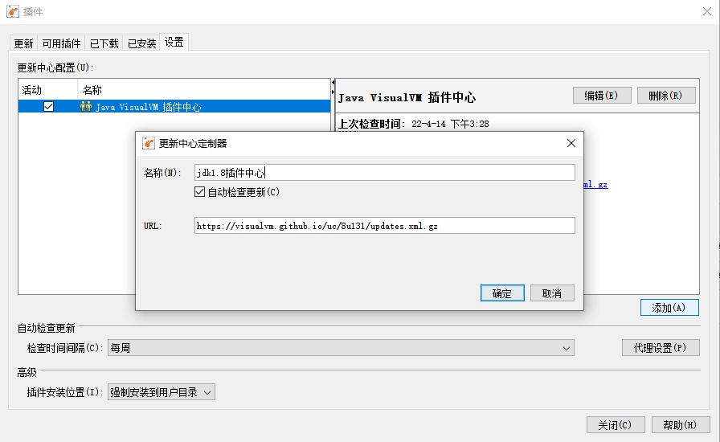

# jvisualvm

多合一故障管理工具

### 安装`Visual GC` -- 查看GC回收所需要的插件

> jdk 1.8.0_291

根据jdk版本选择对应插件地址 http://visualvm.github.io/pluginscenters.html

工具 -> 插件 -> 设置 -> 添加相应插件URL(ex: https://visualvm.github.io/uc/8u131/updates.xml.gz)

然后在 可用插件中勾选`Visual GC`安装 -> 重启`jvisualvm`

