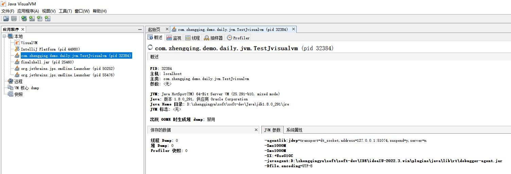
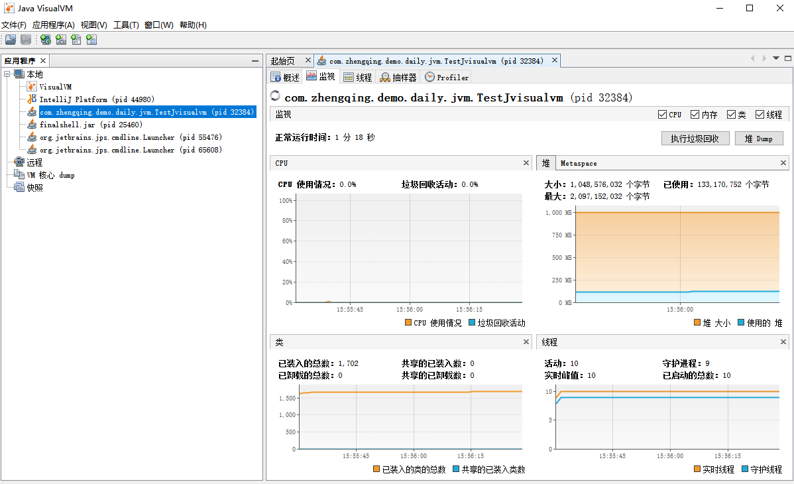
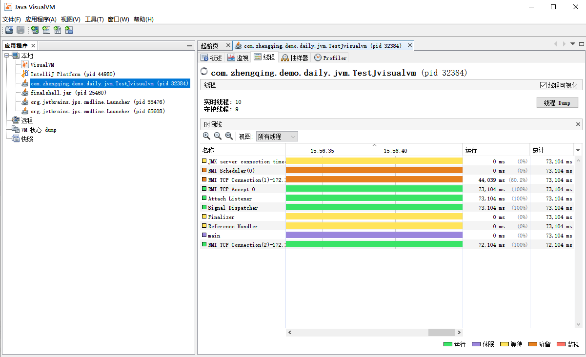

# jvisualvm 图形化工具

1. https://visualvm.github.io/index.html
2. https://visualvm.github.io/pluginscenters.html

### 一、基础使用

`win + r` -> `jvisualvm`

选择进程查看




### 二、安装`Visual GC`插件 -- 可以查看GC回收

> jdk 1.8.0_291

根据jdk版本选择对应插件地址 http://visualvm.github.io/pluginscenters.html


工具 -> 插件 -> 设置 -> 添加相应插件URL(ex: https://visualvm.github.io/uc/8u131/updates.xml.gz)


然后在 可用插件中勾选`Visual GC`安装 -> 重启`jvisualvm`


### 三、使用jvisualvm的jstatd方式远程监控Java程序

#### 1、客户端：Windows

打开%JAVA_HOME%/bin/jvisualvm.exe，在“远程”节点，右键，“添加远程主机”

#### 2、服务端：Linux

```shell
# 在$JAVA_HOME/bin/下新建策略文件
cd /usr/lib/jvm/java-1.8-openjdk/bin
cd /usr/lib/jvm/java-1.8-openjdk/jre/bin

echo 'grant codebase "file:/usr/java/default/lib/tools.jar" {   
    permission java.security.AllPermission;   
};' > jstatd.all.policy

# 启动jstatd
./jstatd -J-Djava.security.policy=./jstatd.all.policy
```

最后在客户端即可看到服务端上运行的所有Java程序了
