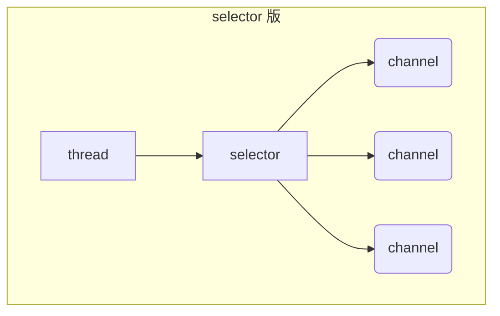
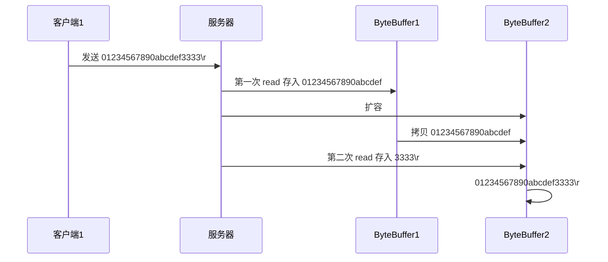

## 4. 网络编程

### 4.1 非阻塞 vs 阻塞

#### 阻塞

* 阻塞模式下，相关方法都会导致线程暂停
    * ServerSocketChannel.accept 会在没有连接建立时让线程暂停
    * SocketChannel.read 会在没有数据可读时让线程暂停
    * 阻塞的表现其实就是线程暂停了，暂停期间不会占用 cpu，但线程相当于闲置
* 单线程下，阻塞方法之间相互影响，几乎不能正常工作，需要多线程支持
* 但多线程下，有新的问题，体现在以下方面
    * 32 位 jvm 一个线程 320k，64 位 jvm 一个线程 1024k，如果连接数过多，必然导致 OOM，并且线程太多，反而会因为频繁上下文切换导致性能降低
    * 可以采用线程池技术来减少线程数和线程上下文切换，但治标不治本，如果有很多连接建立，但长时间 inactive，会阻塞线程池中所有线程，因此不适合长连接，只适合短连接


服务器端

```java
// 使用 nio 来理解阻塞模式, 单线程
// 0. ByteBuffer
ByteBuffer buffer = ByteBuffer.allocate(16);
// 1. 创建了服务器
ServerSocketChannel ssc = ServerSocketChannel.open();

// 2. 绑定监听端口
ssc.bind(new InetSocketAddress(8080));

// 3. 连接集合
List<SocketChannel> channels = new ArrayList<>();
while (true) {
    // 4. accept 建立与客户端连接， SocketChannel 用来与客户端之间通信
    log.debug("connecting...");
    SocketChannel sc = ssc.accept(); // 阻塞方法，线程停止运行
    log.debug("connected... {}", sc);
    channels.add(sc);
    for (SocketChannel channel : channels) {
        // 5. 接收客户端发送的数据
        log.debug("before read... {}", channel);
        channel.read(buffer); // 阻塞方法，线程停止运行
        buffer.flip();
        debugRead(buffer);
        buffer.clear();
        log.debug("after read...{}", channel);
    }
}
```

客户端

```java
SocketChannel sc = SocketChannel.open();
sc.connect(new InetSocketAddress("localhost", 8080));
System.out.println("waiting...");
```


#### 非阻塞

* 非阻塞模式下，相关方法都会不会让线程暂停
    * 在 ServerSocketChannel.accept 在没有连接建立时，会返回 null，继续运行
    * SocketChannel.read 在没有数据可读时，会返回 0，但线程不必阻塞，可以去执行其它 SocketChannel 的 read 或是去执行 ServerSocketChannel.accept
    * 写数据时，线程只是等待数据写入 Channel 即可，无需等 Channel 通过网络把数据发送出去
* 但非阻塞模式下，即使没有连接建立，和可读数据，线程仍然在不断运行，白白浪费了 cpu
* 数据复制过程中，线程实际还是阻塞的（AIO 改进的地方）


服务器端，客户端代码不变

```java
// 使用 nio 来理解非阻塞模式, 单线程
// 0. ByteBuffer
ByteBuffer buffer = ByteBuffer.allocate(16);
// 1. 创建了服务器
ServerSocketChannel ssc = ServerSocketChannel.open();
ssc.configureBlocking(false); // 非阻塞模式
// 2. 绑定监听端口
ssc.bind(new InetSocketAddress(8080));
// 3. 连接集合
List<SocketChannel> channels = new ArrayList<>();
while (true) {
    // 4. accept 建立与客户端连接， SocketChannel 用来与客户端之间通信
    SocketChannel sc = ssc.accept(); // 非阻塞，线程还会继续运行，如果没有连接建立，但sc是null
    if (sc != null) {
        log.debug("connected... {}", sc);
        sc.configureBlocking(false); // 非阻塞模式
        channels.add(sc);
    }
    for (SocketChannel channel : channels) {
        // 5. 接收客户端发送的数据
        int read = channel.read(buffer);// 非阻塞，线程仍然会继续运行，如果没有读到数据，read 返回 0
        if (read > 0) {
            buffer.flip();
            debugRead(buffer);
            buffer.clear();
            log.debug("after read...{}", channel);
        }
    }
}
```


#### 多路复用

单线程可以配合 Selector 完成对多个 Channel 可读写事件的监控，这称之为多路复用

* 多路复用仅针对网络 IO、普通文件 IO 没法利用多路复用
* 如果不用 Selector 的非阻塞模式，线程大部分时间都在做无用功，而 Selector 能够保证
    * 有可连接事件时才去连接
    * 有可读事件才去读取
    * 有可写事件才去写入
        * 限于网络传输能力，Channel 未必时时可写，一旦 Channel 可写，会触发 Selector 的可写事件


### 4.2 Selector




好处

* 一个线程配合 selector 就可以监控多个 channel 的事件，事件发生线程才去处理。避免非阻塞模式下所做无用功
* 让这个线程能够被充分利用
* 节约了线程的数量
* 减少了线程上下文切换


#### 创建

```java
Selector selector = Selector.open();
```


#### 绑定 Channel 事件

也称之为注册事件，绑定的事件 selector 才会关心

```java
channel.configureBlocking(false);
SelectionKey key = channel.register(selector, 绑定事件);
```

* channel 必须工作在非阻塞模式
* FileChannel 没有非阻塞模式，因此不能配合 selector 一起使用
* 绑定的事件类型可以有
    * connect - 客户端连接成功时触发
    * accept - 服务器端成功接受连接时触发
    * read - 数据可读入时触发，有因为接收能力弱，数据暂不能读入的情况
    * write - 数据可写出时触发，有因为发送能力弱，数据暂不能写出的情况


#### 监听 Channel 事件

可以通过下面三种方法来监听是否有事件发生，方法的返回值代表有多少 channel 发生了事件

方法1，阻塞直到绑定事件发生

```java
int count = selector.select();
```


方法2，阻塞直到绑定事件发生，或是超时（时间单位为 ms）

```java
int count = selector.select(long timeout);
```


方法3，不会阻塞，也就是不管有没有事件，立刻返回，自己根据返回值检查是否有事件

```java
int count = selector.selectNow();
```


#### 💡 select 何时不阻塞

> * 事件发生时
    >   * 客户端发起连接请求，会触发 accept 事件
    >   * 客户端发送数据过来，客户端正常、异常关闭时，都会触发 read 事件，另外如果发送的数据大于 buffer 缓冲区，会触发多次读取事件
>   * channel 可写，会触发 write 事件
>   * 在 linux 下 nio bug 发生时
> * 调用 selector.wakeup()
> * 调用 selector.close()
> * selector 所在线程 interrupt


### 4.3 处理 accept 事件

客户端代码为

```java
public class Client {
    public static void main(String[] args) {
        try (Socket socket = new Socket("localhost", 8080)) {
            System.out.println(socket);
            socket.getOutputStream().write("world".getBytes());
            System.in.read();
        } catch (IOException e) {
            e.printStackTrace();
        }
    }
}
```


服务器端代码为

```java
@Slf4j
public class ChannelDemo6 {
    public static void main(String[] args) {
        try (ServerSocketChannel channel = ServerSocketChannel.open()) {
            channel.bind(new InetSocketAddress(8080));
            System.out.println(channel);
            Selector selector = Selector.open();
            channel.configureBlocking(false);
            channel.register(selector, SelectionKey.OP_ACCEPT);

            while (true) {
                int count = selector.select();
//                int count = selector.selectNow();
                log.debug("select count: {}", count);
//                if(count <= 0) {
//                    continue;
//                }

                // 获取所有事件
                Set<SelectionKey> keys = selector.selectedKeys();

                // 遍历所有事件，逐一处理
                Iterator<SelectionKey> iter = keys.iterator();
                while (iter.hasNext()) {
                    SelectionKey key = iter.next();
                    // 判断事件类型
                    if (key.isAcceptable()) {
                        ServerSocketChannel c = (ServerSocketChannel) key.channel();
                        // 必须处理
                        SocketChannel sc = c.accept();
                        log.debug("{}", sc);
                    }
                    // 处理完毕，必须将事件移除
                    iter.remove();
                }
            }
        } catch (IOException e) {
            e.printStackTrace();
        }
    }
}
```


#### 💡 事件发生后能否不处理

> 事件发生后，要么处理，要么取消（cancel），不能什么都不做，否则下次该事件仍会触发，这是因为 nio 底层使用的是水平触发


### 4.4 处理 read 事件

```java
@Slf4j
public class ChannelDemo6 {
    public static void main(String[] args) {
        try (ServerSocketChannel channel = ServerSocketChannel.open()) {
            channel.bind(new InetSocketAddress(8080));
            System.out.println(channel);
            Selector selector = Selector.open();
            channel.configureBlocking(false);
            channel.register(selector, SelectionKey.OP_ACCEPT);

            while (true) {
                int count = selector.select();
//                int count = selector.selectNow();
                log.debug("select count: {}", count);
//                if(count <= 0) {
//                    continue;
//                }

                // 获取所有事件
                Set<SelectionKey> keys = selector.selectedKeys();

                // 遍历所有事件，逐一处理
                Iterator<SelectionKey> iter = keys.iterator();
                while (iter.hasNext()) {
                    SelectionKey key = iter.next();
                    // 判断事件类型
                    if (key.isAcceptable()) {
                        ServerSocketChannel c = (ServerSocketChannel) key.channel();
                        // 必须处理
                        SocketChannel sc = c.accept();
                        sc.configureBlocking(false);
                        sc.register(selector, SelectionKey.OP_READ);
                        log.debug("连接已建立: {}", sc);
                    } else if (key.isReadable()) {
                        SocketChannel sc = (SocketChannel) key.channel();
                        ByteBuffer buffer = ByteBuffer.allocate(128);
                        int read = sc.read(buffer);
                        if(read == -1) {
                            key.cancel();
                            sc.close();
                        } else {
                            buffer.flip();
                            debug(buffer);
                        }
                    }
                    // 处理完毕，必须将事件移除
                    iter.remove();
                }
            }
        } catch (IOException e) {
            e.printStackTrace();
        }
    }
}
```

开启两个客户端，修改一下发送文字，输出

```
sun.nio.ch.ServerSocketChannelImpl[/0:0:0:0:0:0:0:0:8080]
21:16:39 [DEBUG] [main] c.i.n.ChannelDemo6 - select count: 1
21:16:39 [DEBUG] [main] c.i.n.ChannelDemo6 - 连接已建立: java.nio.channels.SocketChannel[connected local=/127.0.0.1:8080 remote=/127.0.0.1:60367]
21:16:39 [DEBUG] [main] c.i.n.ChannelDemo6 - select count: 1
         +-------------------------------------------------+
         |  0  1  2  3  4  5  6  7  8  9  a  b  c  d  e  f |
+--------+-------------------------------------------------+----------------+
|00000000| 68 65 6c 6c 6f                                  |hello           |
+--------+-------------------------------------------------+----------------+
21:16:59 [DEBUG] [main] c.i.n.ChannelDemo6 - select count: 1
21:16:59 [DEBUG] [main] c.i.n.ChannelDemo6 - 连接已建立: java.nio.channels.SocketChannel[connected local=/127.0.0.1:8080 remote=/127.0.0.1:60378]
21:16:59 [DEBUG] [main] c.i.n.ChannelDemo6 - select count: 1
         +-------------------------------------------------+
         |  0  1  2  3  4  5  6  7  8  9  a  b  c  d  e  f |
+--------+-------------------------------------------------+----------------+
|00000000| 77 6f 72 6c 64                                  |world           |
+--------+-------------------------------------------------+----------------+
```


#### 💡 为何要 iter.remove()

> 因为 select 在事件发生后，就会将相关的 key 放入 selectedKeys 集合，但不会在处理完后从 selectedKeys 集合中移除，需要我们自己编码删除。例如
>
> * 第一次触发了 ssckey 上的 accept 事件，没有移除 ssckey
> * 第二次触发了 sckey 上的 read 事件，但这时 selectedKeys 中还有上次的 ssckey ，在处理时因为没有真正的 serverSocket 连上了，就会导致空指针异常


#### 💡 cancel 的作用

> cancel 会取消注册在 selector 上的 channel，并从 keys 集合中删除 key 后续不会再监听事件


#### ⚠️  不处理边界的问题

以前有同学写过这样的代码，思考注释中两个问题，以 bio 为例，其实 nio 道理是一样的

```java
public class Server {
    public static void main(String[] args) throws IOException {
        ServerSocket ss=new ServerSocket(9000);
        while (true) {
            Socket s = ss.accept();
            InputStream in = s.getInputStream();
            // 这里这么写，有没有问题
            byte[] arr = new byte[4];
            while(true) {
                int read = in.read(arr);
                // 这里这么写，有没有问题
                if(read == -1) {
                    break;
                }
                System.out.println(new String(arr, 0, read));
            }
        }
    }
}
```

客户端

```java
public class Client {
    public static void main(String[] args) throws IOException {
        Socket max = new Socket("localhost", 9000);
        OutputStream out = max.getOutputStream();
        out.write("hello".getBytes());
        out.write("world".getBytes());
        out.write("你好".getBytes());
        max.close();
    }
}
```

输出

```
hell
owor
ld�
�好

```

为什么？


#### 处理消息的边界


* 一种思路是固定消息长度，数据包大小一样，服务器按预定长度读取，缺点是浪费带宽
* 另一种思路是按分隔符拆分，缺点是效率低
* TLV 格式，即 Type 类型、Length 长度、Value 数据，类型和长度已知的情况下，就可以方便获取消息大小，分配合适的 buffer，缺点是 buffer 需要提前分配，如果内容过大，则影响 server 吞吐量
    * Http 1.1 是 TLV 格式
    * Http 2.0 是 LTV 格式




服务器端

```java
private static void split(ByteBuffer source) {
    source.flip();
    for (int i = 0; i < source.limit(); i++) {
        // 找到一条完整消息
        if (source.get(i) == '\n') {
            int length = i + 1 - source.position();
            // 把这条完整消息存入新的 ByteBuffer
            ByteBuffer target = ByteBuffer.allocate(length);
            // 从 source 读，向 target 写
            for (int j = 0; j < length; j++) {
                target.put(source.get());
            }
            debugAll(target);
        }
    }
    source.compact(); // 0123456789abcdef  position 16 limit 16
}

public static void main(String[] args) throws IOException {
    // 1. 创建 selector, 管理多个 channel
    Selector selector = Selector.open();
    ServerSocketChannel ssc = ServerSocketChannel.open();
    ssc.configureBlocking(false);
    // 2. 建立 selector 和 channel 的联系（注册）
    // SelectionKey 就是将来事件发生后，通过它可以知道事件和哪个channel的事件
    SelectionKey sscKey = ssc.register(selector, 0, null);
    // key 只关注 accept 事件
    sscKey.interestOps(SelectionKey.OP_ACCEPT);
    log.debug("sscKey:{}", sscKey);
    ssc.bind(new InetSocketAddress(8080));
    while (true) {
        // 3. select 方法, 没有事件发生，线程阻塞，有事件，线程才会恢复运行
        // select 在事件未处理时，它不会阻塞, 事件发生后要么处理，要么取消，不能置之不理
        selector.select();
        // 4. 处理事件, selectedKeys 内部包含了所有发生的事件
        Iterator<SelectionKey> iter = selector.selectedKeys().iterator(); // accept, read
        while (iter.hasNext()) {
            SelectionKey key = iter.next();
            // 处理key 时，要从 selectedKeys 集合中删除，否则下次处理就会有问题
            iter.remove();
            log.debug("key: {}", key);
            // 5. 区分事件类型
            if (key.isAcceptable()) { // 如果是 accept
                ServerSocketChannel channel = (ServerSocketChannel) key.channel();
                SocketChannel sc = channel.accept();
                sc.configureBlocking(false);
                ByteBuffer buffer = ByteBuffer.allocate(16); // attachment
                // 将一个 byteBuffer 作为附件关联到 selectionKey 上
                SelectionKey scKey = sc.register(selector, 0, buffer);
                scKey.interestOps(SelectionKey.OP_READ);
                log.debug("{}", sc);
                log.debug("scKey:{}", scKey);
            } else if (key.isReadable()) { // 如果是 read
                try {
                    SocketChannel channel = (SocketChannel) key.channel(); // 拿到触发事件的channel
                    // 获取 selectionKey 上关联的附件
                    ByteBuffer buffer = (ByteBuffer) key.attachment();
                    int read = channel.read(buffer); // 如果是正常断开，read 的方法的返回值是 -1
                    if(read == -1) {
                        key.cancel();
                    } else {
                        split(buffer);
                        // 需要扩容
                        if (buffer.position() == buffer.limit()) {
                            ByteBuffer newBuffer = ByteBuffer.allocate(buffer.capacity() * 2);
                            buffer.flip();
                            newBuffer.put(buffer); // 0123456789abcdef3333\n
                            key.attach(newBuffer);
                        }
                    }

                } catch (IOException e) {
                    e.printStackTrace();
                    key.cancel();  // 因为客户端断开了,因此需要将 key 取消（从 selector 的 keys 集合中真正删除 key）
                }
            }
        }
    }
}
```

客户端

```java
SocketChannel sc = SocketChannel.open();
sc.connect(new InetSocketAddress("localhost", 8080));
SocketAddress address = sc.getLocalAddress();
// sc.write(Charset.defaultCharset().encode("hello\nworld\n"));
sc.write(Charset.defaultCharset().encode("0123\n456789abcdef"));
sc.write(Charset.defaultCharset().encode("0123456789abcdef3333\n"));
System.in.read();
```


#### ByteBuffer 大小分配

* 每个 channel 都需要记录可能被切分的消息，因为 ByteBuffer 不能被多个 channel 共同使用，因此需要为每个 channel 维护一个独立的 ByteBuffer
* ByteBuffer 不能太大，比如一个 ByteBuffer 1Mb 的话，要支持百万连接就要 1Tb 内存，因此需要设计大小可变的 ByteBuffer
    * 一种思路是首先分配一个较小的 buffer，例如 4k，如果发现数据不够，再分配 8k 的 buffer，将 4k buffer 内容拷贝至 8k buffer，优点是消息连续容易处理，缺点是数据拷贝耗费性能，参考实现 [http://tutorials.jenkov.com/java-performance/resizable-array.html](http://tutorials.jenkov.com/java-performance/resizable-array.html)
    * 另一种思路是用多个数组组成 buffer，一个数组不够，把多出来的内容写入新的数组，与前面的区别是消息存储不连续解析复杂，优点是避免了拷贝引起的性能损耗


### 4.5 处理 write 事件


#### 一次无法写完例子

* 非阻塞模式下，无法保证把 buffer 中所有数据都写入 channel，因此需要追踪 write 方法的返回值（代表实际写入字节数）
* 用 selector 监听所有 channel 的可写事件，每个 channel 都需要一个 key 来跟踪 buffer，但这样又会导致占用内存过多，就有两阶段策略
    * 当消息处理器第一次写入消息时，才将 channel 注册到 selector 上
    * selector 检查 channel 上的可写事件，如果所有的数据写完了，就取消 channel 的注册
    * 如果不取消，会每次可写均会触发 write 事件


```java
public class WriteServer {

    public static void main(String[] args) throws IOException {
        ServerSocketChannel ssc = ServerSocketChannel.open();
        ssc.configureBlocking(false);
        ssc.bind(new InetSocketAddress(8080));

        Selector selector = Selector.open();
        ssc.register(selector, SelectionKey.OP_ACCEPT);

        while(true) {
            selector.select();

            Iterator<SelectionKey> iter = selector.selectedKeys().iterator();
            while (iter.hasNext()) {
                SelectionKey key = iter.next();
                iter.remove();
                if (key.isAcceptable()) {
                    SocketChannel sc = ssc.accept();
                    sc.configureBlocking(false);
                    SelectionKey sckey = sc.register(selector, SelectionKey.OP_READ);
                    // 1. 向客户端发送内容
                    StringBuilder sb = new StringBuilder();
                    for (int i = 0; i < 3000000; i++) {
                        sb.append("a");
                    }
                    ByteBuffer buffer = Charset.defaultCharset().encode(sb.toString());
                    int write = sc.write(buffer);
                    // 3. write 表示实际写了多少字节
                    System.out.println("实际写入字节:" + write);
                    // 4. 如果有剩余未读字节，才需要关注写事件
                    if (buffer.hasRemaining()) {
                        // read 1  write 4
                        // 在原有关注事件的基础上，多关注 写事件
                        sckey.interestOps(sckey.interestOps() + SelectionKey.OP_WRITE);
                        // 把 buffer 作为附件加入 sckey
                        sckey.attach(buffer);
                    }
                } else if (key.isWritable()) {
                    ByteBuffer buffer = (ByteBuffer) key.attachment();
                    SocketChannel sc = (SocketChannel) key.channel();
                    int write = sc.write(buffer);
                    System.out.println("实际写入字节:" + write);
                    if (!buffer.hasRemaining()) { // 写完了
                        key.interestOps(key.interestOps() - SelectionKey.OP_WRITE);
                        key.attach(null);
                    }
                }
            }
        }
    }
}
```

客户端

```java
public class WriteClient {
    public static void main(String[] args) throws IOException {
        Selector selector = Selector.open();
        SocketChannel sc = SocketChannel.open();
        sc.configureBlocking(false);
        sc.register(selector, SelectionKey.OP_CONNECT | SelectionKey.OP_READ);
        sc.connect(new InetSocketAddress("localhost", 8080));
        int count = 0;
        while (true) {
            selector.select();
            Iterator<SelectionKey> iter = selector.selectedKeys().iterator();
            while (iter.hasNext()) {
                SelectionKey key = iter.next();
                iter.remove();
                if (key.isConnectable()) {
                    System.out.println(sc.finishConnect());
                } else if (key.isReadable()) {
                    ByteBuffer buffer = ByteBuffer.allocate(1024 * 1024);
                    count += sc.read(buffer);
                    buffer.clear();
                    System.out.println(count);
                }
            }
        }
    }
}
```


#### 💡 write 为何要取消

只要向 channel 发送数据时，socket 缓冲可写，这个事件会频繁触发，因此应当只在 socket 缓冲区写不下时再关注可写事件，数据写完之后再取消关注


### 4.6 更进一步


#### 💡 利用多线程优化

> 现在都是多核 cpu，设计时要充分考虑别让 cpu 的力量被白白浪费


前面的代码只有一个选择器，没有充分利用多核 cpu，如何改进呢？

分两组选择器

* 单线程配一个选择器，专门处理 accept 事件
* 创建 cpu 核心数的线程，每个线程配一个选择器，轮流处理 read 事件


```java
public class ChannelDemo7 {
    public static void main(String[] args) throws IOException {
        new BossEventLoop().register();
    }


    @Slf4j
    static class BossEventLoop implements Runnable {
        private Selector boss;
        private WorkerEventLoop[] workers;
        private volatile boolean start = false;
        AtomicInteger index = new AtomicInteger();

        public void register() throws IOException {
            if (!start) {
                ServerSocketChannel ssc = ServerSocketChannel.open();
                ssc.bind(new InetSocketAddress(8080));
                ssc.configureBlocking(false);
                boss = Selector.open();
                SelectionKey ssckey = ssc.register(boss, 0, null);
                ssckey.interestOps(SelectionKey.OP_ACCEPT);
                workers = initEventLoops();
                new Thread(this, "boss").start();
                log.debug("boss start...");
                start = true;
            }
        }

        public WorkerEventLoop[] initEventLoops() {
//        EventLoop[] eventLoops = new EventLoop[Runtime.getRuntime().availableProcessors()];
            WorkerEventLoop[] workerEventLoops = new WorkerEventLoop[2];
            for (int i = 0; i < workerEventLoops.length; i++) {
                workerEventLoops[i] = new WorkerEventLoop(i);
            }
            return workerEventLoops;
        }

        @Override
        public void run() {
            while (true) {
                try {
                    boss.select();
                    Iterator<SelectionKey> iter = boss.selectedKeys().iterator();
                    while (iter.hasNext()) {
                        SelectionKey key = iter.next();
                        iter.remove();
                        if (key.isAcceptable()) {
                            ServerSocketChannel c = (ServerSocketChannel) key.channel();
                            SocketChannel sc = c.accept();
                            sc.configureBlocking(false);
                            log.debug("{} connected", sc.getRemoteAddress());
                            workers[index.getAndIncrement() % workers.length].register(sc);
                        }
                    }
                } catch (IOException e) {
                    e.printStackTrace();
                }
            }
        }
    }

    @Slf4j
    static class WorkerEventLoop implements Runnable {
        private Selector worker;
        private volatile boolean start = false;
        private int index;

        private final ConcurrentLinkedQueue<Runnable> tasks = new ConcurrentLinkedQueue<>();

        public WorkerEventLoop(int index) {
            this.index = index;
        }

        public void register(SocketChannel sc) throws IOException {
            if (!start) {
                worker = Selector.open();
                new Thread(this, "worker-" + index).start();
                start = true;
            }
            tasks.add(() -> {
                try {
                    SelectionKey sckey = sc.register(worker, 0, null);
                    sckey.interestOps(SelectionKey.OP_READ);
                    worker.selectNow();
                } catch (IOException e) {
                    e.printStackTrace();
                }
            });
            worker.wakeup();
        }

        @Override
        public void run() {
            while (true) {
                try {
                    worker.select();
                    Runnable task = tasks.poll();
                    if (task != null) {
                        task.run();
                    }
                    Set<SelectionKey> keys = worker.selectedKeys();
                    Iterator<SelectionKey> iter = keys.iterator();
                    while (iter.hasNext()) {
                        SelectionKey key = iter.next();
                        if (key.isReadable()) {
                            SocketChannel sc = (SocketChannel) key.channel();
                            ByteBuffer buffer = ByteBuffer.allocate(128);
                            try {
                                int read = sc.read(buffer);
                                if (read == -1) {
                                    key.cancel();
                                    sc.close();
                                } else {
                                    buffer.flip();
                                    log.debug("{} message:", sc.getRemoteAddress());
                                    debugAll(buffer);
                                }
                            } catch (IOException e) {
                                e.printStackTrace();
                                key.cancel();
                                sc.close();
                            }
                        }
                        iter.remove();
                    }
                } catch (IOException e) {
                    e.printStackTrace();
                }
            }
        }
    }
}
```


#### 💡 如何拿到 cpu 个数

> * Runtime.getRuntime().availableProcessors() 如果工作在 docker 容器下，因为容器不是物理隔离的，会拿到物理 cpu 个数，而不是容器申请时的个数
> * 这个问题直到 jdk 10 才修复，使用 jvm 参数 UseContainerSupport 配置， 默认开启


### 4.7 UDP

* UDP 是无连接的，client 发送数据不会管 server 是否开启
* server 这边的 receive 方法会将接收到的数据存入 byte buffer，但如果数据报文超过 buffer 大小，多出来的数据会被默默抛弃

首先启动服务器端

```java
public class UdpServer {
    public static void main(String[] args) {
        try (DatagramChannel channel = DatagramChannel.open()) {
            channel.socket().bind(new InetSocketAddress(9999));
            System.out.println("waiting...");
            ByteBuffer buffer = ByteBuffer.allocate(32);
            channel.receive(buffer);
            buffer.flip();
            debug(buffer);
        } catch (IOException e) {
            e.printStackTrace();
        }
    }
}
```

输出

```
waiting...
```


运行客户端

```java
public class UdpClient {
    public static void main(String[] args) {
        try (DatagramChannel channel = DatagramChannel.open()) {
            ByteBuffer buffer = StandardCharsets.UTF_8.encode("hello");
            InetSocketAddress address = new InetSocketAddress("localhost", 9999);
            channel.send(buffer, address);
        } catch (Exception e) {
            e.printStackTrace();
        }
    }
}
```

接下来服务器端输出

```
         +-------------------------------------------------+
         |  0  1  2  3  4  5  6  7  8  9  a  b  c  d  e  f |
+--------+-------------------------------------------------+----------------+
|00000000| 68 65 6c 6c 6f                                  |hello           |
+--------+-------------------------------------------------+----------------+
```


