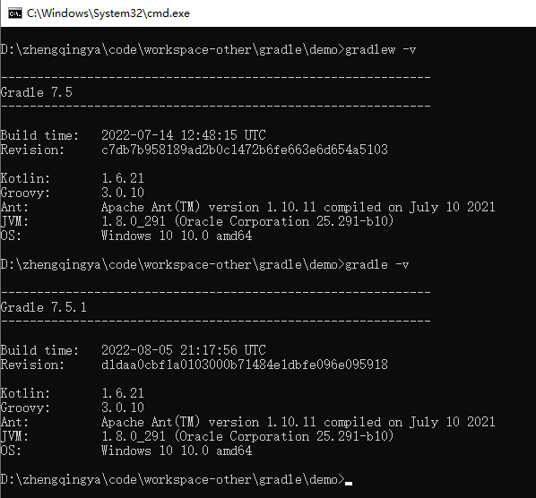

### 目录结构说明

```
D:.
└─gradle-demo
    ├─.gradle            -- gradle执行信息
    ├─.gitignore         -- git提交代码时忽略指定文件
    ├─build              -- 编译后产生的jar包、.class文件等（类似maven中的`target`）
    ├─gradle             -- 为工程指定gradle版本
    │  └─wrapper
    │          gradle-wrapper.jar
    │          gradle-wrapper.properties
    │          
    │  gradlew           -- linux脚本 （执行的是`gradle-wrapper.properties`中指定的gradle版本，非我们自己安装的gradle版本）
    │  gradlew.bat       -- windows脚本
    │  build.gradle      -- 当前module的gradle配置文件（类似maven中的`pom.xml`）
    │  settings.gradle   -- 定义项目及子项目名称信息
    └─src                -- 项目源代码
        ├─main
        │  ├─java
        │  │  └─com
        │  │      └─example
        │  │          └─demo
        │  │                  DemoApplication.java
        │  │                  
        │  └─resources
        │      └─application.properties
```



如果删除`gradle-wrapper`&`gradlew`&`gradlew.bat`使用自己安装的gradle版本，项目需如下配置
