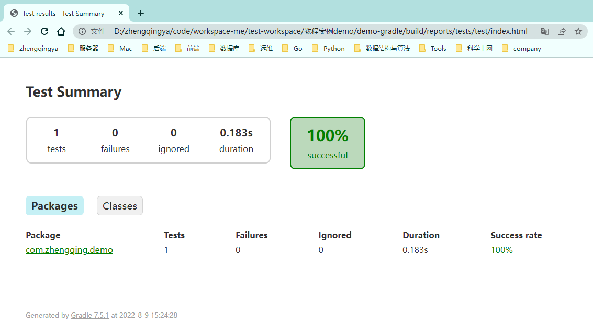

### 常用命令

```shell
# 查看版本
gradle -v

# 清空build目录
gradle clean

# 编译build目录
gradle classes

# 编译测试diamante，生成测试报告 => `项目目录\build\reports\tests\test`
gradle test

# 构建项目 => 生成jar包在`项目目录\build\libs`目录下  -- 执行此命令会自动处理`gradle classes`和`gradle test`
gradle build

# 跳过单元测试构建项目
gradle build -x test
```

